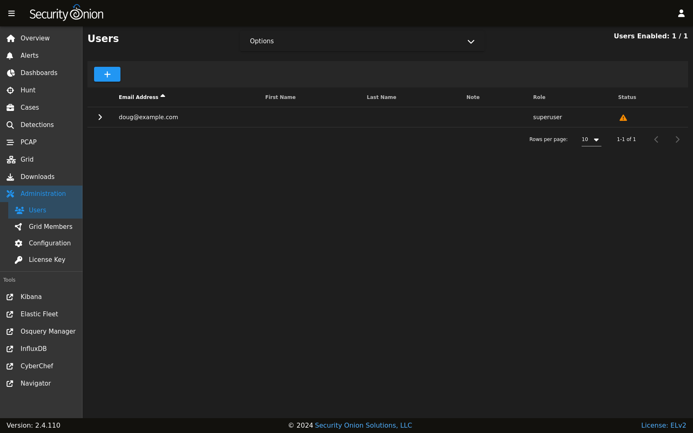

.. _adding-accounts:

Adding Accounts
===============

OS
--

If you need to add a new OS user account, you can use the ``adduser`` command.  For example, to add a new account called ``tom``:

::

    sudo adduser tom

We recommend creating usernames in lower case for consistency.

For more information, please see the adduser manual by typing ``man adduser``.

SOC
---

If you need to add a new account to :ref:`soc`, navigate to the :ref:`administration` interface, and then click ``Users``.

Click the ``+`` button, fill out the necessary information, and then click the ``ADD`` button.

.. tip::

  We recommend specifying email addresses in lower case for consistency.

For more information about the Users page, please see the :ref:`administration` section.
