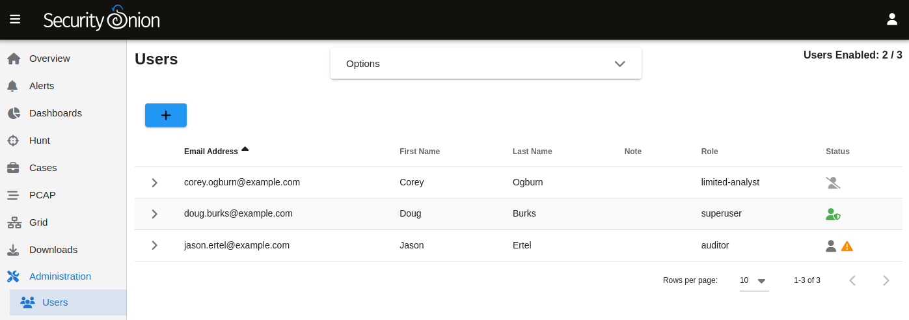

.. _administration:

Administration
==============

:ref:`soc` includes an Administration section which includes sections for Users, Grid Members, and Configuration.

Users
-----

The Role(s) column lists roles assigned to the user as defined in the :ref:`rbac` section.

The Status column will show a different icon depending on the status of the account. In the screenshot above, the first account is disabled, the second account is enabled and has :ref:`mfa` enabled, and the third account is enabled but does not have :ref:`mfa` enabled. Hovering over the icon in the Status column will show you these details as well.

Grid Members
------------

A distributed grid is made of up member nodes. Member nodes will request to join the grid and remain in a pending state until an admninistrator has accepted the node. If a pending member node is not yet listed as pending, then it's possible that the wrong manager host was provided during setup or there could be a connectivity problem.

Configuration
-------------

This section allows you to configure various aspects of your grid including:

- bpf
- elastalert
- elasticsearch
- firewall
- grafana
- idstools
- influxdb
- kibana
- ntp
- pcap
- soc
- suricata
- zeek
