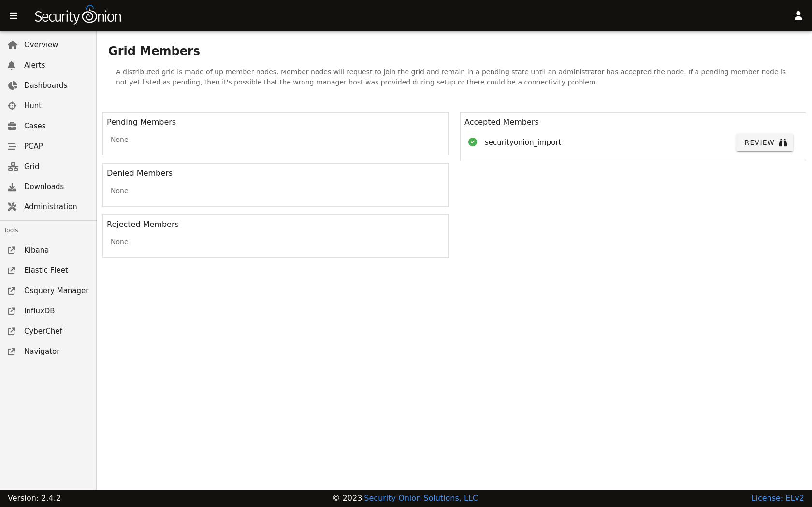
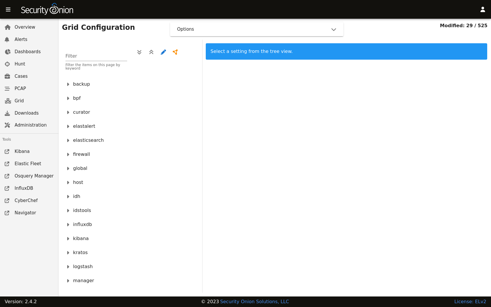

.. _administration:

Administration
==============

:ref:`soc` includes an Administration section which allows you to administer Users, Grid Members, and Configuration.

Users
-----

The Users page shows all user accounts that have been created for the grid.

.. image:: images/users.png
  :target: _images/users.png

The Role(s) column lists roles assigned to the user as defined in the :ref:`rbac` section.

The Status column will show a different icon depending on the status of the account. In the screenshot above, the first account is disabled, the second account is enabled and has :ref:`mfa` enabled, and the third account is enabled but does not have :ref:`mfa` enabled. Hovering over the icon in the Status column will show you these details as well.

Grid Members
------------

The Grid Members page shows nodes that have attempted to join the grid and whether or not they have been accepted into the grid by an administrator.

Unaccepted members are displayed on the left side and broken into three sections: Pending Members, Denied Members, and Rejected Members. When you accept a member, it will then move to the right side under Accepted Members.

For accepted members, you can click the REVIEW button to show additional information about the grid member. If you want to remove the member, you can then click the DELETE button.

Configuration
-------------

The Configuration page allows you to configure various components of your grid.

You can click on a component to drill into it and show all available settings for that component. You can then click on a setting to show the current setting or modify it if necessary. If you make a mistake, you can easily revert back to the default value.

If you're not sure of which component a particular setting may belong to, you can use the Filter at the top of the list to look for a particular setting. To the right of the Filter field are buttons that do the following:

- expand all settings
- collapse all settings
- show settings that have been modified from the default value
- show settings that have a unique value specified for one or more nodes in the grid

By default, the Configuration page only shows the most widely used settings. If you want to see all settings, you can go to the Options bar at the top of the page and then click the toggle labeled ``Show all configurable settings, including advanced settings``.

.. warning::

	Changing advanced settings is unsupported and could result in requiring a full cluster re-installation.
