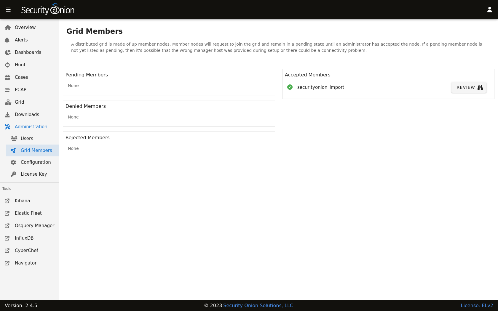
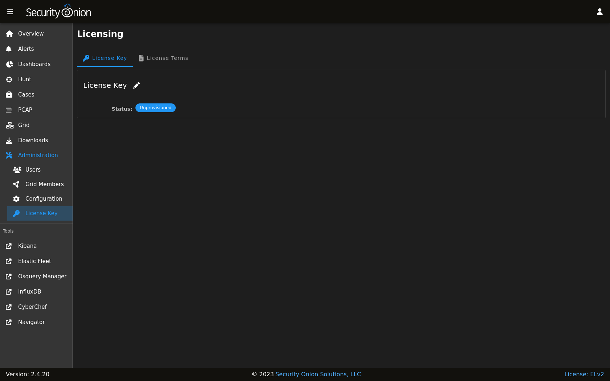

.. _administration:

Administration
==============

:ref:`soc` includes an Administration section which allows you to administer Users, Grid Members, Configuration, and the License Key.

Users
-----

The Users page shows all user accounts that have been created for the grid.

.. image:: images/users.png
  :target: _images/users.png

The Note column allows administrators to include a short note on a user's account.

The Role column lists roles assigned to the user as defined in the :ref:`rbac` section.

The Status column will show different icons depending on the status of the account. In the screenshot above:

- the first account is enabled and has TOTP :ref:`mfa` enabled
- the second account is enabled and has changed their password but does not have :ref:`mfa` enabled
- the third account is enabled but has not yet changed their password and does not have :ref:`mfa` enabled
- the fourth account is locked
  
Hovering over the icon in the Status column will show you these details as well.

Grid Members
------------

The Grid Members page shows nodes that have attempted to join the grid and whether or not they have been accepted into the grid by an administrator.

Unaccepted members are displayed on the left side and broken into three sections: Pending Members, Denied Members, and Rejected Members. When you accept a member, it will then move to the right side under Accepted Members.

For accepted members, you can click the REVIEW button to show additional information about the grid member. If you want to remove the member, you can then click the DELETE button and review the confirmation.

Configuration
-------------

The Configuration page allows you to configure various components of your grid.

.. image:: images/61_config.png
  :target: _images/61_config.png

The most common configuration options are shown in the quick links on the right side. On the left side, you can click on a component in the tree view to drill into it and show all available settings for that component. You can then click on a setting to show the current setting or modify it if necessary. If you make a mistake, you can easily revert back to the default value. If a blue question mark appears on the setting page, you can click it to go to the documentation for that component.

If you're not sure of which component a particular setting may belong to, you can use the Filter at the top of the list to look for a particular setting. To the right of the Filter field are buttons that do the following:

- apply the search filter
- expand all settings
- collapse all settings
- show settings that have been modified from the default value
- show settings that have a unique value specified for one or more nodes in the grid

.. note::

	If you see a key that includes ``_x_``, it is a placeholder value used to represent a period (``.``).

Some settings can be applied across the entire grid or to specific nodes. If you apply a setting to a specific node, it will override the grid setting.

Advanced Settings
~~~~~~~~~~~~~~~~~

By default, the Configuration page only shows the most widely used settings. If you want to see all settings, you can go to the Options bar at the top of the page and then click the toggle labeled ``Show all configurable settings, including advanced settings``.

.. warning::

	Changing advanced settings is unsupported and could result in requiring a full cluster re-installation.

Duplicate Settings
~~~~~~~~~~~~~~~~~~

Starting in Security Onion 2.4.70, some settings can be duplicated to more easily create new settings. If a setting is eligible for duplication, then it will have a DUPLICATE button on the right side of the page, provided the Advanced Option is enabled at the top of the screen. Creating a duplicate setting is a TWO-STEP process.

1. Click the DUPLICATE button and provide a name for the new setting, then click the CREATE SETTING button.
2. The new setting will automatically be shown in the Configuration screen. At this point it is not yet saved to the server. The setting's value must be modified explicitly to persist this new setting. Once the value has been modified, click the green checkmark button to save it.

.. note::

  Duplicated settings do not retain their original setting's full behavior. For example, if the original setting only allowed for CIDR values, this new setting will not have the same protections on later views in the Configuration screen. Further, duplicated settings are marked as advanced settings. In order to see the new setting at a later time the Advanced Option toggle must be enabled under the Configuration Options at the top of the Configuration screen.

License Key
-----------

In 2022, we announced that we would be releasing enterprise features that would only be available to paid users of the platform. You can read the announcement at https://blog.securityonion.net/2022/08/security-onion-enterprise-features-and.html.

Starting in Security Onion 2.4.70, it will be possible for licensed users of Security Onion Pro to activate the following features:

- OIDC Support
- LUKS Disk Encryption
- FIPS OS Compliance
- STIG OS Compliance
- Time Tracking for Cases

OIDC Single Sign-On to SOC
~~~~~~~~~~~~~~~~~~~~~~~~~

This feature allows 3rd-party authentication for :ref:`soc`. Examples are Active Directory, Github, and Google. For more information, please see the :ref:`oidc` section.

LUKS Disk Encryption
~~~~~~~~~~~~~~~~~~~~

Security Onion now supports several modes of LUKS disk encryption. This gives you the option to encrypt all disks or just the /nsm partition. You also have the option to have the disks automatically unlock on boot or require a password to boot. LUKS configuration is handled during the ISO installation. 

FIPS OS Compliance
~~~~~~~~~~~~~~~~~~

FIPS is a requirement for many government customers.

STIG OS Compliance
~~~~~~~~~~~~~~~~~~

STIG is a requirement for many government customers.

Time Tracking for Cases
~~~~~~~~~~~~~~~~~~~~~~~

This feature allows you to specify how much time you've spent working on a particular case and it will then show the total time spent by all analysts working on a particular case. For more information, please see the :ref:`cases` section.

Upcoming Pro Features
~~~~~~~~~~~~~~~~~~~~~

- Guaranteed Message Delivery
