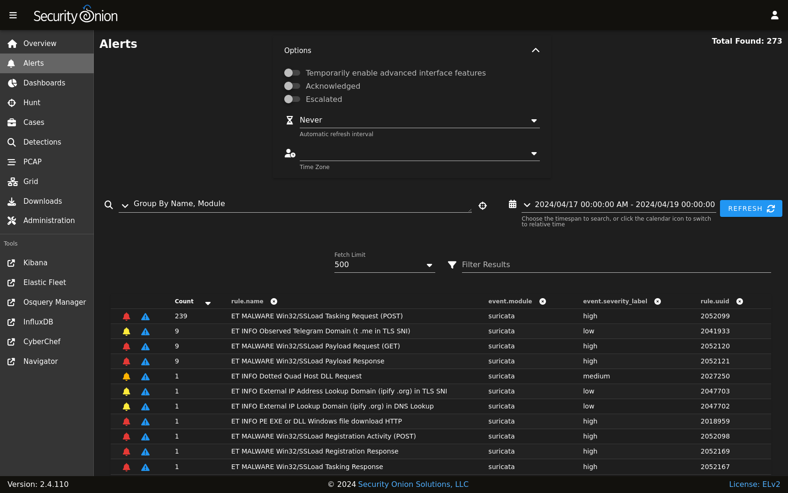

.. _alerts:

Alerts
======

:ref:`soc` includes an Alerts interface which gives you an overview of the alerts that Security Onion is generating. You can then quickly drill down into details, pivot to :ref:`hunt` or the :ref:`pcap` interface, and escalate alerts to :ref:`cases`.

.. image:: images/50_alerts.png
  :target: _images/50_alerts.png
  
Options
-------

At the top of the page, there is an Options menu that allows you to set options such as Acknowledged/Escalated, Automatic Refresh Interval, and Time Zone.

  
Toggles
~~~~~~~

The first toggle is labeled ``Temporarily enable advanced interface features``. If you enable this option, then the interface will show more advanced features similar to :ref:`dashboards` and :ref:`hunt`. These advanced features are only enabled temporarily so if you navigate away from the page and then return to the page, it will default back to its simplified view.

The ``Acknowledged`` and ``Escalated`` toggles control what alerts are displayed:

- Enabling the ``Acknowledged`` toggle will only show alerts that have previously been acknowledged by an analyst. 

- Enabling the ``Escalated`` toggle will only show alerts that have previously been escalated by an analyst to :ref:`cases`.

Automatic Refresh Interval
~~~~~~~~~~~~~~~~~~~~~~~~~~

Another option is the Automatic Refresh Interval setting. When enabled, the Alerts page will automatically refresh at the time interval you select.

Time Zone
~~~~~~~~~

Alerts will try to detect your local time zone via your browser. You can manually specify your time zone if necessary.

Query Bar
---------

The query bar defaults to ``Group By Name, Module`` which groups the alerts by ``rule.name`` and ``event.module``. You can click the dropdown box to select other queries which will group by other fields.

On the right side of the query bar is a hunt button that will start a new hunt based on the current query.

If you would like to save your own personal queries, you can bookmark them in your browser. If you would like to customize the default queries for all users, please see the :ref:`soc-customization` section.

Time Picker
-----------

By default, Alerts searches the last 24 hours. If you want to search a different time frame, you can change it in the upper-right corner of the screen.

Data Table
----------

The remainder of the page is a data table that starts in the grouped view and can be switched to the detailed view. Both views have some functionality in common:

- Clicking the table headers allows you to sort ascending or descending. 

- Clicking the bell icon acknowledges an alert. That alert can then be seen by selecting the ``Acknowledged`` toggle at the top of the page. In the ``Acknowledged`` view, clicking the bell icon removes the acknowledgement.

- Clicking the blue exclamation icon escalates the alert to :ref:`cases` and allows you to create a new case or add to an existing case. If you need to find that original escalated alert in the Alerts page, you can enable the ``Escalated`` toggle (which will automatically enable the ``Acknowledged`` toggle as well).

- Clicking a value in the table brings up a context menu of actions for that value. This allows you to refine your existing search, start a new search, or even pivot to external sites like Google and VirusTotal.

- You can adjust the ``Rows per page`` setting in the bottom right and use the left and right arrow icons to page through the table.

Grouped View
~~~~~~~~~~~~

By default, alerts are grouped by whatever criteria is selected in the query bar. Clicking a field value and then selecting the Drilldown option allows you to drill down into that value which switches to the detailed view. You can also click the value in the Count column to perform a quick drilldown. Note that this quick drilldown feature is only enabled for certain queries.

If you'd like to remove a particular field from the grouped view, you can click the trash icon at the top of the table to the right of the field name.

Detailed View
~~~~~~~~~~~~~

If you click a value in the grouped view and then select the Drilldown option, the display will switch to the detailed view. This shows all search results and allows you to then drill into individual search results as necessary. Clicking the table headers allows you to sort ascending or descending. Starting from the left side of each row, there is an arrow which will expand the result to show all of its fields. To the right of that arrow is the ``Timestamp`` field. Next, a few standard fields are shown: ``rule.name``, ``event.severity_label``, ``source.ip``, ``source.port``, ``destination.ip``, and ``destination.port``. Depending on what kind of data you're looking at, there may be some additional data-specific fields as well. 

When you click the arrow to expand a row in the Events table, it will show all of the individual fields from that event. Field names are shown on the left and field values on the right. When looking at the field names, there are two icons to the left. The Groupby icon, the left most icon, will add a new groupby table for that field. The Toggle Column icon, to the right of the Groupby icon, will toggle that column in the Events table, and the icon will be a blue color if the column is visible. You can click on values on the right to bring up the context menu to refine your search or pivot to other pages. 

Context Menu
------------

Clicking a value in the page brings up a context menu that allows you to refine your existing search, start a new search, or even pivot to external sites like Google and VirusTotal. 

Include
~~~~~~~

Clicking the ``Include`` option will add the selected field:value pair to your existing search with an ``AND``. This will only show search results that include that value in that field.

Exclude
~~~~~~~

Clicking the ``Exclude`` option will add the selected field:value pair to your existing search with an ``AND NOT``. This will only show search results that do not include that value in that field.

Only
~~~~

Clicking the ``Only`` option will start a new search for the selected value in any field. It will remove any existing filters but retain any existing groupby terms.

Drilldown
~~~~~~~~~

Clicking the ``Drilldown`` option will drill down into a group of alerts to show each individual alert.

Tune Detection
~~~~~~~~~~~~~~

Clicking the ``Tune Detection`` option will take you to :ref:`detections` and allow you disable or modify the detection that fired the alert.

Group By
~~~~~~~~

Clicking the ``Group By`` option will update the existing query and aggregate the results based on the selected field.

New Group By
~~~~~~~~~~~~

Clicking the ``New Group By`` option will create a new data table for the selected field.

Numeric Ops
~~~~~~~~~~~

If the value you clicked is numeric, then the ``Numeric Ops`` sub-menu allows you to choose operations like less than, less than or equal, greater than, greater than or equal, or Between. Choosing the Between option displays a window so that you can specify a range of values.

Clipboard
~~~~~~~~~

The ``Clipboard`` sub-menu has several options that allow you to copy selected data to your clipboard in different ways.

Actions
~~~~~~~

The ``Actions`` sub-menu has several different options. Please note that some of these actions will only display on the Actions menu if you click on a specific log type.

- Clicking the ``Hunt`` option will start a new search for the selected value and will give you a good overview of what types of data are available for that indicator.

- Clicking the ``Add to Case`` option will add an observable to a new or existing case.

- Clicking the ``Correlate`` option will find related logs based on Community ID, uid, fuid, etc.

- Clicking the ``PCAP`` option will pivot to the :ref:`pcap` interface to retrieve full packet capture for the selected stream. This option will only appear if you click on a log that contains source IP, source port, destination IP, destination port, etc.

- Clicking the ``Google`` option will search Google for the selected value. 

- Clicking the ``VirusTotal`` option will search VirusTotal for the selected value.

- Clicking the ``Process Info`` option will show all logs that include this process's entity_id in the ``process.entity_id`` field. This option will only appear if you click on a log that contains the ``process.entity_id`` field.

- Clicking the ``Process and Child Info`` option will show all logs that include this process's entity_id in either the ``process.entity_id`` or ``process.parent.entity_id`` fields. Depending on the process, this may show the same logs as the ``Process Info`` option or it may show more. This option will only appear if you click on a log that contains the ``process.entity_id`` field.

- Clicking the ``Process All Info`` option will show all logs that include this process's entity_id in any field. Depending on the process, this may show the same logs as the ``Process and Child Info`` option or it may show more. This option will only appear if you click on a log that contains the ``process.entity_id`` field.

- Clicking the ``Process Ancestors`` option will show all parent processes for the selected process. This option will only appear if you click on a log that contains the ``process.Ext.ancestry`` field.

If you'd like to add your own custom actions, see the :ref:`soc-customization` section.
