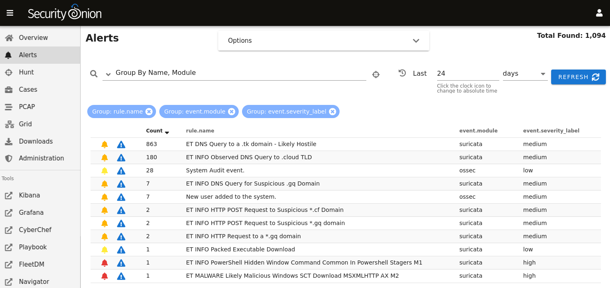
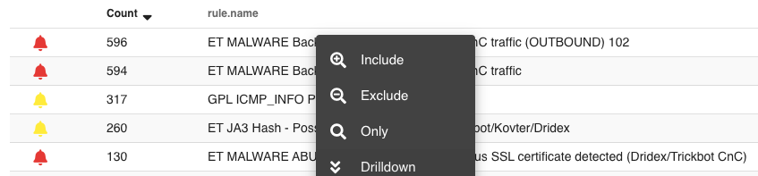
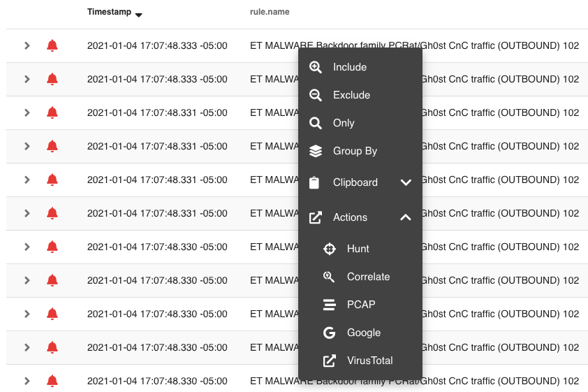
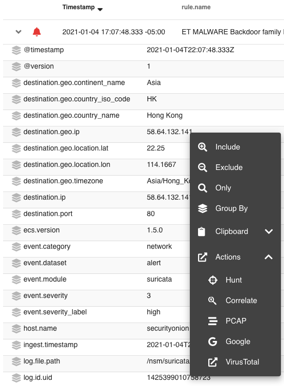

.. _alerts:

Alerts
======

:ref:`soc` gives you access to our new Alerts interface. This interface gives you an overview of the alerts that Security Onion is generating and allows you to quickly drill down into details, pivot to :ref:`hunt` or :ref:`pcap`, and escalate alerts to :ref:`hive`.

  
Toggles
-------

The top of the page has toggles for ``Acknowledged`` and ``Escalated``:

.. image:: https://user-images.githubusercontent.com/1659467/94587683-ed7d8e80-0250-11eb-951d-282ba76932f7.png
  :target: https://user-images.githubusercontent.com/1659467/94587683-ed7d8e80-0250-11eb-951d-282ba76932f7.png

- Enabling the ``Acknowledged`` toggle will only show alerts that have previously been acknowledged by an analyst. 

- Enabling the ``Escalated`` toggle will only show alerts that have previously been escalated by an analyst to :ref:`hive`.

Automatic Refresh Interval
--------------------------

To the right of the toggles is the Automatic Refresh Interval setting:

.. image:: images/soc-automatic-refresh-interval.png
  :target: _images/soc-automatic-refresh-interval.png

When enabled, the Alerts page will automatically refresh at the time interval you select.

Query Bar
---------
The query bar defaults to ``Group By Name, Module`` which groups the alerts by ``rule.name`` and ``event.module``. If you want to send your current Alerts query to :ref:`hunt`, you can click the crosshair icon to the right of the query bar.

.. image:: https://user-images.githubusercontent.com/1659467/94837346-2305b180-03e2-11eb-96c9-0c99fd1781dc.png
  :target: https://user-images.githubusercontent.com/1659467/94837346-2305b180-03e2-11eb-96c9-0c99fd1781dc.png

Under the query bar, you'll notice colored bubbles that represent the individual components of the query and the fields to group by. If you want to remove part of the query, you can click its corresponding bubble to remove it and run a new search.

You can click the dropdown box to select other queries which will group by other fields.

.. image:: https://user-images.githubusercontent.com/1659467/94837439-3e70bc80-03e2-11eb-8399-f40678fd5594.png
  :target: https://user-images.githubusercontent.com/1659467/94837439-3e70bc80-03e2-11eb-8399-f40678fd5594.png
  
Time Picker
-----------

By default, Alerts searches the last 24 hours. If you want to search a different time frame, you can change it in the upper right corner of the screen.

.. image:: https://user-images.githubusercontent.com/1659467/94587826-20c01d80-0251-11eb-8fa3-2e73a0763981.png
  :target: https://user-images.githubusercontent.com/1659467/94587826-20c01d80-0251-11eb-8fa3-2e73a0763981.png

Data Table
----------

The remainder of the page is a data table that starts in the grouped view and can be switched to the detailed view. Both views have some functionality in common:

- Clicking the table headers allows you to sort ascending or descending. 

- Clicking the bell icon acknowledges an alert. That alert can then be seen by selecting the ``Acknowledged`` toggle at the top of the page. In the ``Acknowledged`` view, clicking the bell icon removes the acknowledgement.

- Clicking the blue exclamation icon escalates the alert to :ref:`hive` and creates a case. The case can then be seen in :ref:`hive` interface. If you need to find that original escalated alert in the Alerts page, you can enable the ``Escalated`` toggle (which will automatically enable the ``Acknowledged`` toggle as well).

- Clicking a value in the table brings up a context menu of actions for that value. This allows you to refine your existing search, start a new search, or even pivot to external sites like Google and VirusTotal.

- You can adjust the ``Rows per page`` setting in the bottom right and use the left and right arrow icons to page through the table.

Grouped View
~~~~~~~~~~~~

By default, alerts are grouped by whatever criteria is selected in the query bar. Clicking a field value and then selecting the Drilldown option allows you to drill down into that value which switches to the detailed view.

Detailed View
~~~~~~~~~~~~~

If you click a value in the grouped view and then select the Drilldown option, the display will switch to the detailed view. This shows all search results and allows you to then drill into individual search results as necessary. Clicking the table headers allows you to sort ascending or descending. Starting from the left side of each row, there is an arrow which will expand the result to show all of its fields. To the right of that arrow is the ``Timestamp`` field. Next, a few standard fields are shown: ``rule.name``, ``event.severity_label``, ``source.ip``, ``source.port``, ``destination.ip``, and ``destination.port``. Depending on what kind of data you're looking at, there may be some additional data-specific fields as well. 

When you click the arrow to expand a row in the Events table, it will show all of the individual fields from that event. Field names are shown on the left and field values on the right. When looking at the field names, there is an icon to the left that will add that field to the ``groupby`` section of your query. You can click on values on the right to bring up the context menu to refine your search or pivot to other pages. 

Context Menu
------------

Clicking a value in the page brings up a context menu that allows you to refine your existing search, start a new search, or even pivot to external sites like Google and VirusTotal. 

Include
~~~~~~~

Clicking the ``Include`` option will add the selected value to your existing search to only show search results that include that value.

Exclude
~~~~~~~

Clicking the ``Exclude`` option will exclude the selected value from your existing search results.

Only
~~~~

Clicking the ``Only`` option will start a new search for the selected value and retain any existing groupby terms.

Group By
~~~~~~~~

Clicking the ``Group By`` option will update the existing query and aggregate the results based on the selected field.

Clipboard
~~~~~~~~~

The ``Clipboard`` sub-menu has several options that allow you to copy selected data to your clipboard in different ways.

Actions
~~~~~~~

The ``Actions`` sub-menu has several different options:

- Clicking the ``Hunt`` option will start a new search for the selected value and will aggregate the results by ``event.module`` and ``event.dataset`` to give you a good overview of what types of data are available for that indicator.

- Clicking the ``Correlate`` option will find related logs based on Community ID, uid, fuid, etc.

- Clicking the ``PCAP`` option will pivot to the :ref:`pcap` interface to retrieve full packet capture for the selected stream.

- Clicking the ``Google`` option will search Google for the selected value. 

- Clicking the ``VirusTotal`` option will search VirusTotal for the selected value.

If you'd like to add your own custom actions, you can copy ``/opt/so/saltstack/default/salt/soc/files/soc/alerts.actions.json`` to ``/opt/so/saltstack/local/salt/soc/files/soc/alerts.actions.json`` and then add new entries.

For example, suppose we want to add ``AbuseIPDB`` with URL ``https://www.abuseipdb.com/check/{value}``. First, we need to copy ``/opt/so/saltstack/default/salt/soc/files/soc/alerts.actions.json`` to ``/opt/so/saltstack/local/salt/soc/files/soc/alerts.actions.json``:

::

  sudo cp -n /opt/so/saltstack/default/salt/soc/files/soc/alerts.actions.json /opt/so/saltstack/local/salt/soc/files/soc/alerts.actions.json

Next, we need to edit ``/opt/so/saltstack/local/salt/soc/files/soc/alerts.actions.json`` using our favorite text editor and insert the following as the next to last line of the file:

::

  ,{ "name": "AbuseIPDB", "description": "Search for this value at AbuseIPDB", "icon": "fa-external-link-alt", "target": "_blank","links": [ "https://www.abuseipdb.com/check/{value}" ]}

Finally, restart SOC to make the changes take effect:

::

  sudo so-soc-restart

Once you've verifed that your change works as intended, you may want to make the same change in ``hunt.actions.json`` for :ref:`hunt`.

Here are some other customization options for Alerts actions:
https://github.com/Security-Onion-Solutions/securityonion/issues/1749
https://github.com/Security-Onion-Solutions/securityonion/issues/2904
