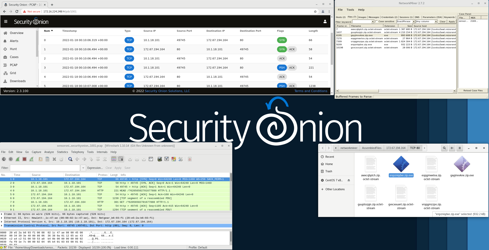

.. _analyst-vm:

Analyst VM
==========

Full-time analysts may want to create a dedicated Analyst VM. This allows you to investigate pcaps and other potentially malicious artifacts without impacting your Security Onion deployment or your workstation.

The ``so-analyst-install`` script will install a full GNOME desktop environment including Chromium web browser, :ref:`networkminer`, :ref:`wireshark`, and other analyst tools. ``so-analyst-install`` is totally independent of the standard setup process, so you can run it before or after setup or not run setup at all if all you really want is the Analyst VM itself.

.. note::

  ``so-analyst-install`` currently only supports CentOS, so you'll either need to use our Security Onion ISO image (recommended) or a manual installation of CentOS 7.
  
.. note::

 ``so-analyst-install`` currently downloads packages from the Internet, so you will need to ensure that networking is configured before running ``so-analyst-install``.

To connect from the Analyst VM to your manager node, you will need to run :ref:`so-allow` on the manager node and choose the ``analyst`` option to allow the traffic through the host-based :ref:`firewall`.

.. toctree::
   :maxdepth: 2
   
   networkminer
   wireshark
