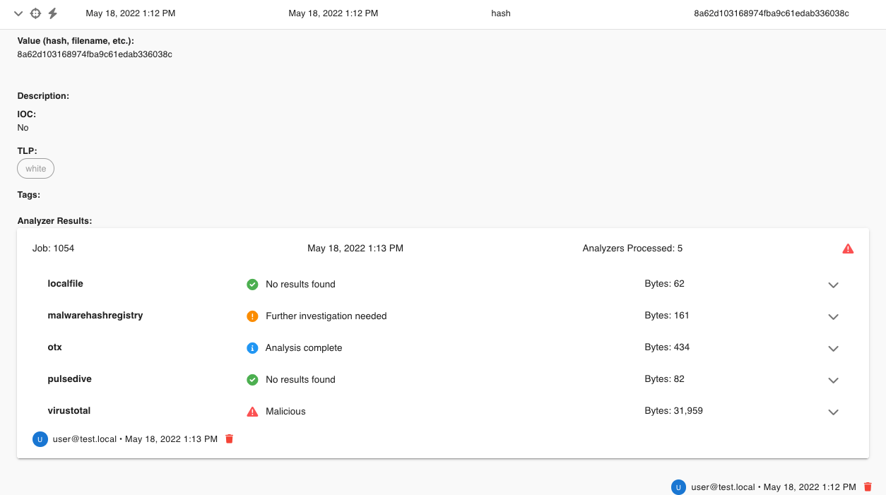
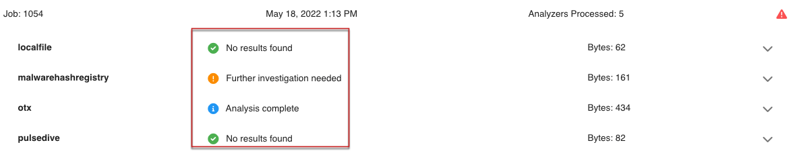

.. _analyzers:

Analyzers
==========
Starting in Security Onion 2.3.130, we have included analyzers, which allow you to quickly gather context around an observable.

Supported Analyzers and Data Types
----------------------------------
The follow is a summary of the native analyzers and their supported data types:

=======================       ======= ====   ==   ===   ====  ===== ===  === ==========
 Name                         Domain  Hash   IP   JA3   Mail  Other URI  URL User Agent 
=======================       ======= ====   ==   ===   ====  ===== ===  === ==========  
Alienvault OTX                   ✓      ✓                                 ✓
EmailRep                                                  ✓
Greynoise                                     ✓
JA3er                                              ✓
LocalFile                        ✓      ✓     ✓                 ✓         ✓  
Malware Hash Registry                   ✓
Pulsedive                        ✓      ✓     ✓                      ✓    ✓      ✓     
Spamhaus                                      ✓
Urlhaus                                                                   ✓
Urlscan                                                                   ✓
Virustotal                       ✓      ✓     ✓                           ✓
WhoisLookup                      ✓
=======================       ======= ====   ==   ===   ====  ===== ===  === ==========

Running Analyzers
-----------------
To enqueue an analyzer job, click the lighting bolt icon from left-hand side of the observable menu:

All configured analyzers supporting the observable's data type will then run and return their analysis:

Analyzer Output
---------------
The collapsed job view for an analyzer will return a summary view of the analysis:

  
Expanding the collapsed row will review a more detailed view of the analysis:
  
.. image:: images/analyzers-job-details.png
  :target: _images/analyzers-job-details.png

Configuring Analyzers
---------------------
Some analyzers require authentication or other details to be configured before use. If analysis is requested for an observable, and an analyzer supports that observable type, if the analyzer is left unconfigured, it will not run. 

Developing Analyzers
--------------------
Additional analyzers can be developed using the developer's guide.
