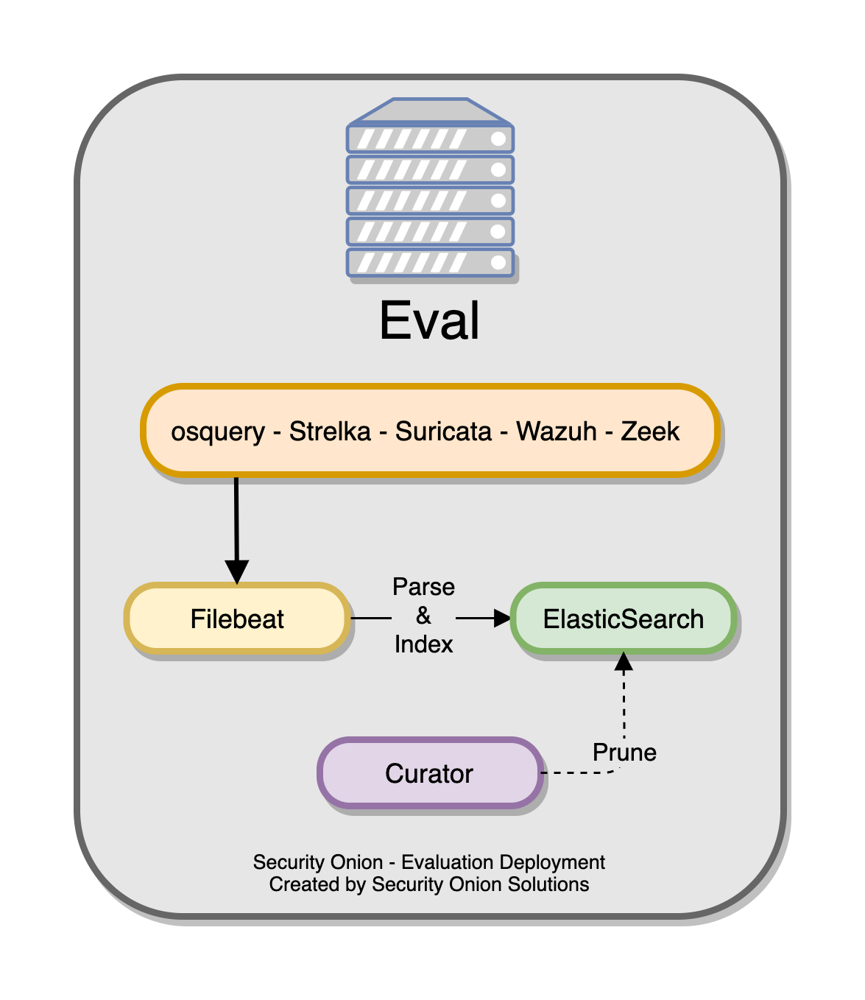

.. _architecture:

Architecture
============

Evaluation
----------
The simplest architecture is ``Evaluation``. All components run on one box. :ref:`filebeat` collects logs and sends them directly to :ref:`elasticsearch` where they are parsed and indexed. Evaluation mode is designed for quick installations to temporarily test out Security Onion. It is **not** designed for production usage at all.

Standalone
----------
``Standalone`` is similar to ``Evaluation`` in that all components run on one box. However, instead of :ref:`filebeat` sending logs directly to :ref:`elasticsearch`, it sends them to :ref:`logstash` which then transports them to :ref:`elasticsearch`. :ref:`elasticsearch` then parses and indexes the logs. 

This type of deployment is typically used for testing, labs, POCs, or **very** low-throughput environments. It's not as scalable as a distributed deployment.

.. image:: images/elastic-architecture/standalone.png

Distributed
-----------

A standard distributed deployment includes a **manager node**, one or more **forward nodes** running network sensor components, and one or more **search nodes** running Elastic search components. This architecture is ideal; while it may cost more upfront, this architecture provides for greater scalability and performance down the line, as one can simply "snap in" new search nodes to handle more traffic or log sources.

-  Recommended deployment type
-  Consists of a manager node, one or more forward nodes, and one or more search nodes.

.. image:: images/elastic-architecture/distributed.png
   
There is the option to utilize only two node types -- the **manager node** and one or more **heavy nodes**, however, this is not recommended due to performance reasons, and should only be used for testing purposes or in low-throughput environments.

-  Recommended only if a standard distributed deployment is not possible.
-  Consists of a manager node and one or more heavy nodes.

.. image:: images/elastic-architecture/heavy-distributed.png

Node Types
----------

Management
~~~~~~~~~~

The ``manager node`` runs its own local copy of Elasticsearch, which manages cross-cluster search configuration for the deployment. This includes configuration for ``heavy nodes`` and ``search nodes`` (where applicable), but not ``forward nodes``, as they do not run Elastic Stack components. An analyst connects to the server from a client workstation (typically a Security Onion virtual machine installation) to execute queries and retrieve data.

The manager node runs the following components:

-  :ref:`elasticsearch`
-  :ref:`logstash`
-  :ref:`kibana`
-  :ref:`curator`
-  :ref:`elastalert`
-  :ref:`redis` (Only if configured to output to a search node)
-  :ref:`wazuh`

Forward Node
~~~~~~~~~~~~

When using a ``forward node``, Elastic Stack components are not installed. :ref:`filebeat` forwards all logs to :ref:`logstash` on the manager node, where they are stored in :ref:`elasticsearch` on the manager node or a search node (if the manager node has been configured to use a search node). From there, the data can be queried through the use of cross-cluster search.

Forward Nodes run the following components:

-  :ref:`zeek`
-  :ref:`suricata`
-  :ref:`stenographer`
-  :ref:`wazuh`

Search Node
~~~~~~~~~~~

When using a ``search node``, Security Onion implements distributed deployments using Elasticsearch's `cross cluster search <https://www.elastic.co/guide/en/elasticsearch/reference/current/modules-cross-cluster-search.html>`__. When you run Setup and choose ``Search Node``, it will create a local :ref:`elasticsearch` instance and then configure the manager node to query that instance. This is done by updating \_cluster/settings on the manager node so that it will query the local :ref:`elasticsearch` instance.

``Search nodes`` primarily collect logs from other nodes and store them for searching.

Search Nodes run the following components:

-  :ref:`elasticsearch`
-  :ref:`logstash`
-  :ref:`curator`
-  :ref:`wazuh`

Heavy Node
~~~~~~~~~~

Similar to search nodes, heavy nodes extend the storage and processing capabilities of the manager node. However, heavy nodes also perform sensor duties and thus have lower performance overall.

Heavy Nodes run the following components:

-  :ref:`elasticsearch`
-  :ref:`logstash`
-  :ref:`curator`
-  :ref:`zeek`
-  :ref:`suricata`
-  :ref:`stenographer`
-  :ref:`wazuh`
