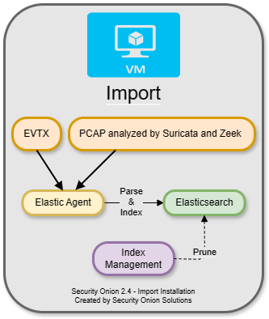
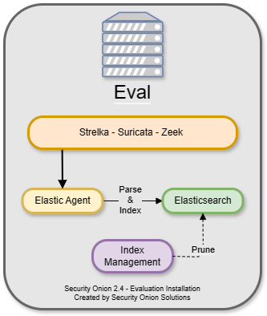
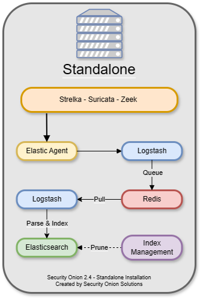
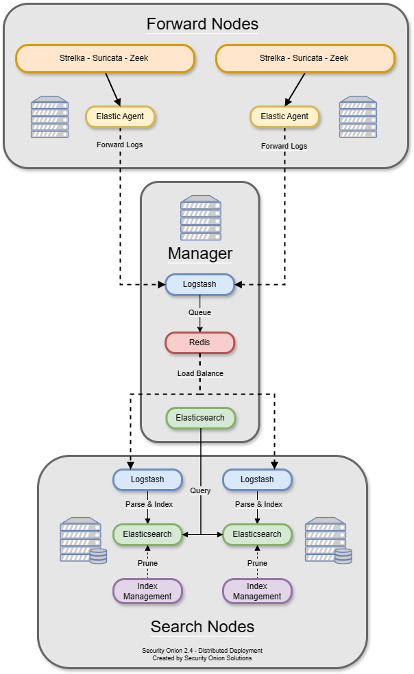
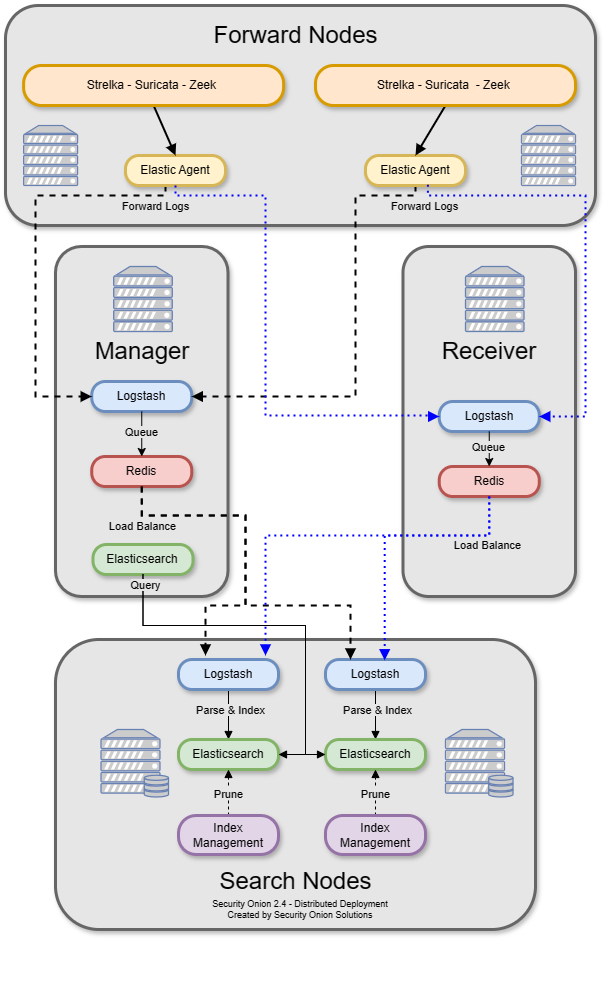
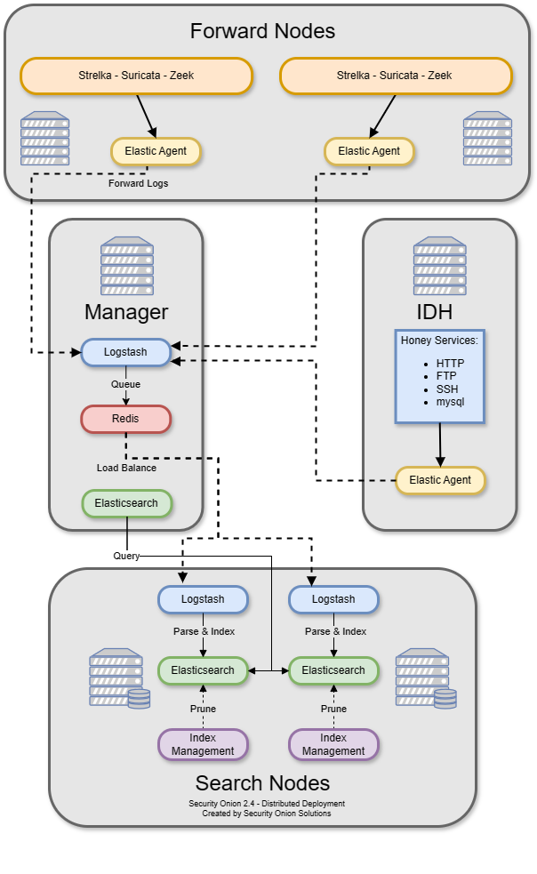
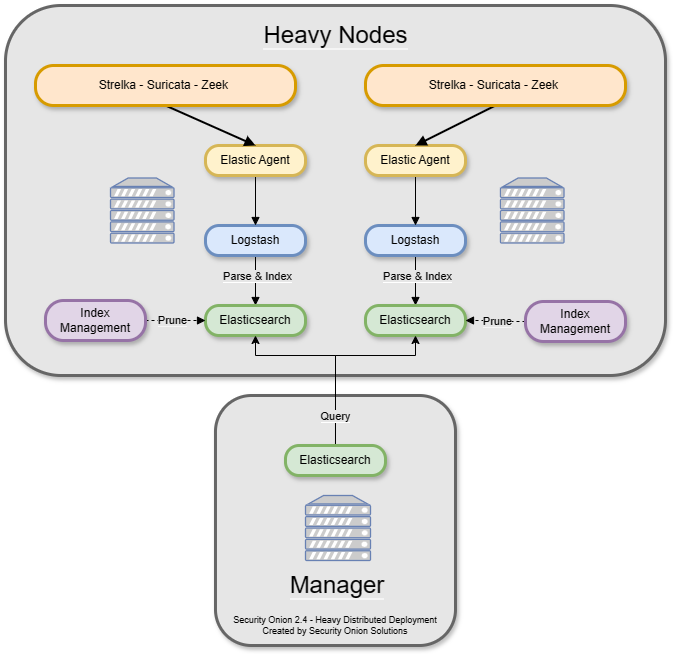

.. _architecture:

Architecture
============

If you're going to deploy Security Onion, you should first decide on what type of deployment you want. This could be anything from a temporary Import installation in a small virtual machine on your personal laptop all the way to a large scalable enterprise deployment consisting of a manager node, multiple search nodes, and lots of forward nodes. This section will discuss what those different deployment types look like from an architecture perspective.

Import
------

The simplest architecture is an ``Import`` node. An import node is a single standalone box that runs just enough components to be able to import pcap files using :ref:`so-import-pcap` or evtx files using :ref:`so-import-evtx`. You can then view those logs in :ref:`soc`.

Evaluation
----------
The next architecture is ``Evaluation``. It's a little more complicated than ``Import`` because it has a network interface dedicated to sniffing live traffic from a TAP or span port. Processes monitor the traffic on that sniffing interface and generate logs. :ref:`elastic-agent` collects those logs and sends them directly to :ref:`elasticsearch` where they are parsed and indexed. Evaluation mode is designed for a quick installation to temporarily test out Security Onion. It is **not** designed for production usage at all.

Standalone
----------
``Standalone`` is similar to ``Evaluation`` in that all components run on one box. However, instead of :ref:`elastic-agent` sending logs directly to :ref:`elasticsearch`, it sends them to :ref:`logstash`, which sends them to :ref:`redis` for queuing. A second Logstash pipeline pulls the logs out of :ref:`redis` and sends them to :ref:`elasticsearch`, where they are parsed and indexed.

This type of deployment is typically used for testing, labs, POCs, or **very** low-throughput environments. It's not as scalable as a distributed deployment.

Distributed
-----------

A standard distributed deployment includes a **manager node**, one or more **forward nodes** running network sensor components, and one or more **search nodes** running Elastic search components. This architecture may cost more upfront, but it provides for greater scalability and performance, as you can simply add more nodes to handle more traffic or log sources.

-  Recommended deployment type
-  Consists of a manager node, one or more forward nodes, and one or more search nodes

.. note::

	If you install a dedicated manager node, you must also deploy one or more search nodes. Otherwise, all logs will queue on the manager and have no place to be stored. If you are limited on the number of nodes you can deploy, you can install a **manager search** node so that your manager node can act as a search node and store those logs. However, please keep in mind that overall performance and scalability of a **manager search** node will be lower compared to our recommended architecture of dedicated manager node and separate search nodes.
	

Node Types
----------

Management
~~~~~~~~~~

The ``manager node`` runs :ref:`soc` and :ref:`kibana`. It has its own local instance of :ref:`elasticsearch`, but that's mainly used for storing :ref:`cases` data and central configuration. An analyst connects to the manager node from a client workstation (perhaps :ref:`desktop`) to execute queries and retrieve data. Please keep in mind that a dedicated manager node requires separate search nodes.

The manager node runs the following components:

-  :ref:`soc`
-  :ref:`elasticsearch`
-  :ref:`logstash`
-  :ref:`kibana`
-  :ref:`curator`
-  :ref:`elastalert`
-  :ref:`redis`

Search Node
~~~~~~~~~~~

Search nodes pull logs from the :ref:`redis` queue on the manager node and then parse and index those logs. When a user queries the manager node, the manager node then queries the search nodes, and they return search results.

Search Nodes run the following components:

-  :ref:`elasticsearch`
-  :ref:`logstash`
-  :ref:`curator`

Manager Search
~~~~~~~~~~~~~~

A ``manager search`` node is both a manager node and a search node at the same time. Since it is parsing, indexing, and searching data, it has higher hardware requirements than a normal manager node. 

A manager search node runs the following components:

-  :ref:`soc`
-  :ref:`elasticsearch`
-  :ref:`logstash`
-  :ref:`kibana`
-  :ref:`curator`
-  :ref:`elastalert`
-  :ref:`redis`

Forward Node
~~~~~~~~~~~~

A ``forward node`` is a sensor that forwards all logs via :ref:`elastic-agent` to :ref:`logstash` on the manager node, where they are stored in :ref:`elasticsearch` on the manager node or a search node (if the manager node has been configured to use a search node).

Forward nodes run the following components:

-  :ref:`zeek`
-  :ref:`suricata`
-  :ref:`stenographer`

Elastic Fleet Standalone Node
~~~~~~~~~~~~~~~~~~~~~~~~~~~~~

An Elastic Fleet Standalone Node is ideal when there are a large amount of Elastic endpoints deployed. It reduces the amount of overhead on the manager node by transferring the workload associated with managing endpoints to a dedicated system. It is also useful for off-network osquery endpoints that do not have remote access to the Manager node as it can be deployed to the DMZ and TCP/8090 made accessible to your off-network osquery endpoints.

Receiver Node
~~~~~~~~~~~~~

The Receiver Node runs :ref:`logstash` and :ref:`redis` and allows for events to continue to be processed by search nodes in the event the manager node is offline. When a receiver node joins the grid, :ref:`elastic-agent` on all nodes adds this new address as a load balanced :ref:`logstash` output. The search nodes add this new node as another :ref:`logstash` input. Receiver nodes are "active-active" and you can add as many as you want (within reason) and events will be balanced among them.

Intrusion Detection Honeypot (IDH) Node
~~~~~~~~~~~~~~~~~~~~~~~~~~~~~~~~~~~~~~~

The :ref:`idh` node mimics common services such as HTTP, FTP, and SSH. Any interaction with these fake services will automatically result in an alert.

Heavy Node
~~~~~~~~~~

There is also an option to have a **manager node** and one or more **heavy nodes**.

.. warning::

	Heavy nodes are NOT recommended for most users due to performance reasons, and should only be used for testing purposes or in low-throughput environments.

-  Recommended only if a standard distributed deployment is not possible
-  Consists of a manager node and one or more heavy nodes

.. note::

	Heavy nodes do not consume from the :ref:`redis` queue on the manager. This means that if you just have a manager and heavy nodes, then the :ref:`redis` queue on the manager will grow and never be drained. To avoid this, you have two options. If you are starting a new deployment, you can make your ``manager`` a ``manager search`` so that it will drain its own :ref:`redis` queue. Alternatively, if you have an existing deployment with a ``manager`` and want to avoid rebuilding, then you can add a separate search node (NOT heavy node) to consume from the :ref:`redis` queue on the manager.

Heavy nodes perform sensor duties and store their own logs in their own local Elasticsearch instance. This results in higher hardware requirements and lower performance. Heavy nodes do NOT pull logs from the redis queue on the manager like search nodes do.

Heavy Nodes run the following components:

-  :ref:`elasticsearch`
-  :ref:`logstash`
-  :ref:`curator`
-  :ref:`zeek`
-  :ref:`suricata`
-  :ref:`stenographer`
