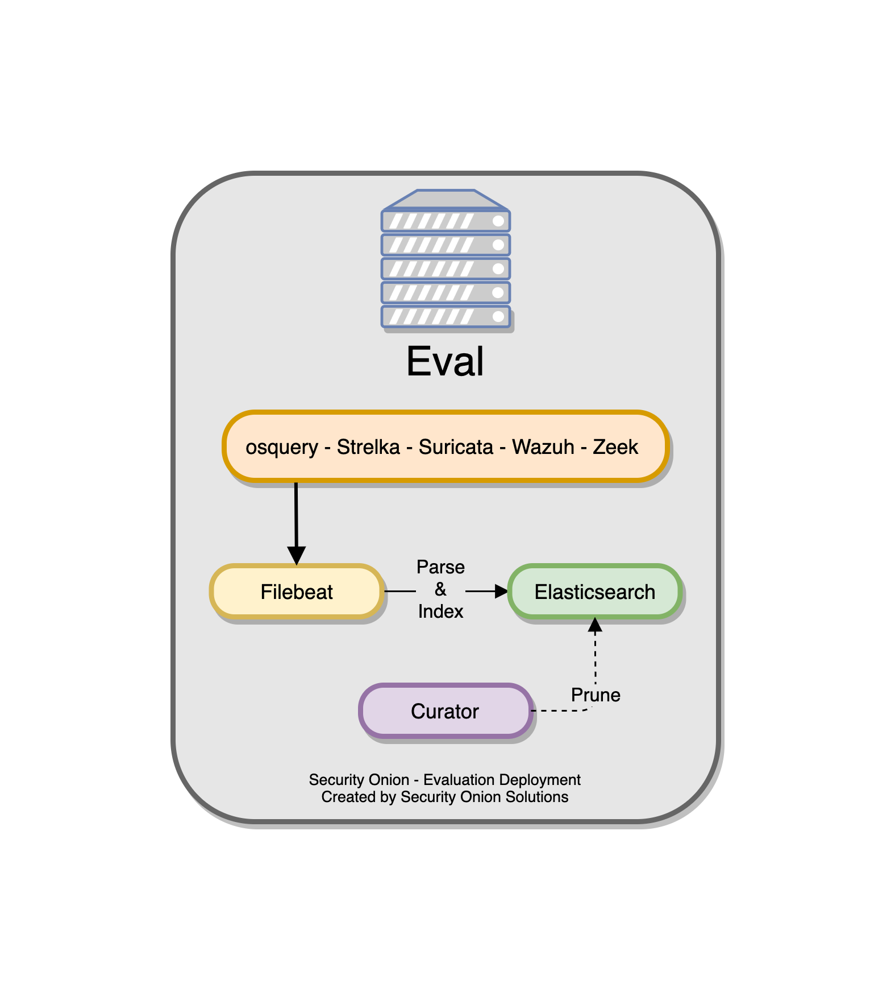
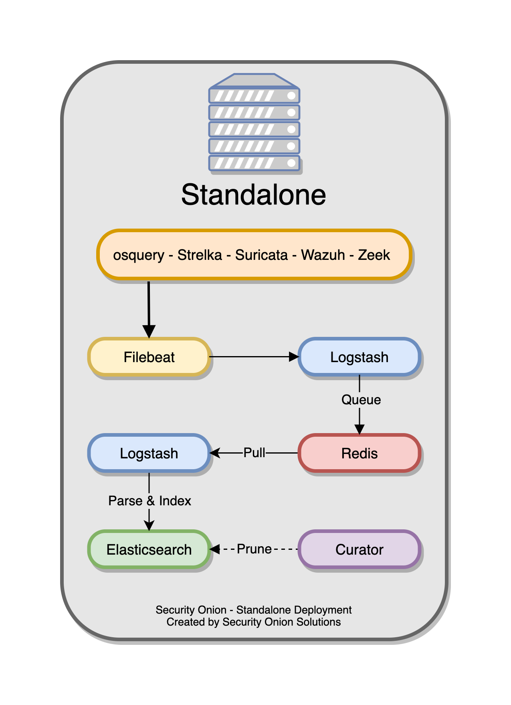
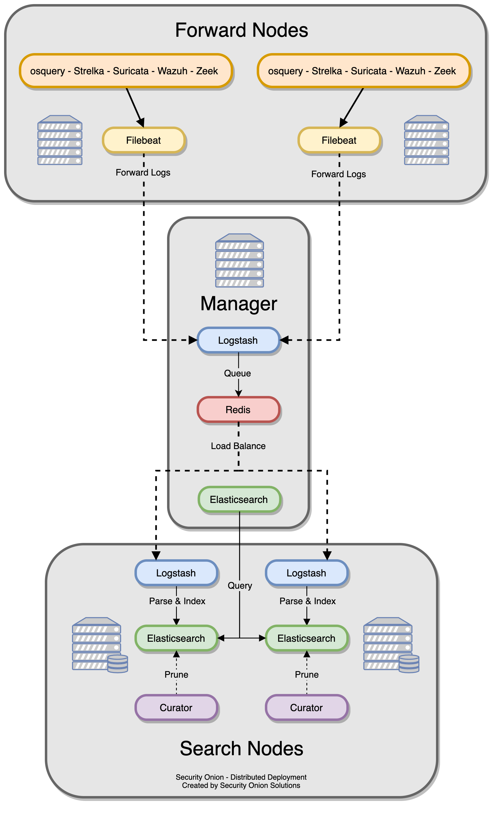
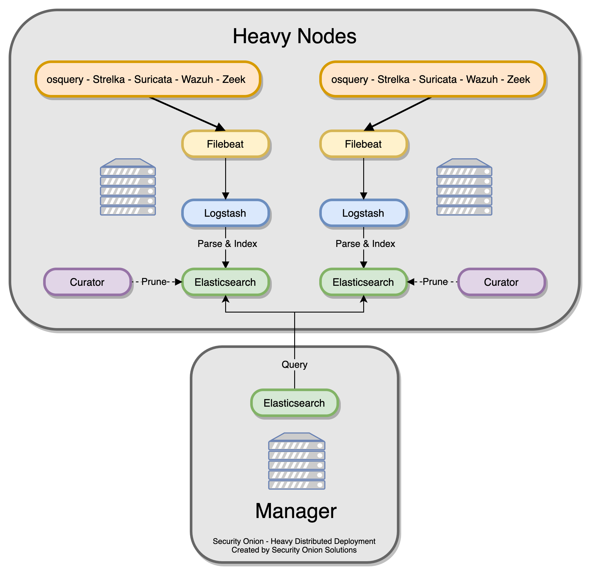

.. _architecture:

Architecture
============

If you're going to deploy Security Onion, you should first decide on what type of deployment you want. This could be anything from a temporary Evaluation installation in a small virtual machine on your personal laptop all the way to a large scalable enterprise deployment consisting of a manager node, multiple search nodes, and lots of forward nodes. This section will discuss what those different deployment types look like from an architecture perspective.

Import
------

The simplest architecture is an ``Import`` node. An import node is a single standalone box that runs just enough components to be able to import a pcap using :ref:`so-import-pcap`. When you run :ref:`so-import-pcap`, it analyzes the pcap using Suricata and Zeek and the resulting logs are picked up by :ref:`filebeat` and sent to :ref:`elasticsearch` where they are parsed and indexed. You can then view those logs in :ref:`soc`.

Evaluation
----------
The next architecture is ``Evaluation``. It's a little more complicated than ``Import`` because it has a network interface dedicated to sniffing live traffic from a TAP or span port. Processes monitor the traffic on that sniffing interface and generate logs. :ref:`filebeat` collects those logs and sends them directly to :ref:`elasticsearch` where they are parsed and indexed. Evaluation mode is designed for quick installations to temporarily test out Security Onion. It is **not** designed for production usage at all.

Standalone
----------
``Standalone`` is similar to ``Evaluation`` in that all components run on one box. However, instead of :ref:`filebeat` sending logs directly to :ref:`elasticsearch`, it sends them to :ref:`logstash`, which sends them to :ref:`redis` for queuing. A second Logstash pipeline pulls the logs out of :ref:`redis` and sends them to :ref:`elasticsearch`, where they are parsed and indexed.

This type of deployment is typically used for testing, labs, POCs, or **very** low-throughput environments. It's not as scalable as a distributed deployment.

Distributed
-----------

A standard distributed deployment includes a **manager node**, one or more **forward nodes** running network sensor components, and one or more **search nodes** running Elastic search components. This architecture may cost more upfront, but it provides for greater scalability and performance, as you can simply add more nodes to handle more traffic or log sources.

-  Recommended deployment type
-  Consists of a manager node, one or more forward nodes, and one or more search nodes.

There is the option to utilize only two node types -- the **manager node** and one or more **heavy nodes**, however, this is not recommended due to performance reasons, and should only be used for testing purposes or in low-throughput environments.

-  Recommended only if a standard distributed deployment is not possible.
-  Consists of a manager node and one or more heavy nodes.

Node Types
----------

Management
~~~~~~~~~~

The ``manager node`` runs its own local copy of Elasticsearch, which manages cross-cluster search configuration for the deployment. This includes configuration for ``heavy nodes`` and ``search nodes`` (where applicable), but not ``forward nodes``, as they do not run Elastic Stack components. An analyst connects to the server from a client workstation (typically a Security Onion virtual machine installation) to execute queries and retrieve data.

The manager node runs the following components:

-  :ref:`elasticsearch`
-  :ref:`logstash`
-  :ref:`kibana`
-  :ref:`curator`
-  :ref:`elastalert`
-  :ref:`redis`
-  :ref:`wazuh`

Forward Node
~~~~~~~~~~~~

A ``forward node`` is a sensor that forwards all logs via :ref:`filebeat` to :ref:`logstash` on the manager node, where they are stored in :ref:`elasticsearch` on the manager node or a search node (if the manager node has been configured to use a search node). From there, the data can be queried through the use of cross-cluster search.

Forward Nodes run the following components:

-  :ref:`zeek`
-  :ref:`suricata`
-  :ref:`stenographer`
-  :ref:`wazuh`

Search Node
~~~~~~~~~~~

When using a ``search node``, Security Onion implements distributed deployments using Elasticsearch's `cross cluster search <https://www.elastic.co/guide/en/elasticsearch/reference/current/modules-cross-cluster-search.html>`__. When you run Setup and choose ``Search Node``, it will create a local :ref:`elasticsearch` instance and then configure the manager node to query that instance. This is done by updating \_cluster/settings on the manager node so that it will query the local :ref:`elasticsearch` instance.

``Search nodes`` primarily collect logs from other nodes and store them for searching.

Search Nodes run the following components:

-  :ref:`elasticsearch`
-  :ref:`logstash`
-  :ref:`curator`
-  :ref:`wazuh`

Manager Search
~~~~~~~~~~~~~~

A ``manager search`` node is both a manager node and a search node at the same time. Since it is parsing, indexing, and searching data, it has higher hardware requirements than a normal manager node. 

A ``manager search`` node runs the following components:

-  :ref:`elasticsearch`
-  :ref:`logstash`
-  :ref:`kibana`
-  :ref:`curator`
-  :ref:`elastalert`
-  :ref:`redis`
-  :ref:`wazuh`

Heavy Node
~~~~~~~~~~

Similar to search nodes, heavy nodes extend the storage and processing capabilities of the manager node. However, heavy nodes also perform sensor duties and thus have lower performance overall.

Heavy Nodes run the following components:

-  :ref:`elasticsearch`
-  :ref:`logstash`
-  :ref:`curator`
-  :ref:`zeek`
-  :ref:`suricata`
-  :ref:`stenographer`
-  :ref:`wazuh`

Fleet Standalone Node
~~~~~~~~~~~~~~~~~~~~~

A Fleet Standalone Node is ideal when there are a large amount of osquery endpoints deployed. It reduces the amount of overhead on the manager node by transferring the workload associated with managing osquery endpoints to a dedicated system. It is also useful for off-network osquery endpoints that do not have  remote access to the Manager node as it can be deployed to the DMZ and TCP/8090 made accessible to your off-network osquery endpoints.

If the Manager Node was originally setup with Fleet, your grid will automatically switch over to using the Fleet Standalone Node instead as a grid can only have one Fleet instance active at a time.

Fleet Standalone Nodes run the following components:

-  :ref:`fleet`
