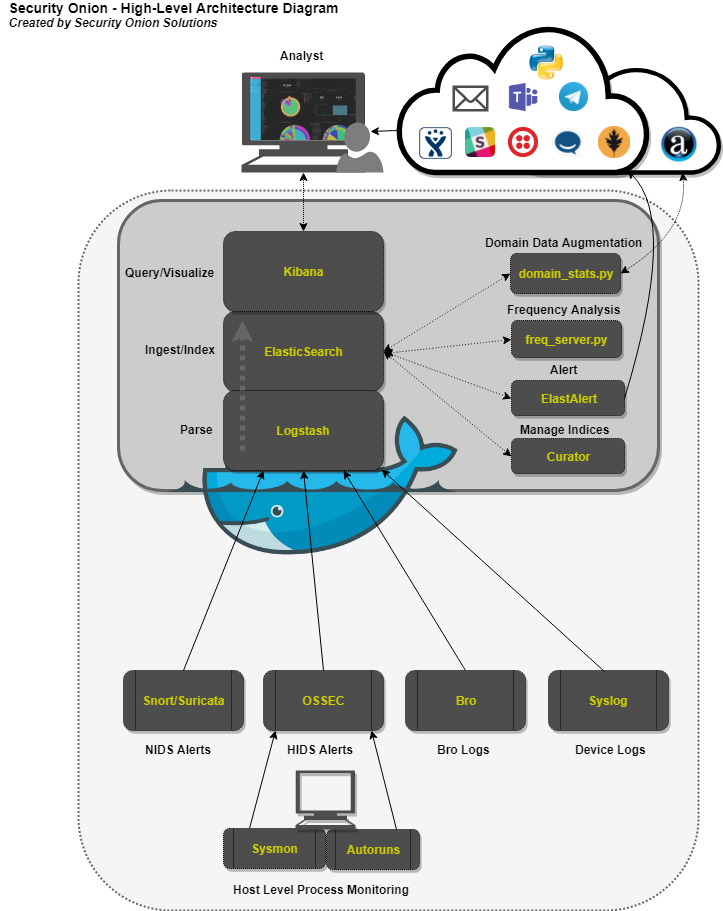
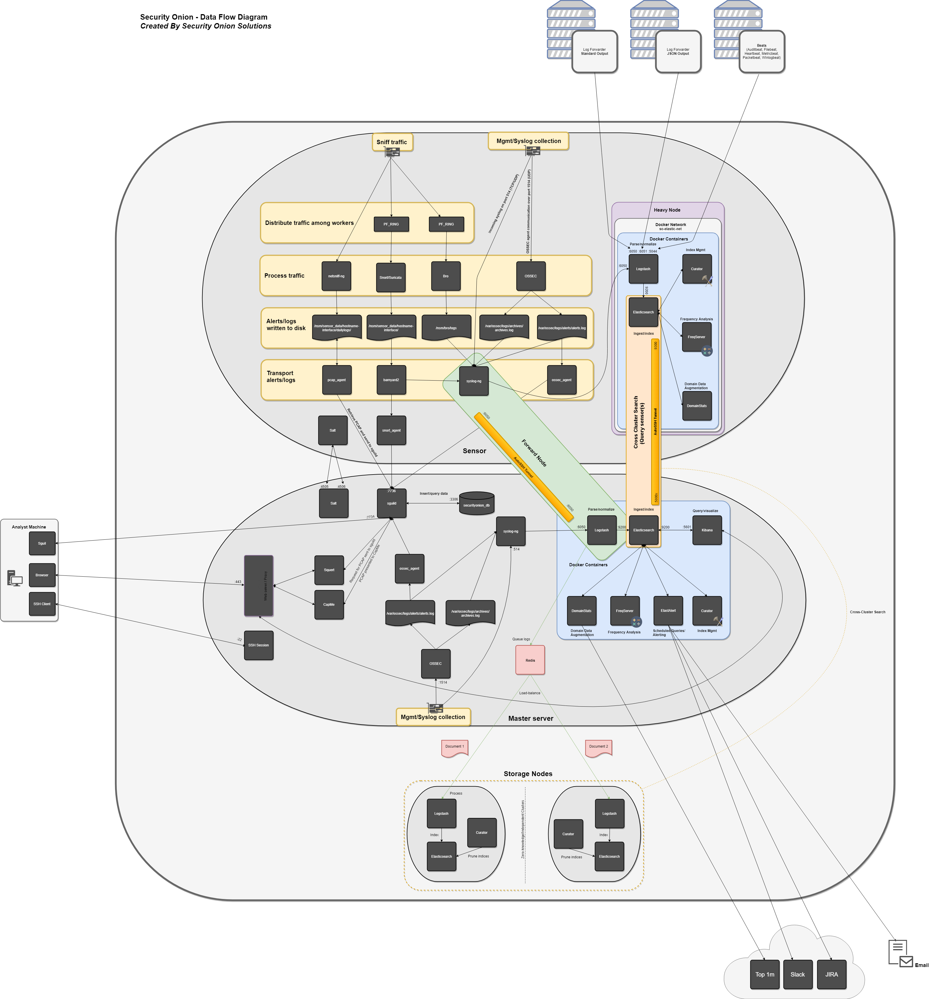
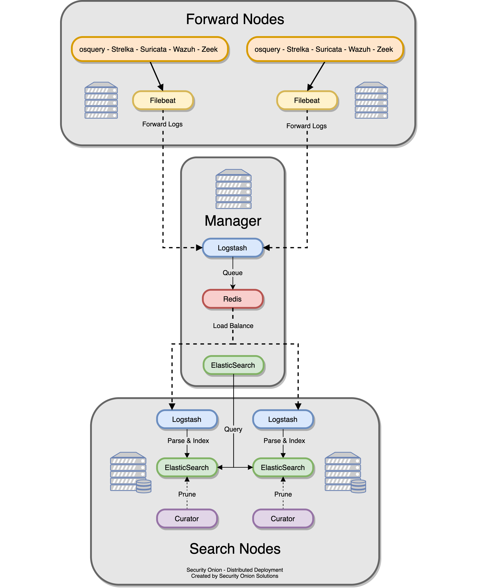
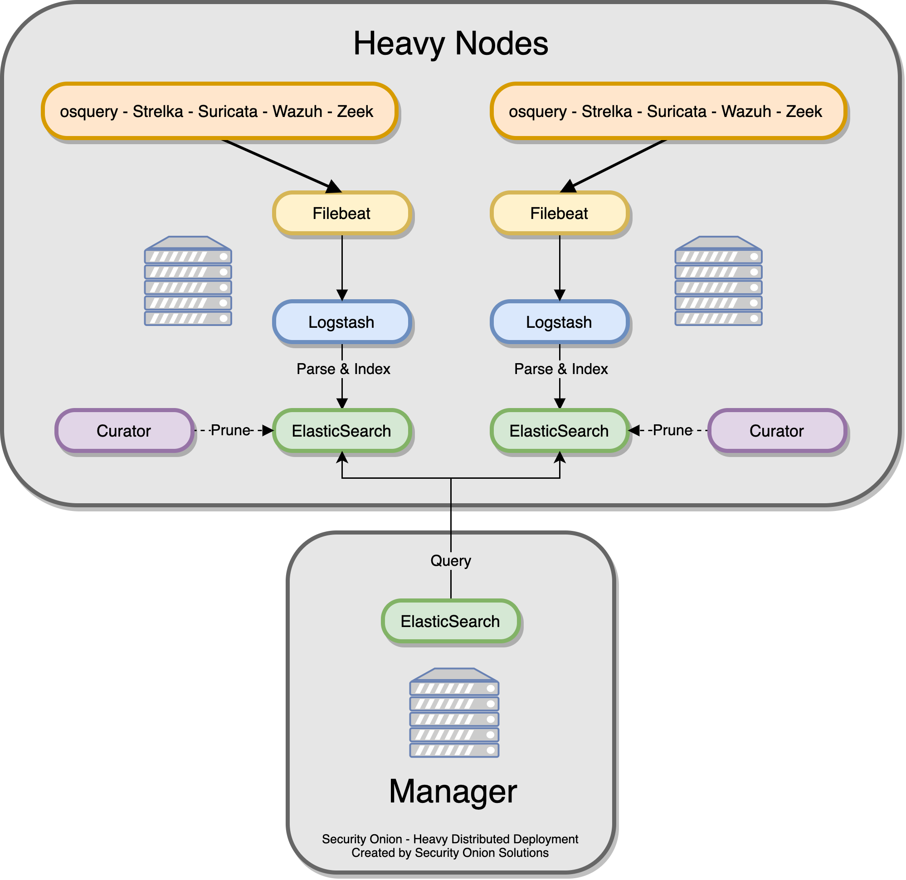
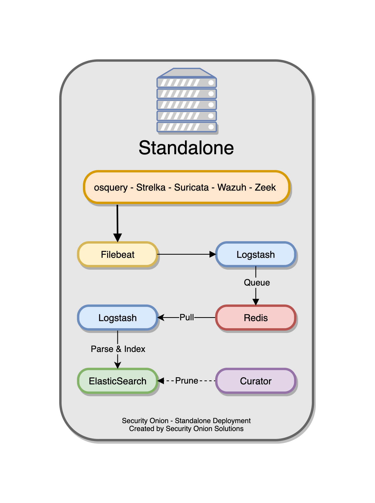

.. _architecture:

Architecture
============

Below are several diagrams to represent the current architecture and deployment scenarios for Security Onion and the Elastic Stack.

High-Level Architecture Diagram
-------------------------------

Core Components
---------------

:ref:`logstash`
  - Parse and format logs.
:ref:`elasticsearch`
  - Ingest and index logs.
:ref:`kibana`
  - Visualize ingested log data.

Auxilliary Components
---------------------

:ref:`curator`
  - Manage indices through scheduled maintenance.
:ref:`elastalert`
  - Query Elasticsearch and alert on user-defined anomalous behavior or other interesting bits of information.
:ref:`freqserver`
  -Detect DGAs and find random file names, script names, process names, service names, workstation names, TLS certificate subjects and issuer subjects, etc.
:ref:`domainstats`
  - Get additional info about a domain by providing additional context, such as creation time, age, reputation, etc.

Detailed Data Flow Diagram
--------------------------

If you're viewing the online version of this documentation, you can click the image to zoom in.

Deployment Types
----------------

Security Onion is built on a modified distributed client-server model. In the past, Security Onion relied solely on the use of a “sensor” (the client) and a Security Onion “server” (the server). With the inclusion of the Elastic Stack, the distributed architecture has since changed, and now includes the use of Elastic components and separate nodes for processing and storing Elastic stack data.

This means that a standard distributed deployment is now comprised of the **manager node**, one or more **forward nodes** (previously called a sensor -- runs sensor components), and one or more **search nodes** (runs Elastic components). This architecture is ideal; while it may cost more upfront, this architecture provides for greater scalability and performance down the line, as one can simply "snap in" new search nodes to handle more traffic or log sources.

There is the option to utilize only two node types -- the **manager node** and one or more **heavy nodes**, however, this is not recommended due to performance reasons, and should only be used for testing purposes or in low-throughput environments.

Last, similar to before, users can run a **standalone**, which combines the functions of a **manager node**, **forward node**, and **search node**. The same caveats with performance apply here. This type of deployment is typically used for testing, labs, POCs, or **very** low-throughput environments.

More detail about each deployment and node type can be found below.

Distributed
~~~~~~~~~~~

-  Recommended deployment type
-  Consists of a manager node, one or more forward nodes, and one or more search nodes.

Heavy Distributed
~~~~~~~~~~~~~~~~~

-  Recommended only if a standard distributed deployment is not possible.
-  Consists of a manager node, and one or more heavy nodes.

Standalone
~~~~~~~~~~

-  Not recommended for monitoring high-throughput links
-  Consists of a single server running manager node components, sensor, and Elastic stack components.

Node Types
----------

Management
~~~~~~~~~~

The ``manager node`` runs it's own local copy of Elasticsearch, which manages cross-cluster search configuration for the deployment. This includes configuration for ``heavy nodes`` and ``search nodes`` (where applicable), but not ``forward nodes``, as they do not run Elastic Stack components. An analyst connects to the server from a client workstation (typically a Security Onion virtual machine installation) to execute queries and retrieve data.

The manager node runs the following components:

-  Elasticsearch
-  Logstash
-  Kibana
-  Curator
-  Elastalert
-  Redis (Only if configured to output to a search node)
-  Wazuh

Forward Node
~~~~~~~~~~~~

When using a ``forward node``, Elastic Stack components are not installed. Syslog-ng forwards all logs to Logstash on the manager node via an autossh tunnel, where they are stored in Elasticsearch on the manager node, or forwarded to search node's Elasticsearch instance (if the manager node has been configured to use a search node). From there, the data can be queried through the use of cross-cluster search.

Forward Nodes run the following components:

-  Zeek (formerly Bro)
-  Suricata
-  Stenographer
-  Wazuh

Heavy Node
~~~~~~~~~~

When using a ``heavy node``, Security Onion implements distributed deployments using Elasticsearch's `cross cluster search <https://www.elastic.co/guide/en/elasticsearch/reference/current/modules-cross-cluster-search.html>`__. When you run Setup and choose ``Heavy Node``, it will create a local Elasticsearch instance and then configure the manager node to query that instance. This is done by updating \_cluster/settings on the manager node so that it will query the local Elasticsearch instance.

Heavy Nodes run the following components:

-  Elasticsearch
-  Logstash
-  Curator
-  Zeek
-  Suricata
-  Stenographer
-  Wazuh

Search Node
~~~~~~~~~~~

``Search nodes`` extend the storage and processing capabilities of the manager node. Just like heavy nodes, search nodes are added to the manager node's cluster search configuration, so the data that resides on the nodes can be queried from the manager node.

Search Nodes run the following components:

-  Elasticsearch
-  Logstash
-  Curator
-  Wazuh
