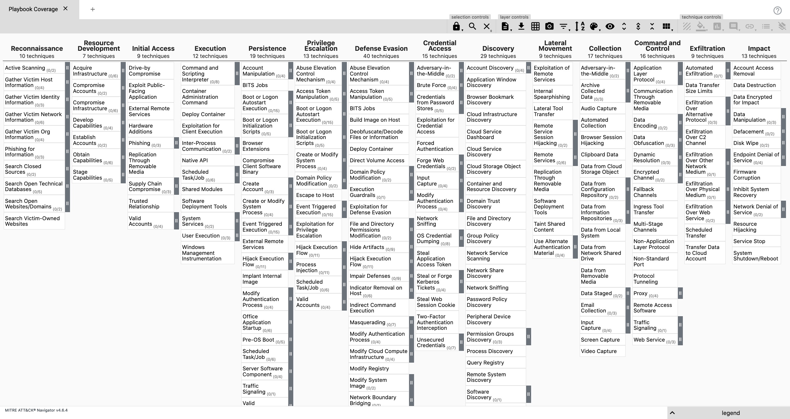

.. _attack-navigator:

ATT&CK Navigator
================

From https://github.com/mitre-attack/attack-navigator:

    The ATT&CK Navigator is designed to provide basic navigation and annotation of ATT&CK matrices, something that people are already doing today in tools like Excel. We've designed it to be simple and generic - you can use the Navigator to visualize your defensive coverage, your red/blue team planning, the frequency of detected techniques or anything else you want to do. The Navigator doesn't care - it just allows you to manipulate the cells in the matrix (color coding, adding a comment, assigning a numerical value, etc.). We thought having a simple tool that everyone could use to visualize the matrix would help make it easy to use ATT&CK.

    The principal feature of the Navigator is the ability for users to define layers - custom views of the ATT&CK knowledge base - e.g. showing just those techniques for a particular platform or highlighting techniques a specific adversary has been known to use. Layers can be created interactively within the Navigator or generated programmatically and then visualized via the Navigator.
    
Accessing
---------

To access Navigator, log into :ref:`soc` and then click the Navigator hyperlink on the left side.

Default Layer - Playbook
------------------------
The default layer is titled ``Playbook`` and is automatically updated when a Play from :ref:`playbook` is made active/inactive. This allows you to see your Detection Playbook coverage across the ATT&CK framework.

Right-clicking any Technique and selecting ``View Related Plays`` will open Playbook with a pre-filtered view of any plays that are tagged with the selected Technique.

Configuration
-------------
Navigator reads its configuration from ``/opt/so/conf/navigator/``. However, please keep in mind that if you make any changes here they may be overwritten since the config is managed with :ref:`salt`.

More Information
----------------

.. note::

    | For more information about ATT&CK Navigator, please see:
    | https://github.com/mitre-attack/attack-navigator
