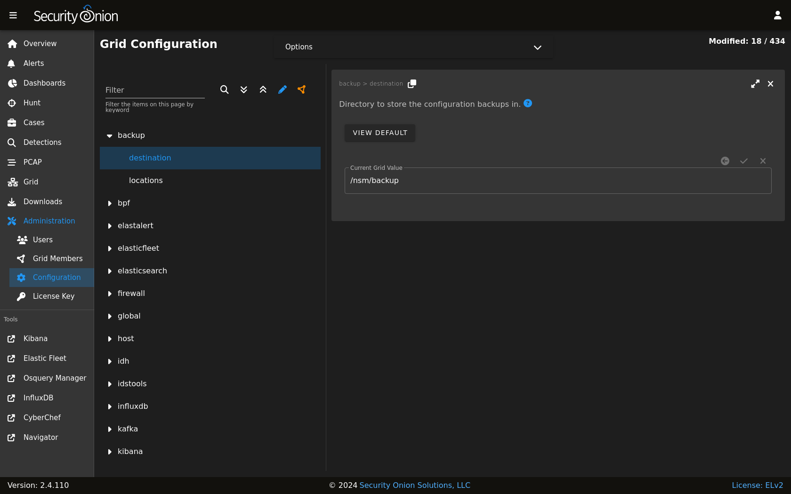

.. _backup:

Backup
======

Security Onion performs a daily backup of some critical files so that you can recover your grid from a catastophic failure of the manager. Daily backups create a tar file located in the ``/nsm/backup/`` directory located on the manager. You may want to replicate this backup directory to a location outside of your manager in case the manager ever needs to be rebuilt.

Here is what gets backed up automatically:

- ``/etc/pki/`` - All of the certs including the CA are backed up. Restoring this would allow you to communicate with your salt minions again.
- ``/opt/so/saltstack/local/`` - This includes all customizations done via :ref:`administration` --> Configuration. 

You can configure backups by going to :ref:`administration` --> Configuration --> backup. 

Elasticsearch
-------------

:ref:`elasticsearch` data is not automatically backed up. This includes things that may be important to you like :ref:`kibana` customizations and :ref:`cases` data. :ref:`kibana` customizations are located in the ``.kibana`` indices and  :ref:`cases` data is stored in the ``so-case`` and ``so-casehistory`` indices. If you have a distributed deployment with :ref:`elasticsearch` clustering, then you can enable replicas to have redundancy in case of a single node failure. Of course, please keep in mind that enabling replicas doubles your storage needs.

Another option is to use :ref:`elasticsearch`'s built-in support for snapshots:
https://www.elastic.co/guide/en/elasticsearch/reference/current/snapshot-restore.html

This option requires that you configure :ref:`elasticsearch` with a ``path.repo`` setting where it can store the snapshots. Once :ref:`elasticsearch` has the ``path.repo`` setting, you should be able to log into :ref:`kibana` and configure snapshots as shown in the link above. Those snapshots will then be accessible in ``/nsm/elasticsearch/repo/``.
