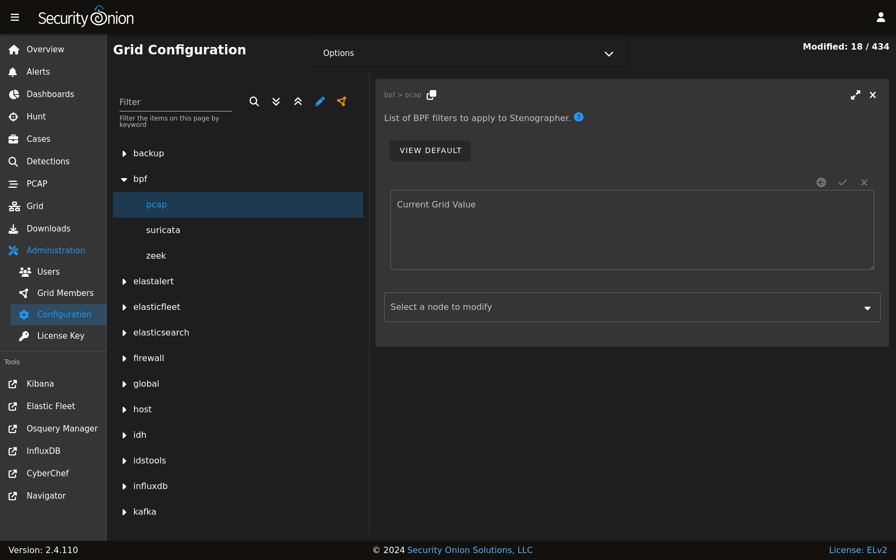

.. _bpf:

BPF
===

BPF stands for Berkeley Packet Filter. From https://en.wikipedia.org/wiki/Berkeley_Packet_Filter:

   BPF supports filtering packets, allowing a userspace process to supply a filter program that specifies which packets it wants to receive. For example, a tcpdump process may want to receive only packets that initiate a TCP connection. BPF returns only packets that pass the filter that the process supplies. This avoids copying unwanted packets from the operating system kernel to the process, greatly improving performance.

Configuration
-------------

You can modify your BPF configuration by going to :ref:`administration` --> Configuration --> bpf. You can apply BPF configuration to :ref:`stenographer`, :ref:`suricata`, or :ref:`zeek`.

Multiple Conditions
~~~~~~~~~~~~~~~~~~~

If your BPF contains multiple conditions you can join them with a logical ``and`` or logical ``or``.

Here's an example of joining conditions with a logical ``and``:

::
    
    not host 192.168.1.2 and not host 192.168.1.3
      
Here's an example of joining conditions with a logical ``or``:

::

    host 192.168.1.2 or host 192.168.1.3

VLAN
~~~~

If you have traffic that has VLAN tags, you can craft a BPF as follows:

::

    <your filter> or (vlan and <your filter>)

Notice that you must include your filter on both sides of the vlan tag.

For example:

::

    (not (host 192.168.1.2 or host 192.168.1.3 or host 192.168.1.4)) or (vlan and (not (host 192.168.1.2 or host 192.168.1.3 or host 192.168.1.4)))

.. warning::

   | Please note that :ref:`stenographer` should correctly record traffic on a VLAN but won't log the actual VLAN tags due to the way that :ref:`af-packet` works:
   | https://github.com/google/stenographer/issues/211

Adding Comments
~~~~~~~~~~~~~~~

To provide more context to your filters, you can add comments. For example:

::

   # lab-east
   not host 192.168.1.2 and not host 192.168.1.3 &&
   # lab-west
   not host 192.168.1.4 or not host 192.168.1.5 &&
   # lab-central
   not host 192.168.1.6 or not host 192.168.1.27

Troubleshooting BPF using tcpdump
~~~~~~~~~~~~~~~~~~~~~~~~~~~~~~~~~

| If you need to troubleshoot BPF, you can use ``tcpdump`` as shown in the following articles:
| https://taosecurity.blogspot.com/2004/09/understanding-tcpdumps-d-option-have.html
| https://taosecurity.blogspot.com/2004/12/understanding-tcpdumps-d-option-part-2.html
| https://taosecurity.blogspot.com/2008/12/bpf-for-ip-or-vlan-traffic.html

More Information
----------------

.. note::

   | For more information about BPF, please see:
   | https://en.wikipedia.org/wiki/Berkeley_Packet_Filter
   | https://biot.com/capstats/bpf.html
