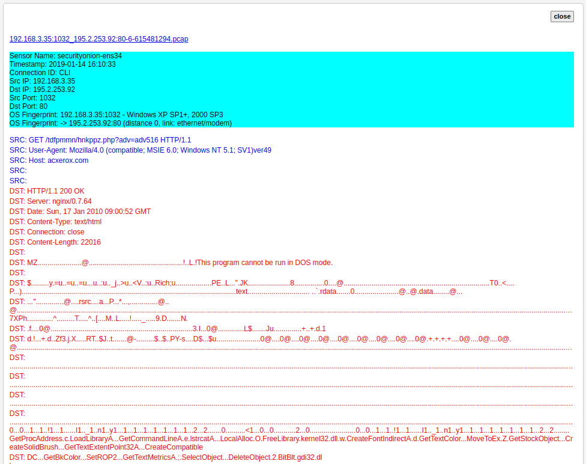

CapME
=====

CapME is a web interface that allows you to:

-  view a pcap transcript rendered with tcpflow
-  view a pcap transcript rendered with `Bro <Bro>`__ (especially
   helpful for dealing with gzip encoding)
-  download a pcap

Screenshot
----------

Accessing
---------

You can pivot to CapME from a NIDS alert in `Squert <Squert>`__ or from
any log in `Kibana <Kibana>`__ that has timestamp, source IP, source
port, destination IP, and destination port.

Logging In
----------

When prompted for username/password, simply enter your normal
Sguil/Squert/Kibana username/password.
