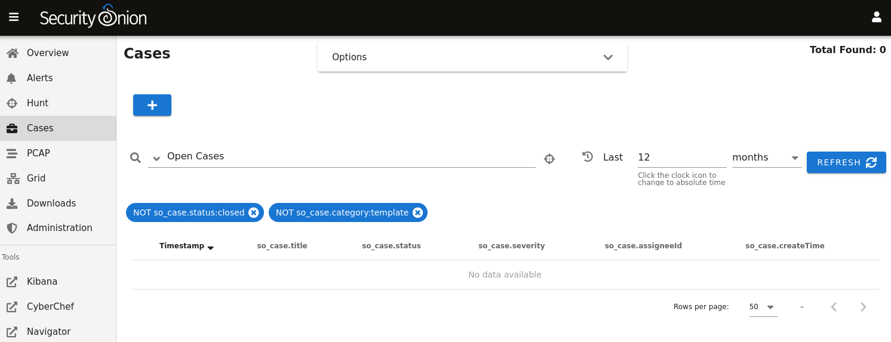
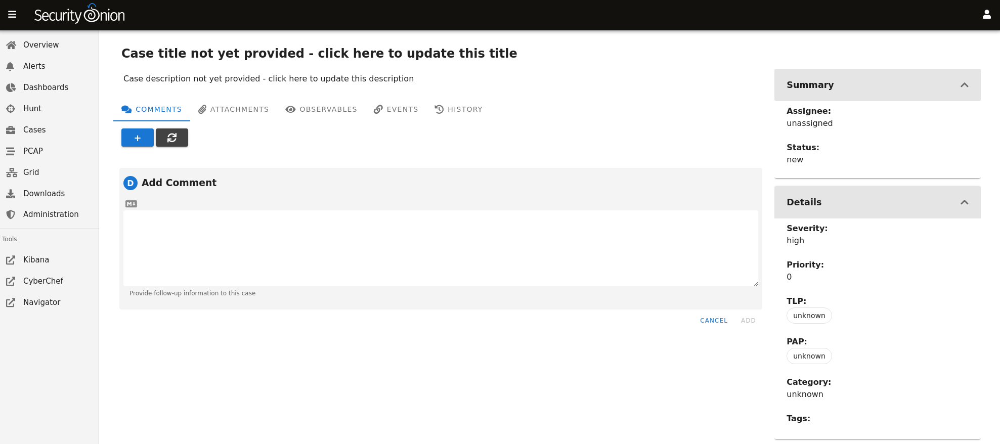
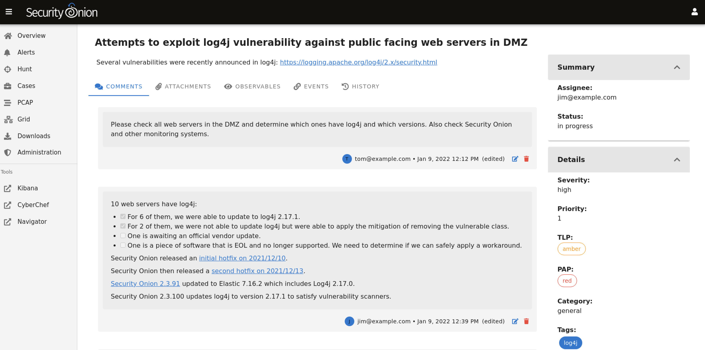
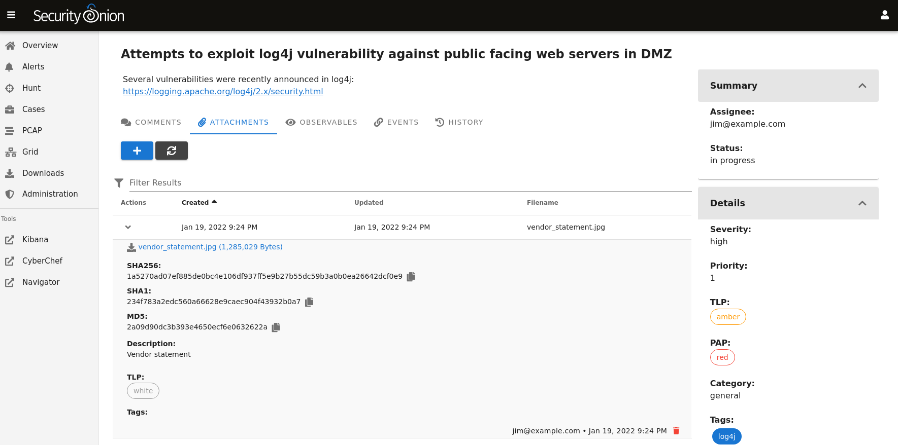
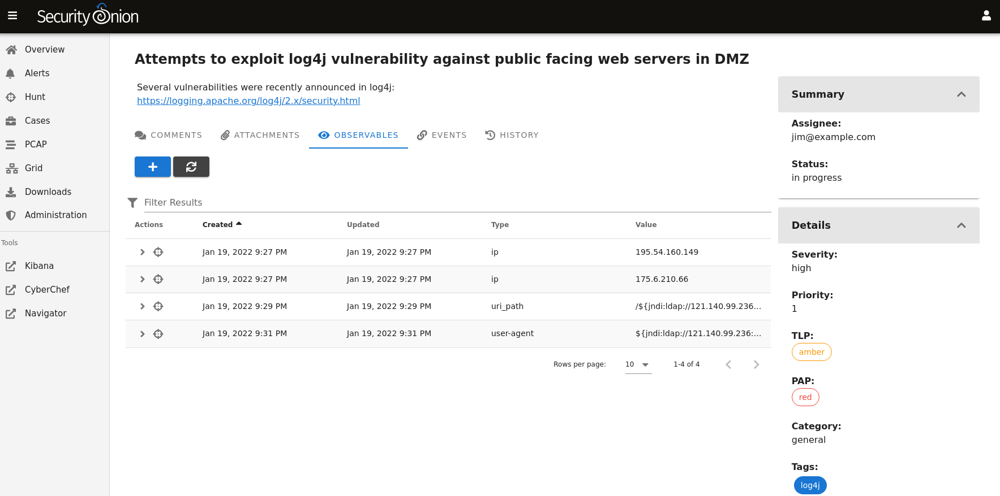
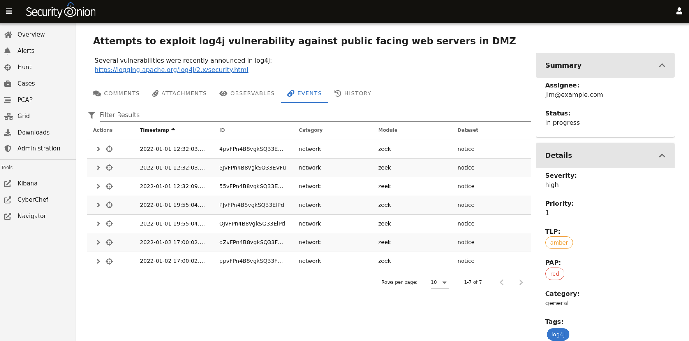
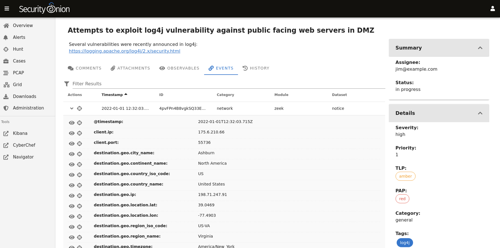
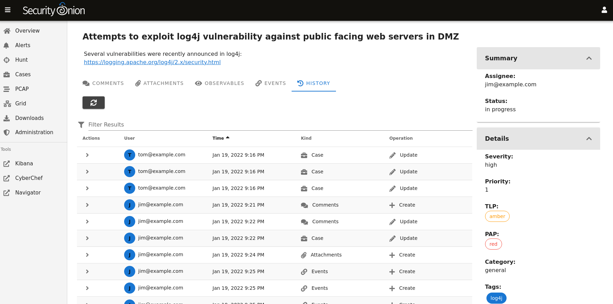

.. _cases:

Cases
=====

Starting in Security Onion 2.3.100, we have a new Cases interface for case management. It allows you to escalate logs from :ref:`alerts`, :ref:`dashboards`, and :ref:`hunt`, and then assign analysts, add comments and attachments, and track observables. Check out our Cases video at https://youtu.be/y_kr_hrtqVc!

Installation
------------

Cases is a part of :ref:`soc`. It's automatically enabled when doing an Import, Eval, Standalone, Manager, or ManagerSearch installation. If you want the quickest and easiest way to try out Cases, you can follow our :ref:`first-time-users` guide to install a minimal Import installation.

Creating a New Case
-------------------

On a new deployment, Cases will be empty until you create a new case.

To create a new case, click the + icon and then fill out the Title and Description and optionally the fields on the right side including Assignee, Status, Severity, Priority, TLP, PAP, Category, and Tags. Clicking the fields on the right side reveals drop-down boxes with standard options.

Alternatively, if you find events of interest in :ref:`alerts` or :ref:`hunt`, you can escalate directly to Cases using the escalate button (blue triangle with exclamation point). Clicking the escalate button will escalate the data from the row as it is displayed. This means that if you're looking at an aggregated view, you will get limited details in the resulting escalated case. If you want more details to be included in the case, then first drill into the aggregation and escalate one of the individual items in that aggregation.

.. image:: https://user-images.githubusercontent.com/1659467/95380455-c9572880-08b4-11eb-8821-cee23b97d85e.png
  :target: https://user-images.githubusercontent.com/1659467/95380455-c9572880-08b4-11eb-8821-cee23b97d85e.png

Once you click the escalate button, you can choose to escalate to a new case or an existing case. 

.. image:: images/cases-escalate.png
  :target: _images/cases-escalate.png
  
Comments
--------

On the Comments tab, you can add comments about the case. The Comments field uses markdown syntax and you can read more about that at https://www.markdownguide.org/cheat-sheet/.

Attachments
-----------

On the Attachments tab, you can upload attachments. For each attachment, you can optionally define TLP and add tags. Cases will automatically generate SHA256, SHA1, and MD5 hash values for each attachment. Buttons next to the hash values allow you to copy the value or add it as an observable.

Observables
-----------

On the Observables tab, you can track observables like IP addresses, domain names, hashes, etc. You can add observables directly on this tab or you can add them from the Events tab as well.

For each observable, you can click the icon on the far left of the row to drill into the observable and see more information about it. To the right of that is the the hunt icon which will start a new hunt for the observable.

Events
------

On the Events tab, you can see any events that have been escalated to the case. This could be :ref:`suricata` alerts, network metadata from :ref:`suricata` or :ref:`zeek`, or endpoint logs. 

For each event, you can click the icon on the far left of the row to drill in and see all the fields included in that event.

If you find something that you would like to track as an Observable, you can click the eye icon on the far left of the row to add it to the Observables tab. It will attempt to automatically identify well known data types such as IP addresses.

To the right of the eye icon is a Hunt icon that can be used to start a new hunt for that particular value.

History
-------

On the History tab, you can see the history of the case itself, including any changes made by each user. For each row of history, you can click the icon on the far left of the row to drill in and see more information.

Overview Page
-------------

Once you have one or more cases, you can use the main Cases page to get an overview of all cases. 

.. image:: images/cases.png
  :target: _images/cases.png

Options
-------

Starting at the top of the main Cases page, the Options drop-down menu allows you to set options such as Automatic Refresh Interval and Time Zone.

Query Bar
---------

The query bar defaults to Open Cases. Clicking the dropdown box reveals other options such as Closed Cases, My Open Cases, My Closed Cases, and Templates. If you want to send your current query to Hunt, you can click the crosshair icon to the right of the query bar.

Under the query bar, you’ll notice colored bubbles that represent the individual components of the query and the fields to group by. If you want to remove part of the query, you can click the X in the corresponding bubble to remove it and run a new search.

Time Picker
-----------

The time picker is to the right of the query bar. By default, Cases searches the last 12 months. If you want to search a different time frame, you can change it here.

Data Table
----------

The remainder of the main Cases page is a data table that shows a high level overview of the cases matching the current search criteria.

- Clicking the table headers allows you to sort ascending or descending.

- Clicking a value in the table brings up a context menu of actions for that value. This allows you to refine your existing search, start a new search, or even pivot to external sites like Google and VirusTotal.

- You can adjust the Rows per page setting in the bottom right and use the left and right arrow icons to page through the table.

- When you click the arrow to expand a row in the data table, it will show the high level fields from that case. Field names are shown on the left and field values on the right. When looking at the field names, there is an icon to the left that will add that field to the ``groupby`` section of your query. You can click on values on the right to bring up the context menu to refine your search.

- To the right of the arrow is a binoculars icon. Clicking this will display the full case including the Comments, Attachments, Observables, Events, and History tabs.

Data
----

Cases data is stored in :ref:`elasticsearch`. You can view it in :ref:`hunt` by clicking the Options menu and disabling the ``Exclude case data`` option. You can then search the ``so-case`` index with the following query:

::

	_index:"*:so-case"

You can also use this query in :ref:`kibana`.
