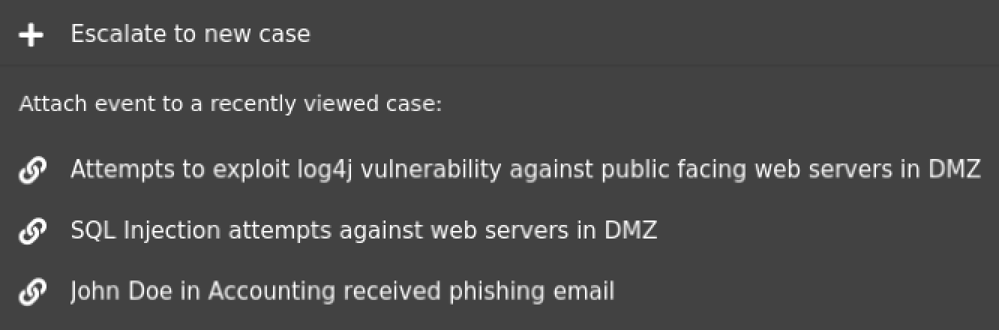

.. _cases:

Cases
=====

Starting in Security Onion 2.3.100, we have a new Cases interface for case management. It allows you to manage your cases from start to finish including escalating logs from Alerts and Hunts, assigning analysts, commenting, adding attachments, and tracking observables.

.. image:: images/cases.png
  :target: _images/cases.png

You can create a new case by going to Cases and clicking the + icon. Alernatively, you can go to Alerts or Hunt, find an event of interest, and escalate to a new case or an existing case.

From the main Cases page, you can drill into a case by clicking the binoculaurs icon. This detail view shows you more information about the case including Comments, Attachments, Observables, Events, and History.

Comments
--------

On the Comments tab, users can add comments about the case. The Comments field uses Github flavored markdown.

.. image:: images/cases-comments.png
  :target: _images/cases-comments.png

Attachments
-----------

On the Attachments tab, you can upload attachments. 

.. image:: images/cases-attachments.png
  :target: _images/cases-attachments.png

Observables
-----------

On the Observables tab, you can track observables like IP addresses, domain names, hashes, etc.

.. image:: images/cases-observables.png
  :target: _images/cases-observables.png

Events
------

On the Events tab, you can see any events that have been escalated to the case.

.. image:: images/cases-events.png
  :target: _images/cases-events.png

History
-------

On the History tab, you can see the history of the case itself, including any changes made by each user.

.. image:: images/cases-history.png
  :target: _images/cases-history.png
