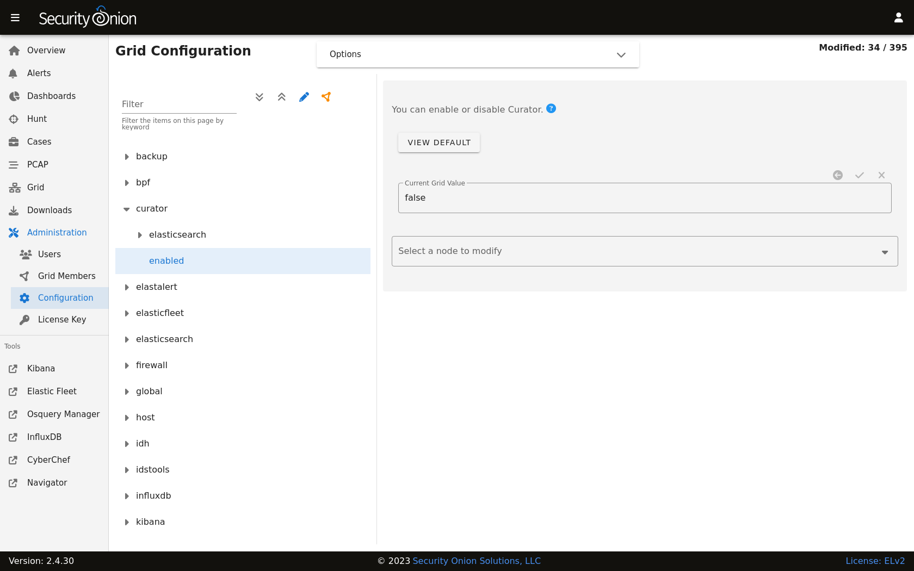

.. _curator:

Curator
=======

From https://www.elastic.co/guide/en/elasticsearch/client/curator/current/about.html#about:

    Elasticsearch Curator helps you curate, or manage, your Elasticsearch indices and snapshots by:

    #. Obtaining the full list of indices (or snapshots) from the cluster, as the actionable list
    #. Iterate through a list of user-defined filters to progressively remove indices (or snapshots) from this actionable list as needed.
    #. Perform various actions on the items which remain in the actionable list.

Configuration
-------------

Curator defaults to closing indices older than 30 days. Curator also deletes old indices to prevent your disk from filling up.

Curator configuration can be found by going to :ref:`administration` --> Configuration --> curator.

For more information about the Curator close and delete settings, please see the :ref:`elasticsearch` section.

Diagnostic Logging
------------------

When Curator completes an action, it logs its activity in a log file found in ``/opt/so/log/curator/``. Depending on what you’re looking for, you may also need to look at the :ref:`docker` logs for the container:

::

        sudo docker logs so-curator

More Information
----------------

.. note::

    | For more information about Curator, please see:
    | https://www.elastic.co/guide/en/elasticsearch/client/curator/current/about.html#about
