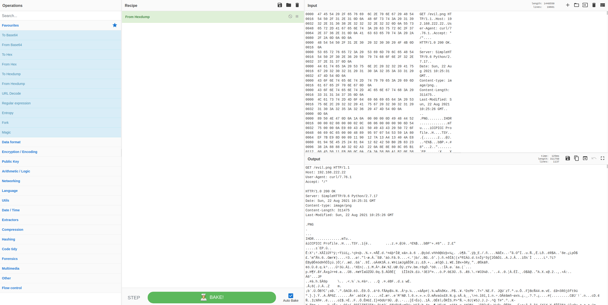
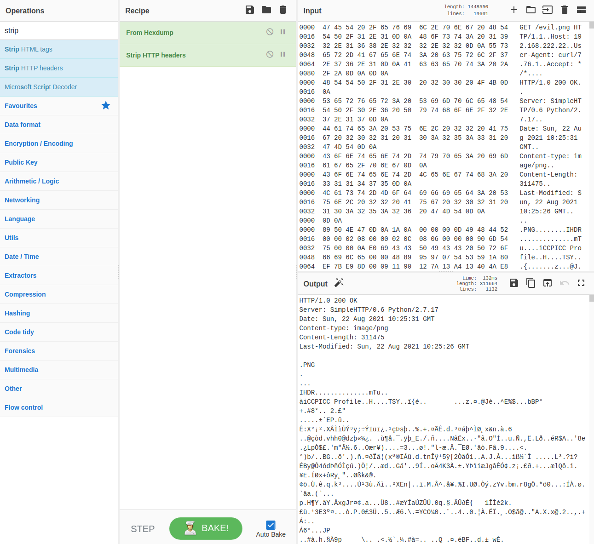
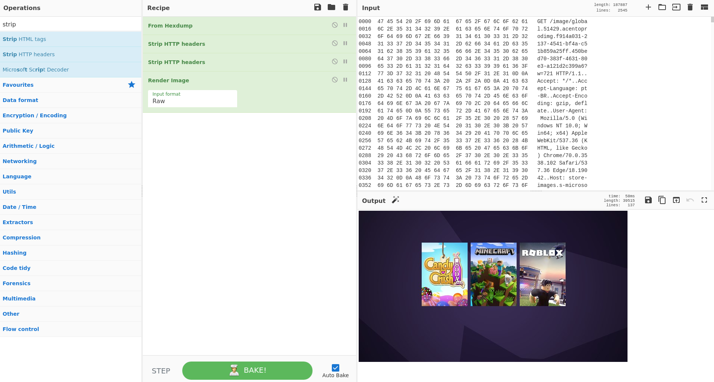

.. _cyberchef:

CyberChef
=========

From https://github.com/gchq/CyberChef :

    The Cyber Swiss Army Knife
    
    CyberChef is a simple, intuitive web app for carrying out all manner of "cyber" operations within a web browser. These operations include simple encoding like XOR or Base64, more complex encryption like AES, DES and Blowfish, creating binary and hexdumps, compression and decompression of data, calculating hashes and checksums, IPv6 and X.509 parsing, changing character encodings, and much more.

    The tool is designed to enable both technical and non-technical analysts to manipulate data in complex ways without having to deal with complex tools or algorithms.
    
    There are four main areas in CyberChef:

    1. The input box in the top right, where you can paste, type or drag the text or file you want to operate on.
    2. The output box in the bottom right, where the outcome of your processing will be displayed.
    3. The operations list on the far left, where you can find all the operations that CyberChef is capable of in categorised lists, or by searching.
    4. The recipe area in the middle, where you can drag the operations that you want to use and specify arguments and options.

Screenshot
----------

.. image:: images/cyberchef.png
  :target: _images/cyberchef.png

Accessing
---------

To access CyberChef, log into :ref:`soc` and click the CyberChef hyperlink.

Starting in Security Onion 2.3.60, you can send highlighted text from :ref:`pcap` to CyberChef. When the CyberChef tab opens, you will see your highlighted text in both the Input box and the Output box.

Starting in Security Onion 2.3.70, you can send all visible packet data from :ref:`pcap` to CyberChef. When the CyberChef tab opens, it will automatically apply the ``From Hexdump`` recipe to render the hexdump that was sent.

Example
-------

Suppose you are looking at an interesting HTTP transfer in :ref:`pcap` and want to carve the file. Click the :ref:`pcap` CyberChef button and CyberChef will launch in a new tab. It will then show the hexdump in the Input box, automatically apply the ``From Hexdump`` recipe, and show the HTTP transcript in the Output box.

You may want to apply an Operation. In this case, we can remove the client HTTP headers using ``Strip HTTP headers``.

If a magic wand appears in the Output box, then CyberChef has detected some applicable Operations and you can click the magic wand to automatically apply those Operations. Here, CyberChef is automatically applying ``Strip HTTP headers`` again to remove the web server HTTP headers and then rendering the actual PNG image.

More Information
----------------

.. seealso::

    For more information about CyberChef, please see https://github.com/gchq/CyberChef.
