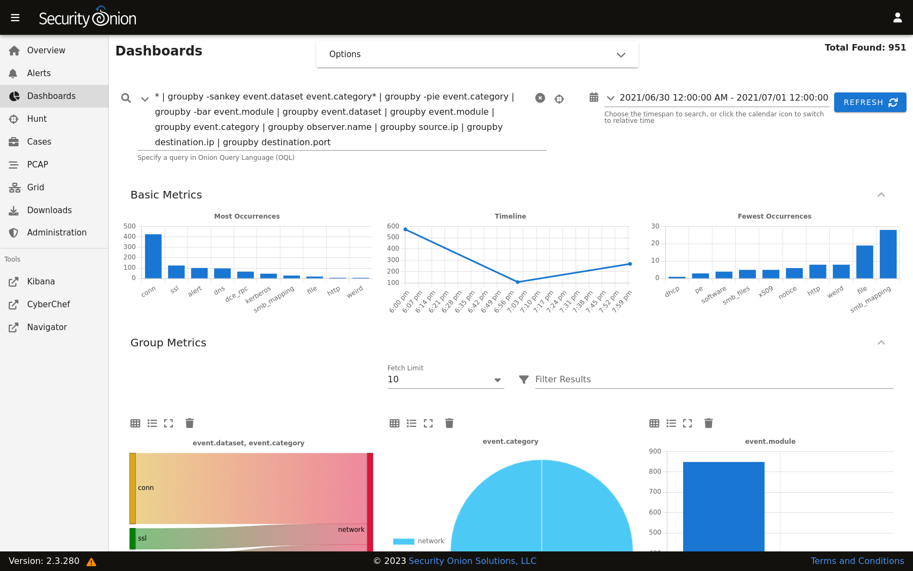
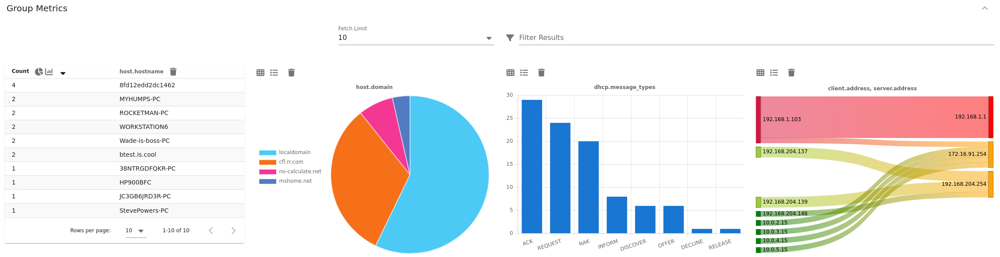
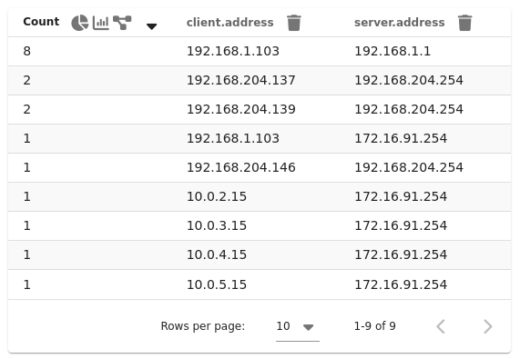
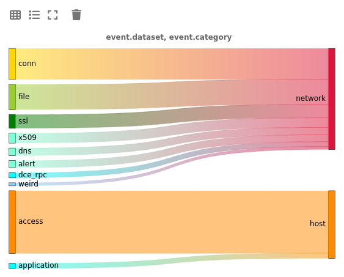
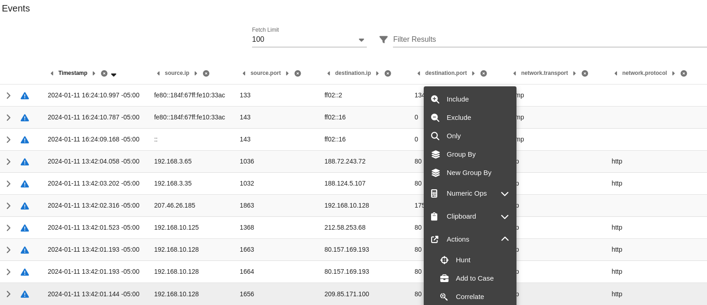

.. _dashboards:

Dashboards
==========

Starting in Security Onion 2.3.130, :ref:`soc` has a new Dashboards interface. This interface includes an entire set of pre-built dashboards for our standard data types.

.. seealso::

    Check out our Dashboards video at https://youtu.be/xUBhyF7se8s!

Options
-------

At the top of the page, there is an Options drop-down menu that allows you to set options such as Auto Apply, Exclude case data, Automatic Refresh Interval, and Time Zone.

Auto Apply
~~~~~~~~~~

The Auto Apply option defaults to enabled:

When enabled, Dashboards will automatically submit your query any time you change filters, groupings, or date ranges.

Exclude case data
~~~~~~~~~~~~~~~~~

Dashboards excludes :ref:`cases` data by default:

.. image:: images/soc-exclude-case-data.png
  :target: _images/soc-exclude-case-data.png

If you disable this option, then you can use Dashboards to query your :ref:`cases` data.

Automatic Refresh Interval
~~~~~~~~~~~~~~~~~~~~~~~~~~

The Automatic Refresh Interval setting will automatically refresh your query at the time interval you select:

.. image:: images/soc-automatic-refresh-interval.png
  :target: _images/soc-automatic-refresh-interval.png

Time Zone
~~~~~~~~~

Dashboards will try to detect your local time zone via your browser. You can manually specify your time zone if necessary.

Query Bar
---------
The easiest way to get started is to click the query drop down box and select one of the pre-defined dashboards. These pre-defined dashboards cover most of the major data types that you would expect to see in a Security Onion deployment: NIDS alerts from :ref:`suricata`, HIDS alerts from :ref:`wazuh`, protocol metadata logs from :ref:`zeek` or :ref:`suricata`, endpoint logs, and firewall logs.

.. image:: images/dashboards-query.png
  :target: _images/dashboards-query.png

Time Picker
-----------

By default, Dashboards searches the last 24 hours. If you want to search a different time frame, you can change it in the upper right corner of the screen. You can use the default relative time or click the clock icon to change to absolute time.

Basic Metrics
-------------

The first section of output contains a Most Occurrences visualization, a timeline visualization, and a Fewest Occurrences visualization. Bar charts are clickable, so you can click a value to update your search criteria. Aggregation defaults to 10 values, so Most Occurrences is the Top 10 and Fewest Occurrences is the Bottom 10 (long tail). The number of aggregation values is controlled by the Fetch Limit setting in the Group Metrics section.

.. image:: https://user-images.githubusercontent.com/1659467/94723255-74506b00-0326-11eb-872f-9229e8efd9ac.png
  :target: https://user-images.githubusercontent.com/1659467/94723255-74506b00-0326-11eb-872f-9229e8efd9ac.png

Group Metrics
-------------

The middle section of output is the Group Metrics section. It consists of one or more data tables or visualizations that allow you to stack (aggregate) arbitrary fields.

Group metrics are controlled by the ``groupby`` parameter in the search bar. You can read more about the ``groupby`` parameter in the OQL section below.

Clicking the table headers allows you to sort ascending or descending. Refreshing the page will retain the sort, but only for the first table.

Clicking a value in the Group Metrics table brings up a context menu of actions for that value. This allows you to refine your existing search, start a new search, or even pivot to external sites like Google and VirusTotal. The default Fetch Limit for the Group Metrics table is ``10``. If you need to see more than the top 10, you can increase the Fetch Limit and then page through the output using the left and right arrow icons or increase the ``Rows per page`` setting.

You can use the buttons in the Count column header to convert the data table to a pie chart or bar chart. If the data table is grouped by more than one field, then you will see an additional button that will convert the data table to a sankey diagram. Starting in Security Onion 2.3.140, there is a Maximize View button that will maximize the table to fill the pane (you can press the Esc key to return to normal view). Each of the groupby field headers has a trash button that will remove the field from the table.

Once you have switched to a chart, you will see different buttons at the top of the chart. You can use the Show Table button to return to the data table, the Toggle Legend button to toggle the legend, and the Remove button to remove the chart altogether. Starting in Security Onion 2.3.140, there is a Maximize View button that will maximize the chart to fill the pane (you can press the Esc key to return to normal view).

Events
------

The third and final section of the page is a data table that contains all search results and allows you to drill into individual search results as necessary. Clicking the table headers allows you to sort ascending or descending. Starting from the left side of each row, there is an arrow which will expand the result to show all of its fields. To the right of that arrow is the ``Timestamp`` field. Next, a few standard fields are shown: ``source.ip``, ``source.port``, ``destination.ip``, ``destination.port``, ``log.id.uid`` (Zeek unique identifier), ``network.community_id`` (Community ID), and ``event.dataset``. Depending on what kind of data you're looking at, there may be some additional data-specific fields as well. 

Clicking a value in the Events table brings up a context menu of actions for that value. This allows you to refine your existing search, start a new search, or even pivot to external sites like Google and VirusTotal.

The default Fetch Limit for the Events table is ``100``. If you need to see more than 100 events, you can increase the Fetch Limit and then page through the output using the left and right arrow icons or increase the ``Rows per page`` setting.

When you click the arrow to expand a row in the Events table, it will show all of the individual fields from that event. Field names are shown on the left and field values on the right. When looking at the field names, there is an icon to the left that will add that field to the ``groupby`` section of your query. You can click on values on the right to bring up the context menu to refine your search or pivot to other pages. 

.. image:: images/hunt-expanded.png
  :target: _images/hunt-expanded.png

Statistics
----------

The bottom left corner of the page shows statistics about the current query including the speed of the backend data fetch and the total round trip time.

.. image:: https://user-images.githubusercontent.com/1659467/92963000-ca28a600-f43f-11ea-99ff-9a69604b03d0.png
  :target: https://user-images.githubusercontent.com/1659467/92963000-ca28a600-f43f-11ea-99ff-9a69604b03d0.png

Context Menu
------------

Clicking a value in the page brings up a context menu that allows you to refine your existing search, start a new search, or even pivot to external sites like Google and VirusTotal. 

Include
~~~~~~~

Clicking the ``Include`` option will add the selected value to your existing search to only show search results that include that value.

Exclude
~~~~~~~

Clicking the ``Exclude`` option will exclude the selected value from your existing search results.

Only
~~~~

Clicking the ``Only`` option will start a new search for the selected value and retain any existing groupby terms.

Group By
~~~~~~~~

If one or more ``Group By`` data tables already exists, clicking the ``Group By`` option will add the field to the most recent data table. If there are no existing ``Group By`` data tables, clicking the ``Group By`` option will create a new data table for the selected field.

New Group By
~~~~~~~~~~~~

Clicking the ``New Group By`` option will create a new data table for the selected field.

Clipboard
~~~~~~~~~

The ``Clipboard`` sub-menu has several options that allow you to copy selected data to your clipboard in different ways.

Actions
~~~~~~~

The ``Actions`` sub-menu has several different options:

- Clicking the ``Hunt`` option will start a new search for the selected value and will aggregate the results by ``event.module`` and ``event.dataset`` to give you a good overview of what types of data are available for that indicator.

- Clicking the ``Correlate`` option will find related logs based on Community ID, uid, fuid, etc.

- Clicking the ``PCAP`` option will pivot to the :ref:`pcap` interface to retrieve full packet capture for the selected stream.

- Clicking the ``Google`` option will search Google for the selected value.

- Clicking the ``VirusTotal`` option will search VirusTotal for the selected value.

If you'd like to add your own custom actions, see the :ref:`soc-customization` section.

OQL
---

Onion Query Language (OQL) starts with standard `Lucene query syntax <https://lucene.apache.org/core/2_9_4/queryparsersyntax.html>`_ and then allows you to add optional segments that control what Dashboards does with the results from the query. 

sortby
~~~~~~

The ``sortby`` segment can be added to the end of a hunt query. This can help ensure that you see the most recent data, for example, when sorting by descending timestamp. Otherwise, if the search yields a dataset larger than the X Limit size selected in the UI then you will only get the first X records and then those will be sorted on the web browser.

You can specify one field to sort by or multiple fields separated by spaces. The default order is descending but if you want to force the sort order to be ascending you can add the optional caret (^) symbol to the end of the field name.

::

  | sortby some.field another.field^

groupby
~~~~~~~

The ``groupby`` segment tells Dashboards to group by (aggregate) a particular field. So, for example, if you want to group by destination IP address, you can add the following to your search:

::

  | groupby destination.ip

The ``groupby`` segment supports multiple aggregations so you can add more fields that you want to group by, separating those fields with spaces. For example, to group by destination IP address and then destination port in the same data table, you could use:

::

  | groupby destination.ip destination.port

OQL supports multiple ``groupby`` segments so if you wanted each of those fields to have their own independent data tables, you could do:

::

  | groupby destination.ip | groupby destination.port

In addition to rendering standard data tables, you can optionally render the data as a pie chart, bar chart, or sankey diagram.

- The pie chart is specified using the ``-pie`` option:

::

  | groupby -pie destination.ip

- The bar chart is specified using the ``-bar`` option:

::

  | groupby -bar destination.ip

- The sankey diagram is specified using the ``-sankey`` option, but keep in mind that this requires at least two fields:

::

  | groupby -sankey destination.ip destination.port

Starting in Security Onion 2.3.140, the ``-maximize`` option will maximize the table or chart to fill the pane. After viewing the maximized result, you can press the Esc key to return to normal view.

By default, grouping by a particular field won't show any values if that field is missing. If you would like to include missing values, you can add an asterisk after the field name. For example, suppose you want to look for non-HTTP traffic on port 80 using a query like ``event.dataset:conn AND destination.port:80 | groupby network.protocol destination.port``. If there was non-HTTP traffic on port 80, the ``network.protocol`` field may be null and so this query would only return port 80 traffic identified as HTTP. To fix this, add the asterisk after the ``network.protocol``:

::

  event.dataset:conn AND destination.port:80 | groupby network.protocol* destination.port

Please note that adding the asterisk to a non-string field may not work as expected. As an alternative, you may be able to use the asterisk with the equivalent ``keyword`` field if it is available. For example, ``source.geo.ip*`` may return 0 results, or a query failure error, but ``source.geo.ip.keyword*`` may work as expected.

Sankey Diagram Recursion
~~~~~~~~~~~~~~~~~~~~~~~~

There's a known limitation with Sankey diagrams where the diagram is unable to render all data when multiple fields of the diagram contain the same value. This causes a recursion issue. For example, this can occur if using an OQL query of ``* | groupby -sankey source.ip destination.ip`` and the included events have a specific IP appearing in both the ``source.ip`` and ``destination.ip`` fields. SOC will attempt to prevent the recursion issue by omitting any data that introduces recursion. This can result in some diagrams showing partial data on the diagram, and when this occurs the Sankey diagram will have the phrase ``(partial)`` appended to the title. In rare scenarios, it's possible for the diagram to be completely blank, such as if all data results have the same value in each field. Following the example mentioned above, this could happen if the ``source.ip`` and ``destination.ip`` were always equal.
