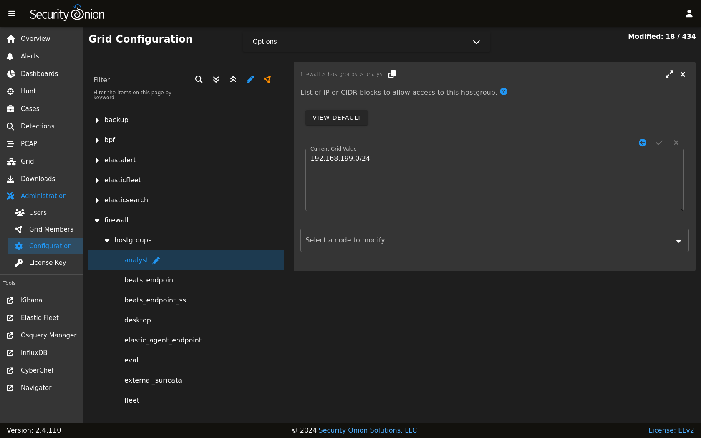

.. _desktop:

Security Onion Desktop
======================

.. warning::

   Security Onion Desktop is still considered experimental!

Full-time analysts may want to use a dedicated Security Onion desktop. This allows you to investigate pcaps, malware, and other potentially malicious artifacts without impacting your Security Onion deployment or your usual desktop environment.

.. image:: images/desktop.png
  :target: _images/desktop.png

.. note::

  Security Onion Desktop currently only supports Oracle Linux 9, so you'll either need to use our Security Onion ISO image (recommended) or a manual installation of Oracle Linux 9.
  
Security Onion Desktop consists of a full desktop environment including :ref:`chromium`, :ref:`networkminer`, :ref:`wireshark`, and other analyst tools.
 
**Installation**

There are a few different ways to install Security Onion Desktop:

- Our Security Onion ISO image includes a boot menu option for Desktop installs that will partition your disk appropriately and immediately perform a Desktop installation. The minimum disk size is 50GB.

- If you’re doing a network installation on Oracle Linux 9 (NOT using our Security Onion ISO image), then in our normal Setup wizard, you can choose ``OTHER`` and then choose ``ANALYST``.

- The ``so-desktop-install`` command is totally independent of the standard setup process, so you can run it before or after setup or not run setup at all if all you really want is the Analyst desktop itself.

**Joining to Grid**

You can optionally join your Desktop installation to your grid. This allows it to pull updates from the grid and automatically trust the grid's HTTPS certificate. It also updates the manager's firewall to allow the Desktop installation to connect. Starting with Security Onion 2.4.20, Desktop nodes will now display on the :ref:`grid` page along with the other grid nodes.

If you choose not to join your Desktop installation to your grid, then you may need to allow the traffic through the host-based :ref:`firewall` by going to :ref:`administration` --> Configuration --> firewall.

**Disabling**

The analyst desktop is controlled via :ref:`salt` pillar. If you need to disable the Desktop desktop environment, find the ``workstation`` setting in your :ref:`salt` pillar and change ``enabled: true`` to ``enabled: false``:

::

	workstation:
	  gui:
	    enabled: false

.. toctree::
   :maxdepth: 2
   
   chromium   
   networkminer
   wireshark
