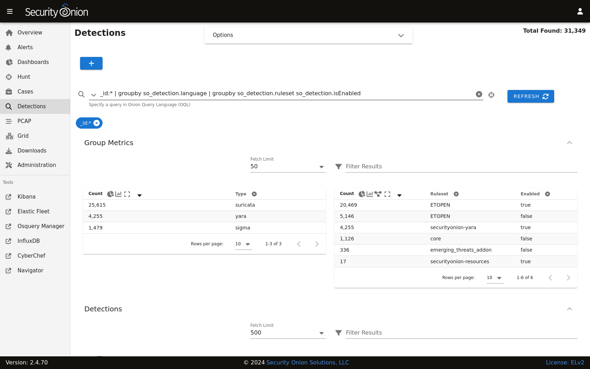
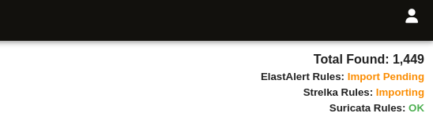

.. _detections:

Detections
==========

Starting in Security Onion 2.4.70, :ref:`soc` includes our Detections interface for managing all of your rules:

- :ref:`nids` rules that get loaded into :ref:`suricata`
- :ref:`sigma` rules that get loaded into :ref:`elastalert`
- :ref:`yara` rules that get loaded into :ref:`strelka`

.. note::

    Check out our Detections sneak peek video at https://youtu.be/oxR4q53N6OI!

Options
-------

Starting at the top of the main Detections page, the Options menu allows you to synchronize a particular detection engine such as :ref:`suricata`, :ref:`strelka`, or :ref:`elastalert`. Once you've selected the detection engine that you want to synchronize, you can then click either the ``DIFFERENTIAL UPDATE`` or ``FULL UPDATE`` button. 

The differential update is a lightweight sync that will skip the thorough sync and comparison of each individual rule. For example, with Suricata it will compute and compare the hash of the source rule list with the hash of the deployed rules, and only if there's a mismatch will it perform the full sync. A full sync can involve inspecting and comparing individual rules, of which there can be thousands. This more thorough sync can take much longer than the differential sync. Note that each engine has its own unique synchronization process.

Rule Engine Status
------------------

To the right of the Options menu is a count of detections that matched the search query. Underneath the count is a status indicator for the detection engines. The status can show whether a sync is in process, as well as whether the engine has detected errors. 

Below is a list of statuses and associated explanations.

- **Pending**: The browser is waiting for the server to send an initial status report.
- **Import Pending**: The import will start once the system stabilizes, usually within twenty minutes. Imports take place only once, after upgrading to Security Onion 2.4.70+.
- **Importing**: The previous version of Security Onion's rules are being imported into the new Detections system. This can take a an hour or more on some systems.
- **Migrating**: Rules will be migrated between Security Onion versions following system upgrades. This can take some time if upgrading from a much older version.
- **Migration Failed**: A failure occurred during the migration. The migration will stop on the first error and will not attempt to migrate to newer versions until the issue is resolved.
- **Synchronizing**: A rule synchronization is in progress. This occurs daily, to ensure the Security Onion grid has the latest rules. 
- **Sync Failed**: A failure occurred during the synchronization procedure. The next sync will retry within a few minutes.
- **Rule Mismatch**: An integrity check process detected a mismatch between the deployed rules and the enabled rules. The SOC log will note the specific mismatched rules.
- **OK**: No known issues with the rule engine.

Clicking the status text will navigate to the Hunt page and attempt to find related logs.

The Detections menu option on the left side of the application will show an exclamation mark if there is a recent failure in any of the detection engines. In this situation the web browser tab will also show an exclamation indicator. If no failures are detected, and if any of the detection engines has an import pending or is performing a rule import, synchronization, or migration, then a blue hourglass will appear next to the Detections menu option.

Adding Detections
-----------------

To add a detection, click the blue + button between Options and the query bar. A form will appear where you will:

- select the kind of detection you wish to add - :ref:`suricata` (:ref:`nids`), :ref:`elastalert` (:ref:`sigma`), or :ref:`strelka` (:ref:`yara`)
- specify a license (optional)
- add the signature

Once you've filled out the form, click the ``CREATE`` button and the detection should deploy to your grid at the next 15-minute cycle.

Query Bar
---------

The query bar defaults to All Detections. Clicking the drop-down box reveals other options such as ``Custom Detections``, ``All Detections - Enabled``, and ``All Detections - Disabled``.

Under the query bar, you’ll notice colored bubbles that represent the individual components of the query. If you want to remove part of the query, you can click the X in the corresponding bubble to remove it and run a new search.

Group Metrics
-------------

The Group Metrics section of output consists of one or more data tables or visualizations that allow you to stack (aggregate) arbitrary fields.

Data Table
----------

The remainder of the main Detections page is a data table that shows a high level overview of the detections matching the current search criteria.

- Clicking the table headers allows you to sort ascending or descending.
- Clicking a value in the table brings up a context menu of actions for that value. This allows you to refine your existing search or copy text to the clipboard.
- You can adjust the Rows per page setting in the bottom right and use the left and right arrow icons to page through the table.
- When you click the arrow to expand a row in the data table, it will show the high level fields from that detection. Field names are shown on the left and field values on the right. You can click on values on the right to bring up the context menu to refine your search.
- To the right of the arrow is a binoculars icon. Clicking this will take you to the detection detail page.

Detection Details
-----------------

The detection details page includes several tabs:

- The OVERVIEW tab displays the Summary, References, and Detection Logic.
- The OPERATIONAL NOTES tab allows you add your own local notes to this rule in markdown format.
- The DETECTION SOURCE tab shows the full content of the detection.
- The TUNING tab allows you to tune the detection. For :ref:`nids` rules, you can modify, suppress, or threshold. For :ref:`sigma` rules, you can create a custom filter.
- The HISTORY tab shows the history of the detection since it was added to your deployment.

On the right side of the detection details page, there is a Status field that shows whether the detection is enabled or disabled. You can click the status to change it.

Managing Detections
-------------------

To manage :ref:`nids` rules for :ref:`suricata`, please see the :ref:`nids` section.

To manage :ref:`sigma` rules for :ref:`elastalert`, please see the :ref:`sigma` section.

To manage :ref:`yara` rules for :ref:`strelka`, please see the :ref:`yara` section.
