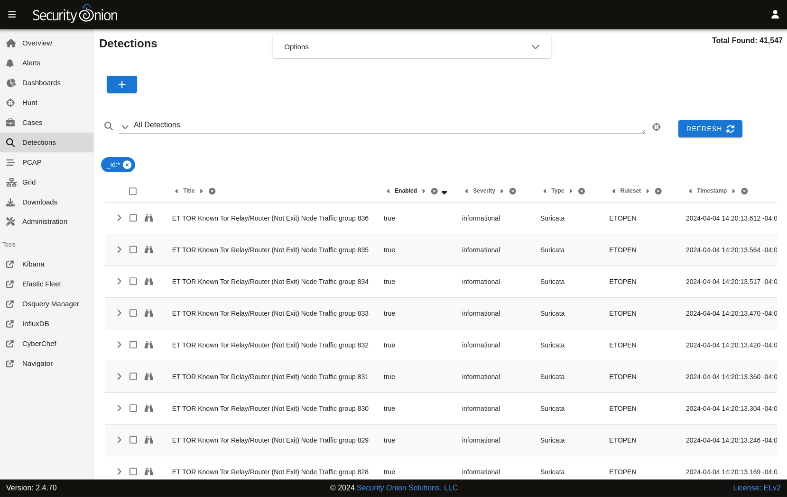

.. _detections:

Detections
==========

Starting in Security Onion 2.4.70, :ref:`soc` includes our Detections interface for managing all of your rules:

- NIDS rules that get loaded into :ref:`suricata`
- Sigma rules that get loaded into :ref:`elastalert`
- YARA rules that get loaded into :ref:`strelka`

Options
-------

Starting at the top of the main Detections page, the Options menu allows you to set a few options.

First, there is a toggle labeled ``Temporarily enable advanced interface features``. If you enable this option, then the interface will show more advanced features similar to :ref:`dashboards` and :ref:`hunt`. These advanced features are only enabled temporarily so if you navigate away from the page and then return to the page, it will default back to its simplified view.

Next, you have the option to synchronize a particular detection engine such as :ref:`suricata`, :ref:`strelka`, or :ref:`elastalert`. Once you've selected the detection engine that you want to synchronize, you can then click either the ``DIFFERENTIAL UPDATE`` or ``FULL UPDATE`` buttons.

Query Bar
---------

The query bar defaults to All Detections. Clicking the drop-down box reveals other options such as Custom Detections, All Detections - Enabled, and All Detections - Disabled.

Under the query bar, you’ll notice colored bubbles that represent the individual components of the query. If you want to remove part of the query, you can click the X in the corresponding bubble to remove it and run a new search.

Data Table
----------

The remainder of the main Detections page is a data table that shows a high level overview of the detections matching the current search criteria.

- Clicking the table headers allows you to sort ascending or descending.
- Clicking a value in the table brings up a context menu of actions for that value. This allows you to refine your existing search or copy text to the clipboard.
- You can adjust the Rows per page setting in the bottom right and use the left and right arrow icons to page through the table.
- When you click the arrow to expand a row in the data table, it will show the high level fields from that detection. Field names are shown on the left and field values on the right. You can click on values on the right to bring up the context menu to refine your search.
- To the right of the arrow is a binoculars icon. Clicking this will take you to the detection detail page including the Overview, Operational Notes, Detection Source, Tuning, and History tabs.

Tuning Detections
-----------------

There are two main ways to tune a detection:

- From the main Detections interface, you can search for the desired detection and click the binoculars icon.
- From the :ref:`alerts` interface, you can click an alert and then click the ``Tune Detection`` menu item.

Once you've used one of these methods to reach the detection detail page, click the Tuning tab, click the blue + button, select the type of tuning, fill out the requested values, and then click the ``CREATE`` button.

Adding Detections
-----------------

To add a detection, click the blue + button between Options and the query bar. A form will appear where you will:

- select the kind of detection you wish to add (:ref:`suricata`, Sigma, or YARA)
- specify a license (optional)
- add the signature

Once you've filled out the form, click the ``CREATE`` button and the detection should deploy to your grid at the next 15-minute cycle.
