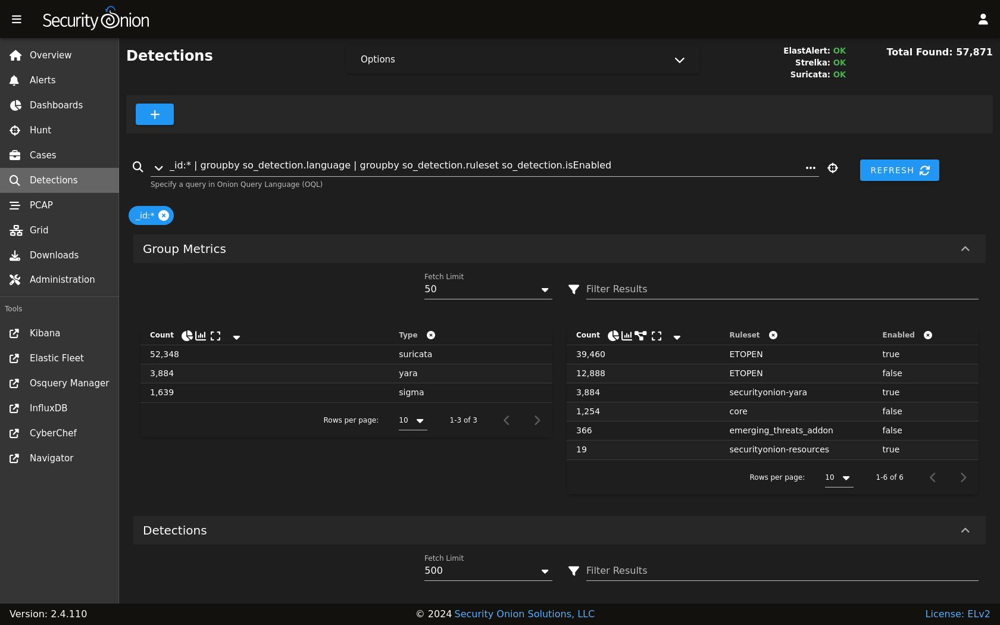
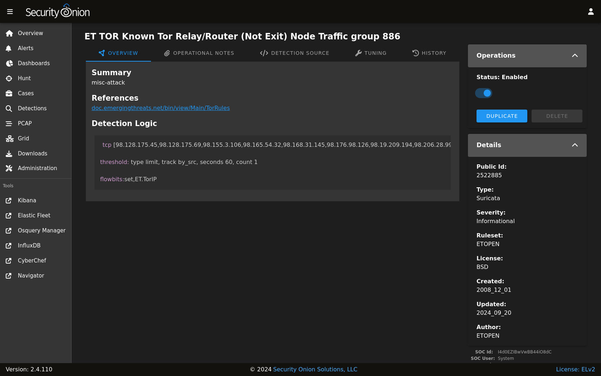
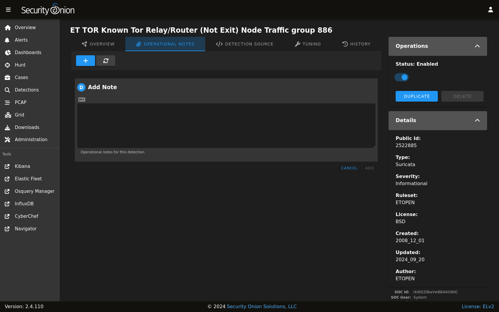
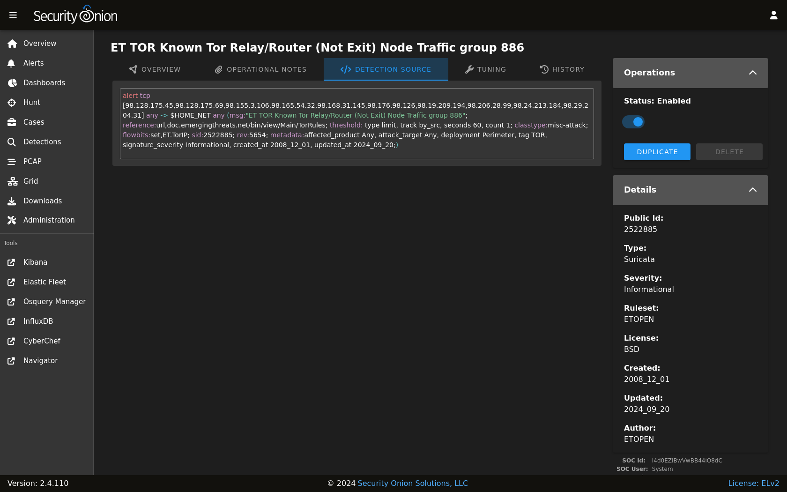
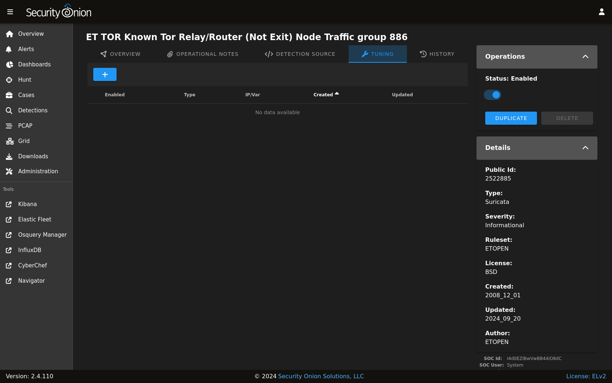

.. _detections:

Detections
==========

Starting in Security Onion 2.4.70, :ref:`soc` includes our Detections interface for managing all of your rules:

- :ref:`nids` rules that get loaded into :ref:`suricata`
- :ref:`sigma` rules that get loaded into :ref:`elastalert`
- :ref:`yara` rules that get loaded into :ref:`strelka`

.. note::

    Check out our Detections video at https://youtu.be/DelAmqtU2hg!

Rule Engine Status
------------------

The upper-right corner shows a count of detections that matched the search query. To the left of that is a status indicator for each of the detection engines. The status can show whether a sync is in process, as well as whether the engine has detected errors. 

Here is the list of possible status messages and what they mean:

- **Pending**: The browser is waiting for the server to send an initial status report.
- **Import Pending**: The import will start once the system stabilizes, usually within twenty minutes. Imports take place only once, after upgrading to Security Onion 2.4.70+.
- **Importing**: The previous version of Security Onion's rules are being imported into the new Detections system. This can take an hour or more on some systems.
- **Migrating**: Rules will be migrated between Security Onion versions following system upgrades. This can take some time if upgrading from a much older version.
- **Migration Failed**: A failure occurred during the migration. The migration will stop on the first error and will not attempt to migrate to newer versions until the issue is resolved.
- **Synchronizing**: A rule synchronization is in progress. This occurs daily, to ensure the Security Onion grid has the latest rules. 
- **Sync Failed**: A failure occurred during the synchronization procedure. The next sync will retry within a few minutes.
- **Rule Mismatch**: An integrity check process detected a mismatch between the deployed rules and the enabled rules. The SOC log will note the specific mismatched rules. One possible reason for this is if you had previously added custom rules to /opt/so/saltstack/local/salt/idstools/rules/local.rules. If this is the case, you can remove the rules from that file and then re-add them using the Detections interface. Another possible reason is if you have changed the default metadata engine setting from :ref:`zeek` to :ref:`suricata`. When using :ref:`suricata` as the metadata engine, there are some metadata rules that are enabled which cause the mismatch. This issue will be resolved in a future release.
- **OK**: No known issues with the rule engine.

Clicking the status text will navigate to :ref:`hunt` and attempt to find related logs.

As part of the sync process, Detections checks for duplicates. If duplicates are found, Detections will log information about the duplicate.

The Detections menu option on the left side of the application will show an exclamation mark if there is a recent failure in any of the detection engines. In this situation the web browser tab will also show an exclamation indicator. If no failures are detected, and if any of the detection engines has an import pending or is performing a rule import, synchronization, or migration, then a blue hourglass will appear next to the Detections menu option.

Options
-------

The Options menu allows you to synchronize a particular detection engine such as :ref:`elastalert`, :ref:`strelka`, or :ref:`suricata`. 

.. image:: images/58_detections_options.png
  :target: _images/58_detections_options.png

Once you've selected the detection engine that you want to synchronize, you can then click either the ``DIFFERENTIAL UPDATE`` or ``FULL UPDATE`` button. 

The differential update is a lightweight sync that will skip the thorough sync and comparison of each individual rule. For example, with :ref:`suricata` it will compute and compare the hash of the source rule list with the hash of the deployed rules, and only if there's a mismatch will it perform the full sync. 

A full sync can involve inspecting and comparing individual rules, of which there can be thousands. This more thorough sync can take much longer than the differential sync. Note that each engine has its own unique synchronization process.

Query Bar
---------

The query bar defaults to ``All Detections``. Clicking the drop-down box reveals other options such as ``Custom Detections``, ``All Detections - Enabled``, and ``All Detections - Disabled``.

Under the query bar, you’ll notice colored bubbles that represent the individual components of the query. If you want to remove part of the query, you can click the X in the corresponding bubble to remove it and run a new search.

If you would like to save your own personal queries, you can bookmark them in your browser. If you would like to customize the default queries for all users, please see the :ref:`soc-customization` section.

Group Metrics
-------------

The Group Metrics section of output consists of one or more data tables or visualizations that allow you to stack (aggregate) arbitrary fields.

Data Table
----------

The remainder of the main Detections page is a data table that shows a high level overview of the detections matching the current search criteria.

- Clicking the table headers allows you to sort ascending or descending.
- Clicking a value in the table brings up a context menu of actions for that value. This allows you to refine your existing search or copy text to the clipboard.
- You can adjust the Rows per page setting in the bottom right and use the left and right arrow icons to page through the table.
- When you click the arrow to expand a row in the data table, it will show the high level fields from that detection. Field names are shown on the left and field values on the right. You can click on values on the right to bring up the context menu to refine your search.
- To the right of the arrow is a binoculars icon. Clicking this will take you to the detection details page.

Detection Details
-----------------

There are two ways to reach the detail page for an individual detection:

- From the main :ref:`detections` interface, you can search for the desired detection and click the binoculars icon.
- From the :ref:`alerts` interface, you can click an alert and then click the ``Tune Detection`` menu item.

Once you've used one of these methods to reach the detection detail page, you can check the Status field in the upper-right corner and use the slider to enable or disable the detection.

To the left of the Status field are several tabs. The OVERVIEW tab displays the Summary, References, and Detection Logic for the detection.

The OPERATIONAL NOTES tab allows you to add your own local notes to the detection in markdown format.

The DETECTION SOURCE tab shows the full content of the detection.

The TUNING tab allows you to tune the detection. For :ref:`nids` rules, you can modify, suppress, or threshold. For :ref:`sigma` rules, you can create a custom filter.

The HISTORY tab shows the history of the detection since it was added to your deployment.

.. image:: images/60_detection_nids_3_history.png
  :target: _images/60_detection_nids_3_history.png

More Information
----------------

For more information about managing :ref:`nids` rules for :ref:`suricata`, please see the :ref:`nids` section.

For more information about managing :ref:`sigma` rules for :ref:`elastalert`, please see the :ref:`sigma` section.

For more information about managing :ref:`yara` rules for :ref:`strelka`, please see the :ref:`yara` section.

Technical Background
--------------------

Detections abstracts the underlying alerting engine and simplifies writing detections for different rule types. Here's what happens behind the scenes.

Enable and Disable (Bulk and Individual) Operations
~~~~~~~~~~~~~~~~~~~~~~~~~~~~~~~~~~~~~~~~~~~~~~~~~~~

Elastalert/Sigma
  - Immediate change in the UI and on disk

Suricata/NIDS
  - UI Bulk and Individual: Immediate change in the UI, disk change once the `idstools` state runs again
  - Regex: UI and disk change once the `soc` state runs again and the :ref:`suricata` engine syncs

Strelka/YARA
  - Immediate change in the UI, disk change once the `strelka` state runs again

Tuning
~~~~~~

Elastalert/Sigma
  - Immediate change in the UI and on disk

Suricata/NIDS
  - Immediate change in the UI, disk change once the `idstools` state runs again

Strelka/YARA
  - N/A

Ruleset Changes
~~~~~~~~~~~~~~~

Elastalert/Sigma
  - Sigma Ruleset Packages: UI and disk change once the `soc` state runs again and the :ref:`elastalert` engine syncs
  - Git repo (https or disk): UI and disk change once the `soc` state runs again and the :ref:`elastalert` engine syncs

Suricata/NIDS
  - ETOPEN/ETPRO: UI and disk change once the `soc` and  `idstools` states run again and the :ref:`suricata` engine syncs
  - Custom URL: UI and disk change once the `soc` and `idstools` states run again and the :ref:`suricata` engine syncs
  - Custom Local File: UI and disk change once the `soc` and `idstools` states run again and the :ref:`suricata` engine syncs

Strelka/YARA
  - Git repo (https or disk): UI and disk change once the `soc` state runs again and the :ref:`strelka` engine syncs
