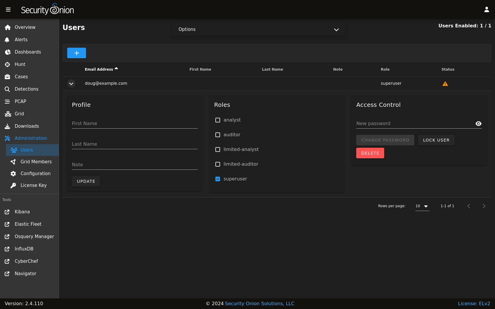

.. _disabling-accounts:

Disabling Accounts
==================

OS
--

If you need to disable an OS user account, you can expire the account using ``usermod --expiredate 1``.  For example, to disable the account for user ``tom``:

::

    sudo usermod --expiredate 1 tom

For more information, please see passwd manual by typing ``man passwd`` and the usermod manual by typing ``man usermod``.

SOC
---

If you need to disable an account in :ref:`soc`, you can go to :ref:`administration` --> Users, expand the user account, and click the ``LOCK USER`` button.

After disabling a user account, it will be shown with a disabled icon in the Status column.

For more information about the Users page, please see the :ref:`administration` section.
