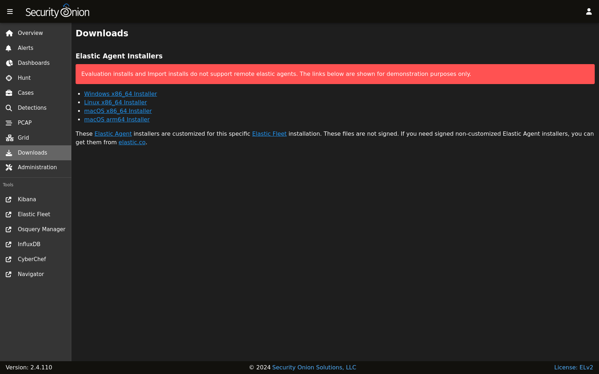

.. _downloads:

Downloads
=========

:ref:`soc` includes a Downloads interface that allows you to download the :ref:`elastic-agent` for various operating systems.

.. warning::

  Please note that Evaluation installs and Import installs do not support remote Elastic agents, so in those cases the links are shown for demonstration purposes only.

.. note::

  When installing the Elastic Agent onto remote systems, be sure to allow network access through the :ref:`firewall`.
