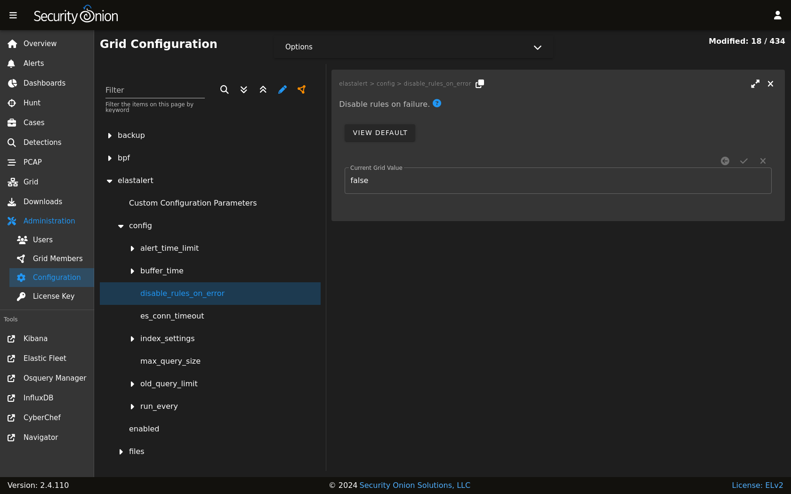

.. _elastalert:

ElastAlert 2
============

From https://elastalert2.readthedocs.io/en/latest/elastalert.html#overview:

    ElastAlert 2 is a simple framework for alerting on anomalies, spikes, or other patterns of interest from data in Elasticsearch.

ElastAlert queries :ref:`elasticsearch` and provides an alerting mechanism with multiple output types, such as Slack, Email, JIRA, OpsGenie, and many more.

Sigma Rules
-----------

The Detections module will generate ElastAlert 2 compatible rules automatically for all :ref:`sigma` detections. There is no need to manually modify the generated rules on disk. Further, any modifications will be overwritten during the next :ref:`sigma` rule synchronization.

Adjusting a :ref:`sigma` rule should always be done via the :ref:`detections` screen.

See the :ref:`notifications` section for information on how to enable outbound notifications via the Detections module.

Custom Rules
------------

Custom ElastAlert 2 rules, which are not associated to the Detections module, can be added to the Security Onion manager node inside a custom subdirectory under the ``/opt/so/rules/elastalert/rules/`` directory. For example, create a subdirectory called ``/opt/so/rules/elastalert/rules/custom/`` and place custom rules within that directory. 

.. warning::

    Do not modify or add rules to the ``/opt/so/rules/elastalert/rules/`` directory itself as those rules are overwritten by the Detections module.

Refer to the ElastAlert 2 documention, linked above, for detailed information on how to write custom rules. Be aware that writing rules requires an in-depth understanding of Elasticsearch document records, their data structure, and other related concepts.

Diagnostic Logging
------------------

Elastalert diagnostic logs are in ``/opt/so/log/elastalert/`` and may also appear in the :ref:`docker` logs for the container. To view container logs run the following command on the manager:

::

    sudo docker logs so-elastalert

ElastAlert 2 stores rule status information, such as number of hits, times each rule last ran, etc to :ref:`elasticsearch` indices. This data can helpful in assisting with troubleshooting custom rules. Searching in :ref:`dashboards`, :ref:`hunt`, or :ref:`kibana`. :ref:`soc` does not automatically include the ``elastalert`` indices by default. To include them adjust the appropriate configuration setting. Find it in the Administration --> Configuration screen by filtering for ``elastic.index`` and selecting Options (at the top) and toggle on "Show all configurable settings". Add ``*:elastalert*`` to the ``index`` setting. The new setting value should resemble the following:

::

    *:so-*,*:endgame-*,*:logs-*,*:elastalert*

so-elastalert-create
~~~~~~~~~~~~~~~~~~~~

``so-elastalert-create`` is a tool created by `Bryant Treacle <https://github.com/bryant-treacle/so-elastalert-create>`__ that can be used to help ease the pain of ensuring correct syntax and creating Elastalert rules from scratch. It will walk you through various questions, and eventually output an Elastalert rule file that you can deploy in your environment to start alerting quickly and easily.

so-elastalert-test
~~~~~~~~~~~~~~~~~~~~

``so-elastalert-test`` is a wrapper script originally written by Bryant Treacle for ElastAlert's ``elastalert-test-rule`` tool.  The script allows you to test an ElastAlert rule and get results immediately. Simply run ``so-elastalert-test``, and follow the prompt(s).

.. note::

    ``so-elastalert-test`` does not yet include all options available to ``elastalert-test-rule``.

Performance
~~~~~~~~~~~

For better performance, avoid writing rules that return large numbers of records. Instead, use the ``use_count_query: true`` in each rule file. This will only return counts of matching records and not the records themselves.

Timeframe
~~~~~~~~~

For queries that span greater than a minute back in time, you may want to add the following fields to your rule to ensure searching occurs as planned (for example, for 10 minutes):

::

    buffer_time:   
        minutes: 10   

``allow_buffer_time_overlap: true``

| https://elastalert2.readthedocs.io/en/latest/ruletypes.html#buffer-time
| https://github.com/Yelp/elastalert/issues/805

Configuration
-------------

You can modify ElastAlert 2 configuration by going to :ref:`administration` --> Configuration --> elastalert.

More Information
----------------

.. note::

    For more information about ElastAlert, please see https://elastalert2.readthedocs.io/en/latest/.
