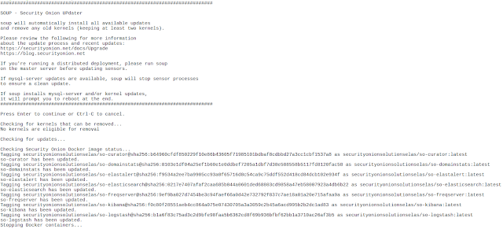
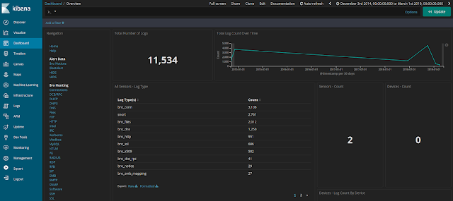

Elastic Features
================

Many folks have asked if they could switch from the open source version of the Elastic Stack to the Features version licensed under the Elastic license.  Here's how:

- First, please review the Elastic Features license:
https://github.com/elastic/elasticsearch/blob/6.7/licenses/ELASTIC-LICENSE.txt

- Next, you should make sure that all updates have been installed:
  
  ::
  
    sudo soup

- If soup prompts to reboot, please do so.  

- Verify that everything is working properly before continuing.

- Edit ``/etc/nsm/elasticdownload.conf`` using your favorite text editor and change ``DOCKERHUB`` from ``securityonionsolutions`` to ``securityonionsolutionselas``:

  ::
  
    DOCKERHUB="securityonionsolutionselas"

- Run soup again to download the new Docker images for Elastic Features:

  ::
  
    sudo soup
    
- Once soup has downloaded the new Docker images, it should restart your Docker containers.

- Kibana should now have some new features on the left side.

Screenshots
-----------

Q&A
---

- Is Elastic Features open source?

No, it is not open source.  It is licensed under the Elastic license:
https://github.com/elastic/elasticsearch/blob/6.7/licenses/ELASTIC-LICENSE.txt

- What does this mean for Security Onion licensing?

Security Onion continues to be free and open source and will continue to default to the open source version of the Elastic Stack.  If you choose to switch to Elastic Features (not open source), you may do so using the instructions above.

- If I switch to Elastic Features, is this a trial license?

If you switch to Elastic Features, you can remain on the BASIC license for free forever or you can choose to upgrade to a paid subscription. For more information about Elastic Features subscription levels, please see:
https://www.elastic.co/subscriptions

- How does authentication work?

Authentication works the same way it does in our existing Elastic open source images.  Security Onion provides Single Sign On (SSO) using the same username and password for Sguil, Squert, and Kibana.

- What about the recent Elastic announcement about security features?

Elastic recently announced that security features are included for free in the Elastic Features license starting in version 6.8.0.  Since Security Onion still uses Elastic 6.7.2, those security features are not free in that version.  We will begin the process of working towards Elastic 6.8.0.
