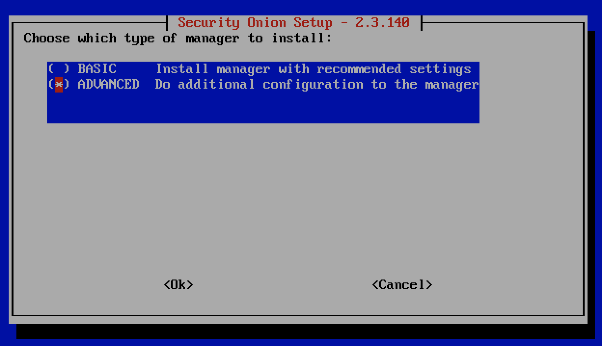
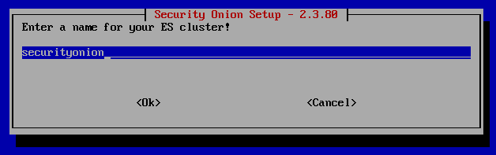

.. _elasticsearch:

Elasticsearch
=============

From https://www.elastic.co/products/elasticsearch:

    Elasticsearch is a distributed, RESTful search and analytics engine capable of addressing a growing number of use cases. As the heart of the Elastic Stack, it centrally stores your data for lightning fast search, fine‑tuned relevancy, and powerful analytics that scale with ease.

Querying
--------

You can query Elasticsearch using web interfaces like :ref:`alerts`, :ref:`hunt`, and :ref:`kibana`. You can also query Elasticsearch from the command line using a tool like ``curl``. Starting in Security Onion 2.3.60, you can also use :ref:`so-elasticsearch-query`.

Authentication
--------------

Starting in Security Onion 2.3.60, we support Elastic authentication via :ref:`so-elastic-auth`.

Diagnostic Logging
------------------

-  Elasticsearch logs can be found in ``/opt/so/log/elasticsearch/``.
-  Logging configuration can be found in ``/opt/so/conf/elasticsearch/log4j2.properties``.

Storage
-------

All of the data Elasticsearch collects is stored under ``/nsm/elasticsearch/``.

Parsing
-------

In Security Onion 2, Elasticsearch receives unparsed logs from :ref:`logstash` or :ref:`filebeat`. Elasticsearch then parses and stores those logs. Parsers are stored in ``/opt/so/conf/elasticsearch/ingest/``.  Custom ingest parsers can be placed in ``/opt/so/saltstack/local/salt/elasticsearch/files/ingest/``.   To make these changes take effect, restart Elasticsearch using ``so-elasticsearch-restart``.

.. seealso::

    | For more about Elasticsearch ingest parsing, please see:
    | https://www.elastic.co/guide/en/elasticsearch/reference/master/ingest.html
    
Community ID
------------
| For logs that don’t natively support :ref:`community-id`, we use the Elasticsearch Community ID processor:
| https://www.elastic.co/guide/en/elasticsearch/reference/7.x/community-id-processor.html

Configuration
-------------

Pillar Files
~~~~~~~~~~~~

All configuration changes take place in :ref:`salt` pillar files. There are two places that hold pillar settings for Elasticsearch. The pillars are:

``/opt/so/saltstack/local/pillar/minions/$minion.sls``

::

    elasticsearch:
      mainip: 10.66.166.22
      mainint: eth0
      esheap: 4066m
      esclustername: {{ grains.host }}
      node_type: search
      es_port: 9200
      log_size_limit: 3198
      node_route_type: hot

``/opt/so/saltstack/local/pillar/global.sls``

::

    elasticsearch:
      replicas: 0
      true_cluster: False
      true_cluster_name: so
      discovery_nodes: 1
      hot_warm_enabled: False
      cluster_routing_allocation_disk.threshold_enabled: true
      cluster_routing_allocation_disk_watermark_low: 95%
      cluster_routing_allocation_disk_watermark_high: 98%
      cluster_routing_allocation_disk_watermark_flood_stage: 98%
      index_settings:
        so-beats:
          shards: 1
          warm: 7
          close: 30
          delete: 365
        so-firewall:
          shards: 1
          warm: 7
          close: 30
          delete: 365
        so-flow:
          shards: 1
          warm: 7
          close: 30
          delete: 365
        so-ids:
          shards: 1
          warm: 7
          close: 30
          delete: 365
        so-import:
          shards: 1
          warm: 7
          close: 73000
          delete: 73001
        so-osquery:
          shards: 1
          warm: 7
          close: 30
          delete: 365
        so-ossec:
          shards: 1
          warm: 7
          close: 30
          delete: 365
        so-strelka:
          shards: 1
          warm: 7
          close: 30
          delete: 365
        so-syslog:
          shards: 1
          warm: 7
          close: 30
          delete: 365
        so-zeek:
          shards: 5
          warm: 7
          close: 45
          delete: 365

Starting in Security Onion 2.3.80, users can completely customize their Elasticsearch configuration via :ref:`salt` pillars. This allows elasticsearch.yml customizations to be retained when doing upgrades of Security Onion. Depending on your customization goal, you can specify settings in either the global pillar or the minion pillar. Create the ``config`` sub-section if it does not already exist in your pillar and then place your configuration options under that sub-section.  For example, to change the ``node_concurrent_recoveries`` setting:

::

    elasticsearch:
      config:
        routing:
          allocation:
            node_concurrent_recoveries: 4

Shards
~~~~~~

Here are a few tips from https://www.elastic.co/blog/how-many-shards-should-i-have-in-my-elasticsearch-cluster:

    TIP: Avoid having very large shards as this can negatively affect the cluster's ability to recover from failure. There is no fixed limit on how large shards can be, but a shard size of 50GB is often quoted as a limit that has been seen to work for a variety of use-cases.

    TIP: Small shards result in small segments, which increases overhead. Aim to keep the average shard size between a few GB and a few tens of GB. For use-cases with time-based data, it is common to see shards between 20GB and 40GB in size.

    TIP: The number of shards you can hold on a node will be proportional to the amount of heap you have available, but there is no fixed limit enforced by Elasticsearch. A good rule-of-thumb is to ensure you keep the number of shards per node below 20 to 25 per GB heap it has configured. A node with a 30GB heap should therefore have a maximum of 600-750 shards, but the further below this limit you can keep it the better. This will generally help the cluster stay in good health.

To see your existing shards:

::

    sudo so-elasticsearch-query _cat/indices
    
The number of shards will be shown in the fifth column.

If you want to view the detail for each of those shards:

::

    sudo so-elasticsearch-query _cat/shards

Given the sizing tips above, if any of your indices are averaging more than 50GB per shard, then you should probably increase the shard count until you get below that recommended maximum of 50GB per shard.

The number of shards for an index is defined in ``/opt/so/saltstack/local/pillar/global.sls``. You can adjust shard counts for each index individually to meet your needs. The next time the node checks in it will apply the settings automatically.

Please keep in mind that old indices will retain previous shard settings and the above settings will only be applied to newly created indices.

Heap Size
~~~~~~~~~

If total available memory is 8GB or greater, Setup configures the heap size to be 33% of available memory, but no greater than 25GB. You may need to adjust the value for heap size depending on your system's performance. This can be modified in ``/opt/so/saltstack/local/pillar/minions/$minion.sls``.

| For more information, please see:
| https://www.elastic.co/guide/en/elasticsearch/guide/current/heap-sizing.html#compressed_oops
| https://www.elastic.co/guide/en/elasticsearch/reference/current/important-settings.html#heap-size-settings

Field limit
~~~~~~~~~~~

Security Onion currently utilizes the default field limit for Elasticsearch indices (``1000``). If you receive error messages from Logstash, or you would simply like to increase this, you can do so with one of the following options.

Temporary
~~~~~~~~~

If you only need to increase the field limit temporarily, you can do something like:

::

   curl -k -XPUT -H'Content-Type: application/json' https://localhost:9200/logstash-syslog-*/_settings -d'{ "index.mapping.total_fields.limit": 2000 }'

The above command would increase the field limit for the ``logstash-syslog-*`` indice(s) to ``2000``. Keep in mind, this setting only applies to the current index, so when the index rolls over and a new one is created, your new settings will not apply.

Persistent
~~~~~~~~~~

If you need this change to be persistent, you can modify the ``settings`` stanza for the matched indices in the template:

::

    "settings" : {
        "number_of_replicas": 0,
        "number_of_shards": 1,
        "index.refresh_interval" : "5s",
        "index.mapping.total_fields.limit": 2000
    },

Then restart Logstash:

::

   sudo so-logstash-restart

Please note that the change to the field limit will not occur immediately, only on index creation. Therefore, it is recommended to run the previously mentioned temporary command and modify the template file.

Distributed Deployments
-----------------------

For distributed deployments, Security Onion 2 supports two different configurations for deploying Elasticsearch: cross cluster search and Elastic clustering.

Cross Cluster Search
~~~~~~~~~~~~~~~~~~~~
Our traditional and default configuration for distributed Elasticsearch instances is `cross cluster search <https://www.elastic.co/guide/en/elasticsearch/reference/current/modules-cross-cluster-search.html>`__. This means that each Elasticsearch instance is totally independent and the manager queries all Elasticsearch instances via cross cluster search. This lowers the amount of maintenance required and the required knowledge of Elasticsearch internals. This configuration is recommended for most users.

The ``manager node`` runs its own local copy of Elasticsearch, which manages cross-cluster search configuration for the deployment. This includes configuration for ``search nodes`` and ``heavy nodes`` (where applicable). This does not include ``forward nodes`` since they do not run Elastic Stack components.

``Search nodes`` extend the storage and processing capabilities of the manager node, and run :ref:`elasticsearch`, :ref:`logstash`, and :ref:`curator`. Search nodes are added to the manager node's cluster search configuration, so the data that resides on the nodes can be queried from the manager node.

``Heavy nodes`` run sensor services and store their own logs in a local Elasticsearch instance. Heavy nodes are added to the manager node's cluster search configuration, so the data that resides on the nodes can be queried from the manager node. Heavy nodes are not recommended for most use cases.

When using a ``forward node``, Elastic Stack components are not enabled. :ref:`filebeat` forwards all logs to :ref:`logstash` on the manager node, where they are stored in Elasticsearch on the manager node or a search node (if the manager node has been configured to use search nodes). From there, the data can be queried through the use of cross-cluster search.

Let's look at the ``close`` setting shown in the global pillar above. This setting configures :ref:`curator` to close any index older than the value given. The more indices are open, the more heap is required. Having too many open indices can lead to performance issues. There are many factors that determine the number of days you can have in an open state, so this is a good setting to adjust specific to your environment.

The ``delete`` setting in the global pillar is ignored when using cross cluster search. Instead, index deletion is controlled by :ref:`curator` based on available disk space and the ``log_size_limit`` value in the minion pillar. 

Elastic Clustering
~~~~~~~~~~~~~~~~~~
For advanced users that require advanced features like shard replicas and hot/warm indices, Security Onion 2 also supports Elastic clustering. In this configuration, Elasticsearch instances join together to create a single cluster. However, please keep in mind that this requires more maintenance, more knowledge of Elasticsearch internals, and more traffic between nodes in the cluster. 

.. warning::

    Due to the increased complexity, we only recommend this option if you absolutely need cluster features.

.. image:: images/elastic-cluster-2.png
  :target: _images/elastic-cluster-2.png

Let's discuss how to tune the ``close``, and ``delete`` settings shown above in the global pillar in an Elastic cluster. First, check your indices, using :ref:`so-elasticsearch-query` to query ``_cat/indices``. For example:

::

	sudo so-elasticsearch-query _cat/indices | grep 2021.08.26

	green open  so-zeek-2021.08.26              rEtb1ERqQcyr7bfbnR95zQ 5 0  2514236      0    2.4gb    2.4gb
	green open  so-ids-2021.08.26               d3ySLbRHSJGRQ2oiS4pmMg 1 0     1385    147    3.3mb    3.3mb
	green open  so-ossec-2021.08.26             qYf1HWGUSn6fIOlOgFgJOQ 1 0   125333     61  267.1mb  267.1mb
	green open  so-elasticsearch-2021.08.26     JH8tOgr3QjaQ-EX08OGEXw 1 0    61170      0   32.7mb   32.7mb
	green open  so-firewall-2021.08.26          Qx6_ZQS3QL6VGwIXIQ8mfQ 1 0   508799      0  297.4mb  297.4mb
	green open  so-syslog-2021.08.26            3HiYP3fgSPmoV-Nbs3dlDw 1 0   181207      0     27mb     27mb
	green open  so-kibana-2021.08.26            C6v6sazHSYiwqq5HxfokQg 1 0      745      0  809.5kb  809.5kb
 
Adding all the index sizes together plus a little padding results in 3.5GB per day. We will use this as our baseline for tuning our settings.

Let's look at the ``close`` setting shown in the global pillar above. This setting configures :ref:`curator` to close any index older than the value given. The more indices are open, the more heap is required. Having too many open indices can lead to performance issues. There are many factors that determine the number of days you can have in an open state, so this is a good setting to adjust specific to your environment.

The ``delete`` setting shown in the global pillar above configures :ref:`curator` to delete an index older than the value given. Curator can only delete closed indices so please make sure closed is set to a smaller value than delete!

If we look at our total ``/nsm`` size for our search nodes (data nodes in Elastic nomenclature), we can calculate how many days open or closed that we can store. The equation shown below determines the proper delete timeframe. Note that total usable space depends on replica counts. In the example below we have 2 search nodes with 140GB for 280GB total of ``/nsm`` storage. Since we have a single replica we need to take that into account. The formula for that is: 

1 replica = 2 x Daily Index Size
2 replicas = 3 x Daily Index Size
3 replicas = 4 x Daily Index Size

Let’s use 1 replica:

Total Space / copies of data = Usable Space

280 / 2 = 140

Suppose we want a little cushion so let's make Usable Space = 130

Usable NSM space / Daily Index Size = Days

For our example above lets fill in the proper values:

130GB / 3.5GB = 37.1428571 days rounded down to 37 days

Therefore, we can set all of our ``delete`` values to 37 in the global.sls.

Re-indexing
-----------
Re-indexing may need to occur if field data types have changed and conflicts arise.  This process can be VERY time-consuming, and we only recommend this if keeping data is absolutely critical.  

| For more information about re-indexing, please see:
| https://www.elastic.co/guide/en/elasticsearch/reference/current/docs-reindex.html

More Information
----------------

.. seealso::

    | For more information about Elasticsearch, please see:
    | https://www.elastic.co/products/elasticsearch
