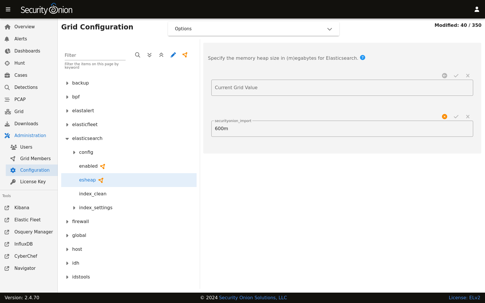

.. _elasticsearch:

Elasticsearch
=============

From https://www.elastic.co/products/elasticsearch:

    Elasticsearch is a distributed, RESTful search and analytics engine capable of addressing a growing number of use cases. As the heart of the Elastic Stack, it centrally stores your data for lightning fast search, fine‑tuned relevancy, and powerful analytics that scale with ease.

Storage
-------

All of the data Elasticsearch collects is stored under ``/nsm/elasticsearch/``.

Schema
------

Security Onion tries to adhere to Elastic Common Schema (ECS) wherever possible. In some cases, additional fields or slight modifications to native Elastic field mappings may be found within the data. You can learn more about ECS at https://www.elastic.co/elasticsearch/common-schema.

Querying
--------

You can query Elasticsearch using web interfaces like :ref:`alerts`, :ref:`dashboards`, :ref:`hunt`, and :ref:`kibana`. You can also query Elasticsearch from the command line using :ref:`so-elasticsearch-query`.

Authentication
--------------

You can authenticate to Elasticsearch using the same username and password that you use for :ref:`soc`.

You can add new user accounts to both Elasticsearch and :ref:`soc` at the same time as shown in the :ref:`adding-accounts` section. Please note that if you instead create accounts directly in Elastic, then those accounts will only have access to Elastic and not :ref:`soc`.

Indexing
--------

Most data is associated with a data stream, which is an abstraction from traditional indices that leverages one or more backing indices to manage and represent the data within the data stream. The usage of data streams allows for greater flexibility in data management.

Data streams can be targeting during search or other operations directly, similar to how indices are targeted.

For example, a CLI-based query against Zeek connection records would look like the following:

::

	so-elasticsearch-query logs-zeek-so/_search?q=event.dataset:conn

When this query is run against the backend data, it is actually targeting one or more backing indices, such as:

::

  .ds-logs-zeek-so-2022-03-07.0001
  .ds-logs-zeek-so-2022-03-08.0001
  .ds-logs-zeek-so-2022-03-08.0002

Similarly, you can target a single backing index with the following query:

::

	so-elasticsearch-query .ds-logs-zeek-so-2022-03-08.001/_search?q=event.dataset:conn

You can learn more about data streams at https://www.elastic.co/guide/en/elasticsearch/reference/current/data-streams.html.

Configuration
-------------

You can configure Elasticsearch by going to :ref:`administration` --> Configuration --> elasticsearch.

Index Management
----------------

Elasticsearch indices are managed by both the ``so-elasticsearch-indices-delete`` utility and Index Lifecycle Management (ILM). 

.. tip::

   Starting in Security Onion 2.4.70, you have the option of disabling ``so-elasticsearch-indices-delete`` and just managing indices using ILM. This may be useful for production deployments since ILM provides more granular index management. You can find this option at :ref:`administration` --> Configuration --> elasticsearch --> index_clean.
   
.. warning::
   
   If you disable ``so-elasticsearch-indices-delete`` via the index_clean setting, then you will need to ensure that ILM is configured properly to delete indices before disk usage reaches the Elasticsearch watermark setting. Otherwise, Elasticsearch may stop ingesting new data.

so-elasticsearch-indices-delete
~~~~~~~~~~~~~~~~~~~~~~~~~~~~~~~

``so-elasticsearch-indices-delete`` manages size-based deletion of Elasticsearch indices based on the value of the ``elasticsearch.retention.retention_pct`` setting. This setting is checked against the total disk space available for ``/nsm/elasticsearch`` across all nodes in the Elasticsearch cluster. If your indices are using more than ``retention_pct``, then ``so-elasticsearch-indices-delete`` will delete old indices until available disk space is back under ``retention_pct``. The default value for this setting is ``50`` percent so that standalone deployments have sufficient space for not only Elasticsearch but also full packet capture and other logs. For distributed deployments with dedicated search nodes where Elasticsearch is main consumer of disk space, you may want to increase this default value.

To modify the ``retention_pct`` value, first navigate to :ref:`administration` --> Configuration. At the top of the page, click the ``Options`` menu and then enable the ``Show advanced settings`` option. Then navigate to elasticsearch --> retention --> retention_pct. Once you make the change and save it, the new setting will take effect at the next 15 minute interval. If you would like to make the change immediately, you can click the ``SYNCHRONIZE GRID`` button under the ``Options`` menu at the top of the page.

ILM
~~~

Index Lifecycle Management (ILM) manages the following:

- size-based index rollover
- time-based index rollover
- time-based content tiers
- time-based index deletion

Time-based index deletion is based on the ``min_age`` setting within the global policy or the individual policy for the index itself. Please note that size-based deletion via ``so-elasticsearch-indices-delete`` takes priority over time-based deletion, as disk usage may reach ``retention_pct`` and indices will be deleted before the ``min_age`` value is reached.

ILM settings can be found by navigating to :ref:`administration` --> Configuration --> elasticsearch --> index_settings. 

To edit the global policy that applies to ALL indices, navigate to global_overrides --> policy --> phases and there you will see the cold, delete, hot, and warm ILM phases.

To edit the policy for an individual index, first click the ``Options`` menu at the top of the page and then enable the ``Show advanced settings`` option. Then navigate to $index --> policy --> phases. There you will see the cold, delete, hot, and warm ILM phases for that particular index.

It's important to note that settings like ``min_age`` are calculated relative to the rollover date (NOT the original creation date of the index). For example, if you have an index that is set to rollover after 30 days and delete ``min_age`` set to 30 then there will be 30 days from index creation to rollover and then an additional 30 days before deletion.

When modifying ILM settings, note that some settings will only take effect after a new index is created.

.. note::

        | You can learn more about ILM at:
        | https://www.elastic.co/guide/en/elasticsearch/reference/current/index-lifecycle-management.html

Parsing
-------

Elasticsearch receives unparsed logs from :ref:`logstash` or :ref:`elastic-agent`. Elasticsearch then parses and stores those logs. Parsers are stored in ``/opt/so/conf/elasticsearch/ingest/``. Custom ingest parsers can be placed in ``/opt/so/saltstack/local/salt/elasticsearch/files/ingest/``. To make these changes take effect, restart Elasticsearch using ``so-elasticsearch-restart``.

:ref:`elastic-agent` may pre-parse or act on data before the data reaches Elasticsearch, altering the data stream or index to which it is written, or other characteristics such as the event dataset or other pertinent information. This configuration is maintained in the agent policy or integration configuration in :ref:`elastic-fleet`.

.. note::

        | You can learn more about Elasticsearch ingest parsing at:
        | https://www.elastic.co/guide/en/elasticsearch/reference/current/ingest.html

Cluster
-------

In a distributed deployment with a manager and one or more search nodes, the manager and search nodes are joined together as a multi-node Elastic cluster.

For more information, please see the cluster information at https://www.elastic.co/guide/en/elasticsearch/reference/current/modules-node.html#modules-node.

Elasticsearch Node Roles
------------------------

Please see the Elasticsearch node roles documentation at https://www.elastic.co/guide/en/elasticsearch/reference/current/modules-node.html. 

When building a distributed deployment, the Security Onion manager has to start off with the ``data`` node role. If you later join a separate search node, then you may want to migrate the data from the manager to the search node and then remove the ``data`` node role from the manager. For more information, please see:

https://www.elastic.co/guide/en/elasticsearch/reference/current/modules-cluster.html#cluster-shard-allocation-filtering

If you want to set certain search nodes to the ``data_hot``, ``data_warm``, or ``data_cold`` roles, make sure you remove the ``data`` role from them. You will also want to ensure that ``data_content`` is assigned to your hot nodes.

.. warning::

   Elasticsearch node roles is an advanced setting and you should be careful to avoid disruption to your cluster!

To see and modify Elasticsearch node roles, first navigate to :ref:`administration` --> Configuration, click the ``Options`` menu at the top of the page, and enable the ``Show advanced settings`` option. Then navigate to elasticsearch --> so_roles and select the desired role. Finally, navigate to config --> node --> roles and the list of roles should appear on the right side of the page.

Templates
---------

Fields are mapped to their appropriate data type using templates. When making changes for parsing, it is necessary to ensure fields are mapped to a data type to allow for indexing, which in turn allows for effective aggregation and searching in :ref:`dashboards`, :ref:`hunt`, and :ref:`kibana`. Elasticsearch leverages both component and index templates.

Component Templates
~~~~~~~~~~~~~~~~~~~

From https://www.elastic.co/guide/en/elasticsearch/reference/current/index-templates.html:

    Component templates are reusable building blocks that configure mappings, settings, and aliases. While you can use component templates to construct index templates, they aren’t directly applied to a set of indices.
    
Also see https://www.elastic.co/guide/en/elasticsearch/reference/current/indices-component-template.html.

Index Templates
~~~~~~~~~~~~~~~

From https://www.elastic.co/guide/en/elasticsearch/reference/current/index-templates.html:    
    
    An index template is a way to tell Elasticsearch how to configure an index when it is created. Templates are configured prior to index creation. When an index is created - either manually or through indexing a document - the template settings are used as a basis for creating the index. Index templates can contain a collection of component templates, as well as directly specify settings, mappings, and aliases.

In Security Onion, component templates are stored in ``/opt/so/saltstack/default/salt/elasticsearch/templates/component/``. 

These templates are specified to be used in the index template definitions in ``/opt/so/saltstack/default/salt/elasticsearch/defaults.yml``.

Community ID
------------

| For logs that don’t naturally include :ref:`community-id`, we use the Elasticsearch Community ID processor:
| https://www.elastic.co/guide/en/elasticsearch/reference/current/community-id-processor.html

field expansion matches too many fields
---------------------------------------

If you get errors like ``failed to create query: field expansion for [*] matches too many fields, limit: 3500, got: XXXX``, then this usually means that you're sending in additional logs and so you have more fields than our default ``max_clause_count`` value. To resolve this, you can go to :ref:`administration` --> Configuration --> elasticsearch --> config --> indices --> query --> bool --> max_clause_count and adjust the value for any boxes running Elasticsearch in your deployment.
      
Shards
------

Here are a few tips from https://www.elastic.co/blog/how-many-shards-should-i-have-in-my-elasticsearch-cluster:

    TIP: Avoid having very large shards as this can negatively affect the cluster's ability to recover from failure. There is no fixed limit on how large shards can be, but a shard size of 50GB is often quoted as a limit that has been seen to work for a variety of use-cases.

    TIP: Small shards result in small segments, which increases overhead. Aim to keep the average shard size between a few GB and a few tens of GB. For use-cases with time-based data, it is common to see shards between 20GB and 40GB in size.

    TIP: The number of shards you can hold on a node will be proportional to the amount of heap you have available, but there is no fixed limit enforced by Elasticsearch. A good rule-of-thumb is to ensure you keep the number of shards per node below 20 to 25 per GB heap it has configured. A node with a 30GB heap should therefore have a maximum of 600-750 shards, but the further below this limit you can keep it the better. This will generally help the cluster stay in good health.

To see your existing shards, run the following command and the number of shards will be shown in the fifth column:

::

    sudo so-elasticsearch-indices-list
    
If you want to view the detail for each of those shards:

::

    sudo so-elasticsearch-shards-list

Given the sizing tips above, if any of your indices are averaging more than 50GB per shard, then you should probably increase the shard count until you get below that recommended maximum of 50GB per shard.

The number of shards for an index can be adjusted by going to :ref:`administration` --> Configuration --> elasticsearch --> index_settings --> so-INDEX-NAME --> index_template --> template --> settings --> index --> number_of_shards.

Please keep in mind that old indices will retain previous shard settings and the above settings will only be applied to newly created indices.

Heap Size
---------

If total available memory is 8GB or greater, Setup configures the heap size to be 33% of available memory, but no greater than 25GB. You may need to adjust the value for heap size depending on your system's performance. You can modify this by going to :ref:`administration` --> Configuration --> elasticsearch --> esheap.

| For more information, please see:
| https://www.elastic.co/guide/en/elasticsearch/guide/current/heap-sizing.html#compressed_oops
| https://www.elastic.co/guide/en/elasticsearch/reference/current/important-settings.html#heap-size-settings

Field limit
-----------

Security Onion currently defaults to a field limit of 5000. If you receive error messages from Logstash, or you would simply like to increase this, you can do so by going to :ref:`administration` --> Configuration --> elasticsearch --> index_settings --> so-INDEX-NAME --> index_template --> template --> settings --> index --> mapping --> total_fields --> limit.

Please note that the change to the field limit will not occur immediately, only on index creation.

Re-indexing
-----------

Re-indexing may need to occur if field data types have changed and conflicts arise. This process can be VERY time-consuming, and we only recommend this if keeping data is absolutely critical.  

| For more information about re-indexing, please see:
| https://www.elastic.co/guide/en/elasticsearch/reference/current/docs-reindex.html

Clearing
--------

If you want to clear all Elasticsearch data including documents and indices, you can run the ``so-elastic-clear`` command.

GeoIP
-----

Elasticsearch 8 no longer includes GeoIP databases by default. We include GeoIP databases for Elasticsearch so that all users will have GeoIP functionality. If your search nodes have Internet access and can reach geoip.elastic.co and storage.googleapis.com, then you can opt-in to database updates if you want more recent information. In :ref:`soc`, navigate to :ref:`administration` --> Configuration. At the top of the page, click the ``Options`` menu and then enable the ``Show advanced settings`` option. Then navigate to elasticsearch --> advanced and add the following config on the right side of the screen.

::

    elasticsearch:
      config:
        ingest:
          geoip:
            downloader:
              enabled: true

Once the config is added, click the green check mark to save the configuration.

Health
------

To check Elasticsearch health, go to the :ref:`grid` interface and check the Elasticsearch Status field. If it shows anything other than OK, then run the following command from the CLI on the manager node to check for additional clues:

::

        sudo so-elasticsearch-query _cluster/health?pretty

Status Pending
--------------

If the :ref:`grid` interface shows Elasticsearch Status as ``Pending``, check for unassigned shards by running the following command from the CLI on the manager node:

::

       sudo so-elasticsearch-query _cat/shards | grep UN

The result of the query should display affected indices. Older metrics indices for Elastic Endpoint logs may have been assigned a replica, so if you are running a single-node Elastic cluster there will be nowhere for the replica to exist.
To resolve the issue, run the following command for each affected index (replacing ``$index`` with the actual index name):

::

        sudo so-elasticsearch-query $index/_settings -d '{"number_of_replicas":0}' -XPUT

After running the command, the index should no longer use replicas and the status should change from "Pending" to "OK" once all indices have been successfully modified.

Diagnostic Logging
------------------

-  Elasticsearch logs can be found in ``/opt/so/log/elasticsearch/``.
-  Logging configuration can be found in ``/opt/so/conf/elasticsearch/log4j2.properties``.

Depending on what you're looking for, you may also need to look at the :ref:`docker` logs for the container:

::

        sudo docker logs so-elasticsearch

More Information
----------------

.. note::

    | For more information about Elasticsearch, please see:
    | https://www.elastic.co/products/elasticsearch
