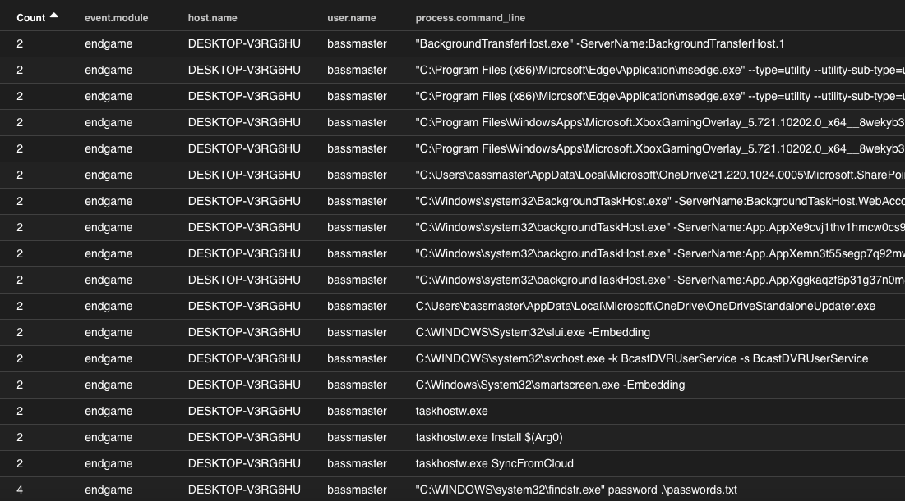
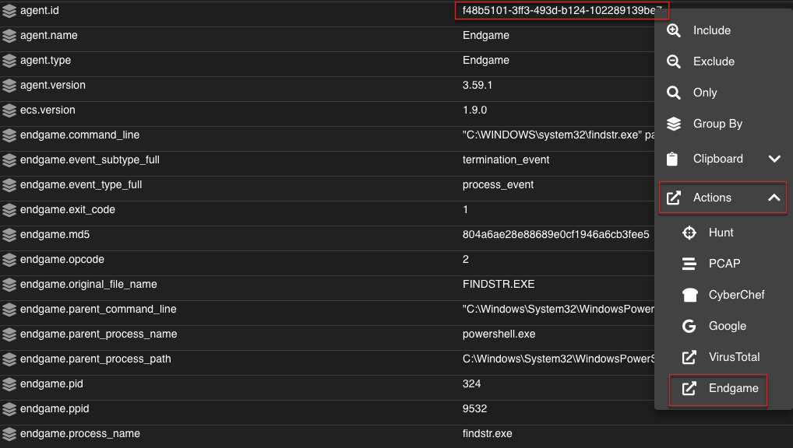

Endgame
=======

.. warning::

        Endgame support has not been tested yet!

You can ingest Endgame data by following the steps below.

.. note::

 Please keep in mind that we currently use the ``*:endgame-*`` index pattern for Endgame data. This means the data will not be visible using the normal Security Onion dashboards/index pattern in Kibana. However, Endgame data will be viewable and aggregatable using Hunt and Elastic Security.

Configuration
-------------

**During Security Onion Setup**

To configure Endgame ingestion during setup, ensure the ``ENDGAMEHOST`` variable is set to the IP address of the Endgame SMP that you want to send data from:

::

 sudo ENDGAMEHOST=192.168.1.100 ./so-setup-network

This will open the Security Onion host-based firewall for access from the SMP to Security Onion on TCP port 3765.

Example Endgame Data
--------------------

Pivot to Endgame Console
------------------------

If Endgame support is enabled, a default `Endgame` pivot will be populated within SOC, based on the ``agent.id`` field:

 
.. image:: images/endgame-console.png
 :target: _images/endgame-console.png
