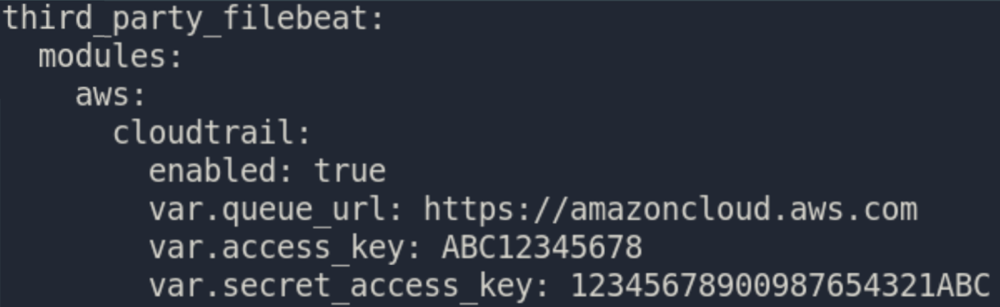
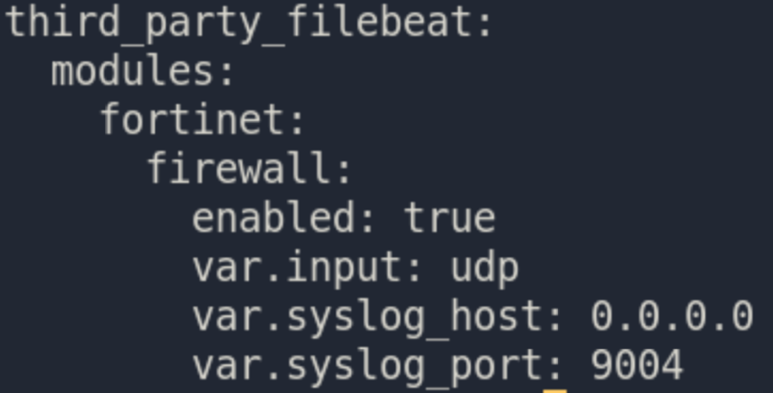

.. _filebeat:

Filebeat
========

From https://www.elastic.co/beats/filebeat:

     Filebeat helps you keep the simple things simple by offering a lightweight way to forward and centralize logs and files.
     
On an Evaluation installation, Filebeat sends logs directly to :ref:`elasticsearch`. For other installation types, Filebeat sends to :ref:`logstash`.

Configuration
-------------

You can configure Filebeat inputs and output using :ref:`salt`. An example of the filebeat pillar can be seen at https://github.com/Security-Onion-Solutions/securityonion/blob/master/salt/filebeat/pillar.example

Any inputs that are added to the pillar definition will be in addition to the default defined inputs. In order to prevent a :ref:`zeek` log from being used as input, the ``zeeklogs:enabled`` pillar will need to be modified. The easiest way to do this is via :ref:`so-zeek-logs`. 

Modules
-------

Starting in Security Onion 2.3.60, we will support official Filebeat modules. You can learn more about Filebeat modules at https://www.elastic.co/guide/en/beats/filebeat/current/filebeat-modules.html.

Example 1: AWS Cloudtrail Logs
~~~~~~~~~~~~~~~~~~~~~~~~~~~~~~

If you would like to parse AWS Cloudtrail logs using the Filebeat cloudtrail module, you can add something like the following to the minion pillar:

Example 2: Fortinet Logs
~~~~~~~~~~~~~~~~~~~~~~~~

If you want to parse Fortinet logs using the Filebeat fortinet module, you can add something like the following to the minion pillar:

(Please note that firewall ports still need to be opened on the minion to accept the Fortinet logs.)

Diagnostic Logging
------------------

Filebeat's log can be found in ``/opt/so/log/filebeat/``.

More Information
----------------

.. seealso::

    For more information about Filebeat, please see https://www.elastic.co/beats/filebeat.
