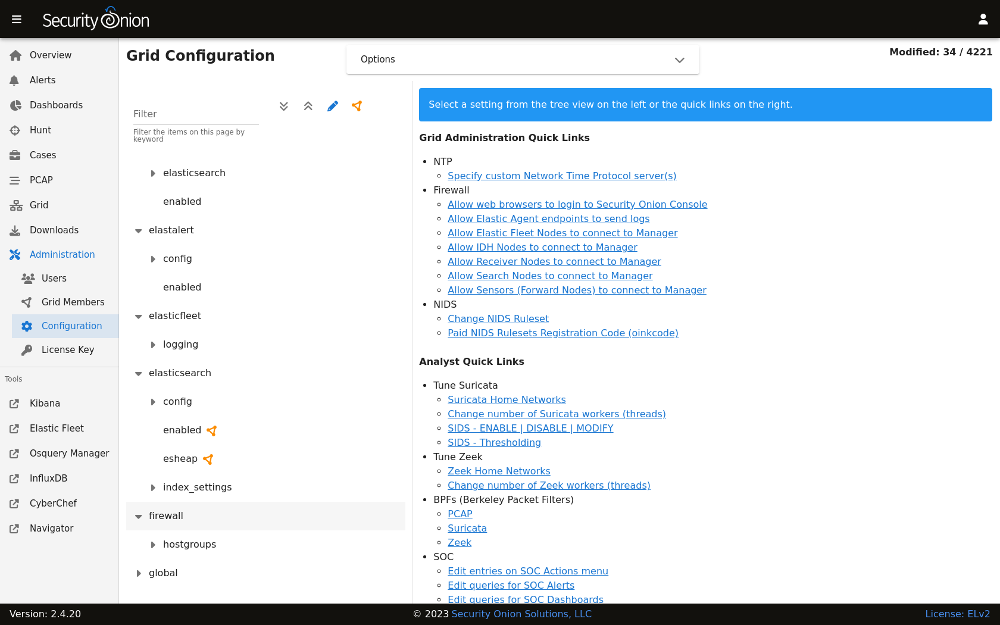

.. _firewall:

Firewall
========

This section will cover both network firewalls outside of Security Onion and the host-based firewall built into Security Onion.

Network Firewalls
-----------------

This first sub-section will discuss network firewalls outside of Security Onion.

Internet Communication
~~~~~~~~~~~~~~~~~~~~~~

When configuring network firewalls for Internet-connected deployments (non-:ref:`airgap`), you'll want to ensure that the deployment can connect outbound (TCP/443) to the following:

- raw.githubusercontent.com (Security Onion public key)
- sigs.securityonion.net (Signature files for Security Onion containers)  
- ghcr.io (Container downloads)  
- pkg-containers.githubusercontent.com (Container downloads)  
- rules.emergingthreatspro.com (Emerging Threats IDS rules)  
- rules.emergingthreats.net (Emerging Threats IDS open rules)  
- github.com (Strelka and Sigma rules updates) 

If you are using our ISO image, you will also need access to the following:

- repo.securityonion.net (primary repo for Oracle Linux package updates)
- repo-alt.securityonion.net (secondary repo for Oracle Linux package updates)
- so-repo-east.s3.us-east-005.backblazeb2.com (secondary repo for Oracle Linux package updates)

If you are not using our ISO image and are instead performing a :ref:`network-installation`, you will also need access to the following:

- update repo for whatever base OS you're installing on (OS packages)
- download.docker.com (:ref:`docker` packages)
- repo.saltstack.com (:ref:`salt` packages)

If you choose to enable GeoIP updates for :ref:`elasticsearch`, you will also need access to the following:

- geoip.elastic.co
- storage.googleapis.com

If you choose to enable the Snort Talos ruleset, you will also need access to the following:

- www.snort.org

Node Communication
~~~~~~~~~~~~~~~~~~

When configuring network firewalls for distributed deployments, you'll want to ensure that nodes can connect as shown below. 

All nodes to Manager:

- TCP/443 - Sensoroni
- TCP/5000 - Docker registry
- TCP/8086 - influxdb
- TCP/4505 - Salt
- TCP/4506 - Salt

Elastic Agent:

- TCP/8220 (All nodes to Manager, Fleet nodes) - Elastic Agent management
- TCP/8443 (All nodes to Manager) - Elastic Agent binary updates
- TCP/5055 (All nodes to Manager, Fleet nodes, Receiver nodes) - Elastic Agent data

Search nodes from/to Manager:

- TCP/9300 - Node-to-node for :ref:`elasticsearch`
- TCP/9696 - :ref:`redis`

Elastic Fleet nodes to Manager:

- TCP/9200 - Node-to-node for :ref:`elasticsearch`
- TCP/5056 - Logstash-to-Logstash for Elastic Agent data ingest

Elastic Fleet nodes to Receiver nodes:

- TCP/5056 - Logstash-to-Logstash for Elastic Agent data ingest

Host Firewall
-------------

The remainder of this section will cover the host firewall built into Security Onion. 

.. tip::

   Security Onion locks down the firewall by default. 

Configuring Host Firewall
-------------------------

You can configure the firewall by going to :ref:`administration` --> Configuration --> firewall --> hostgroups.

If for some reason you can't access :ref:`soc`, you can use the so-firewall command to allow your IP address to connect (replacing ``<IP ADDRESS>`` with your actual IP address):
::

    so-firewall includehost analyst <IP ADDRESS>

Reviewing Host Firewall
-----------------------

You can view the entire firewall configuration from the command line using the ``iptables`` command like this:
::

        sudo iptables -nvL

.. warning::

   You can use this command to view the iptables configuration, but please do not modify the firewall manually using iptables as it is managed by :ref:`salt`. You should only make changes via the Configuration screen as shown above.

Port Groups
-----------

Port groups are a way of grouping together ports similar to a firewall port/service alias. For example, if you have a web server you might add ports 80 and 443 into a port group.

Host Groups
-----------

Host groups are similar to port groups but for storing lists of hosts that will be allowed to connect to the associated port groups.

Function
--------

The firewall state is designed with the idea of creating port groups and host groups, each with their own alias or name, and associating the two in order to create an allow rule. A node that has a port group and host group association assigned to it will allow those hosts to connect to those ports on that node.

The default allow rules for each node are defined by its role (manager, searchnode, sensor, heavynode, etc) in the grid. Host groups and port groups can be created or modified from the manager node by going to :ref:`administration` --> Configuration --> firewall --> hostgroups. When setup is run on a new node, it will ask the manager to add itself to the appropriate host groups. All node types are added to the minion host group to allow :ref:`salt` communication. If you were to add a search node, you would see its IP appear in both the ``minion`` and the ``search_node`` host groups.

Advanced Firewall Config
------------------------

When you go to :ref:`administration` --> Configuration --> firewall, you will only see ``hostgroups`` by default. If you need to modify port groups, then you will need to click the ``Options`` menu and then enable the ``Show all configurable settings, including advanced settings.`` option.

Modifying a default port group
~~~~~~~~~~~~~~~~~~~~~~~~~~~~~~

The analyst hostgroup is allowed access to the nginx ports which are 80 and 443 by default. In this example, we will extend the default nginx port group to include a custom port.

#. At the top of the page, click the ``Options`` menu and then enable the ``Show all configurable settings, including advanced settings.`` option.
#. On the left side, go to ``firewall``, select ``portgroups``, locate the ``nginx`` portgroup, and then select ``tcp``.
#. On the right side, select the manager node, specify your custom port to be added, and then click the checkmark to save the value.
#. If you would like to apply the rules immediately, click the ``SYNCHRONIZE GRID`` button under the ``Options`` menu at the top of the page.

Creating a custom host group with a custom port group
~~~~~~~~~~~~~~~~~~~~~~~~~~~~~~~~~~~~~~~~~~~~~~~~~~~~~

In this example, we will add a new custom hostgroup to allow a custom set of hosts to connect to a custom port on an IDH node.

#. At the top of the page, click the ``Options`` menu and then enable the ``Show all configurable settings, including advanced settings.`` option.
#. On the left side, go to ``firewall``, select ``hostgroups``, and then select ``customhostgroup0``.
#. On the right side, select the IDH node that you want to allow access to, add the list of hosts that require access, and then click the checkmark to save the value.
#. On the left side, go to ``firewall``, select ``portgroups``, select ``customportgroup0``, and then select the appropriate protocol.
#. On the right side, select the IDH node that you want to allow access to, add your custom port, and then click the checkmark to save the value.
#. On the left side, go to ``firewall``, ``role``, and then select ``idh``, ``chain``, ``DOCKER-USER``, ``hostgroups``, ``customhostgroup0``, ``portgroups``.
#. On the right side, select the IDH node that you want to allow access to, add the portgroup ``customportgroup0``, and then click the checkmark to save the value.
#. The next time the IDH node checks in, it should get the appropriate firewall rules.
