.. _first-time-users:

First Time Users
================

Welcome, first time users! You're going to be peeling back the layers of your network in just a few minutes! 

First, download our ISO image as shown in the :ref:`download` section. 

Then install the ISO image and configure for IMPORT as shown below (also see the :ref:`installation` and :ref:`configuration` sections). This can be done in a minimal virtual machine with as little as 4GB RAM, 2 CPU cores, and 200GB of storage. For more information about virtualization, please see the :ref:`vmware`, :ref:`virtualbox`, and :ref:`proxmox` sections.

Once you're comfortable with your IMPORT installation, then you can move on to more advanced installations as shown in the :ref:`architecture` section.

After booting the ISO image, the boot menu appears:

.. image:: images/01_grub.png
  :target: _images/01_grub.png

When prompted, enter your desired username and password:

.. image:: images/02_initial_install.png
  :target: _images/02_initial_install.png

Once installation is complete, you are prompted to reboot:

.. image:: images/03_initial_install_finished.png
  :target: _images/03_initial_install_finished.png

After rebooting, login using the username and password that you specified and then Setup will start automatically:

Perform a standard installation:

.. image:: images/05_setup_option.png
  :target: _images/05_setup_option.png

When prompted for installation type, select IMPORT:

.. image:: images/06_setup_type.png
  :target: _images/06_setup_type.png

If your Security Onion machine has full Internet access as described in the :ref:`firewall` section, select Standard. Otherwise, select :ref:`airgap`:

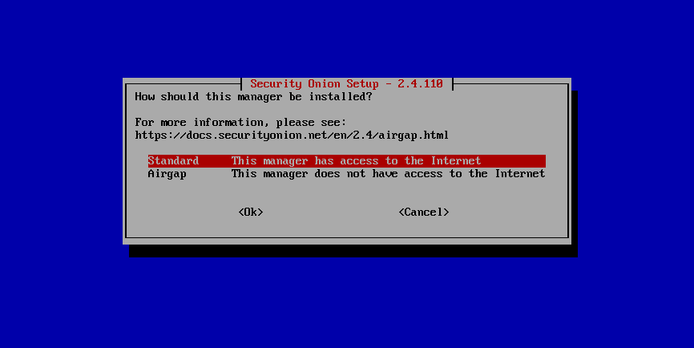

Review the license and agree:

.. image:: images/07_setup_license.png
  :target: _images/07_setup_license.png

Set the hostname:

.. image:: images/08_setup_hostname.png
  :target: _images/08_setup_hostname.png

If you use the default hostname of ``securityonion``, you will see a warning:

.. image:: images/09_setup_hostname_conflict.png
  :target: _images/09_setup_hostname_conflict.png

Select your management interface:

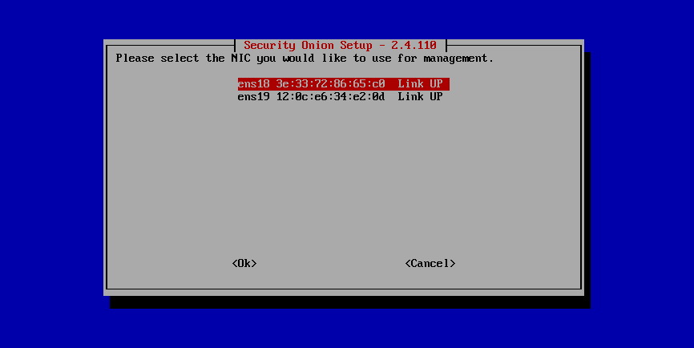

Select static IP addressing (recommended) or DHCP:

.. image:: images/11_setup_mn_int.png
  :target: _images/11_setup_mn_int.png

Specify IP address and CIDR mask:

.. image:: images/12_setup_cidr.png
  :target: _images/12_setup_cidr.png

Set gateway address:

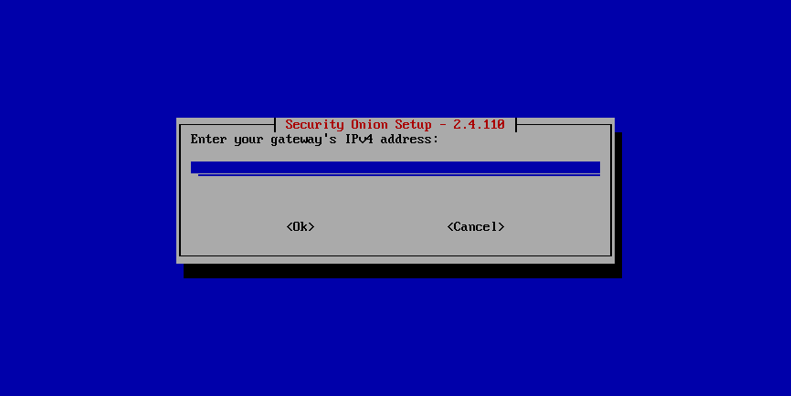

Enter DNS servers:

Configure DNS search domain:

.. image:: images/15_setup_dns_domain.png
  :target: _images/15_setup_dns_domain.png

If necessary, you can change the default Docker IP range:

If you are connected to the Internet, select whether it is direct or via proxy:

.. image:: images/18_setup_direct_proxy.png
  :target: _images/18_setup_direct_proxy.png

Create username for :ref:`soc`:

.. image:: images/20_setup_webuser.png
  :target: _images/20_setup_webuser.png

Set password for :ref:`soc`:

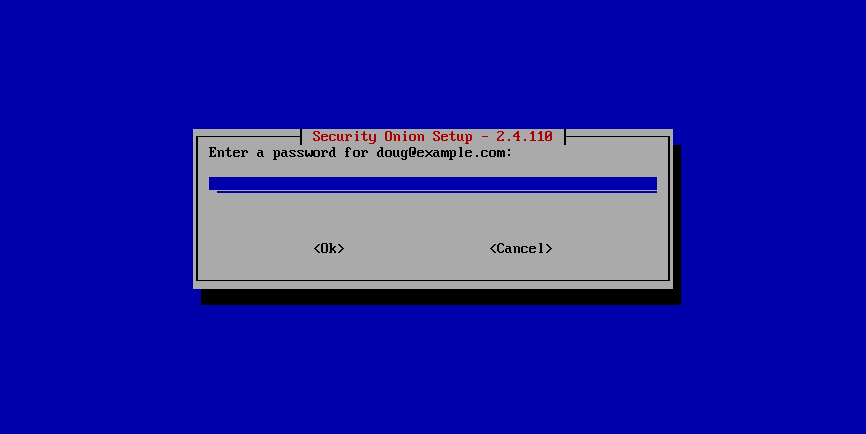

Confirm password for :ref:`soc`:

.. image:: images/22_setup_webpass2.png
  :target: _images/22_setup_webpass2.png

Select how to access :ref:`soc`:

.. image:: images/23_setup_access_type.png
  :target: _images/23_setup_access_type.png

Allow connections through the host-based firewall if necessary:

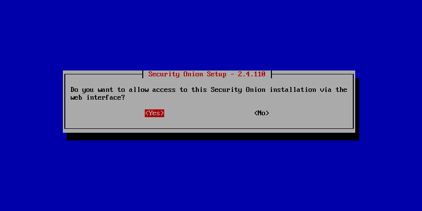

Specify an IP address or range to allow through the host-based firewall:

.. image:: images/27_setup_so_allow_input.png
  :target: _images/27_setup_so_allow_input.png

Confirm all options:

.. image:: images/28_setup_summary.png
  :target: _images/28_setup_summary.png

Setup complete:

Login to :ref:`soc`:

.. image:: images/37_login.png
  :target: _images/37_login.png

After logging in, you will see the :ref:`soc` Overview page:

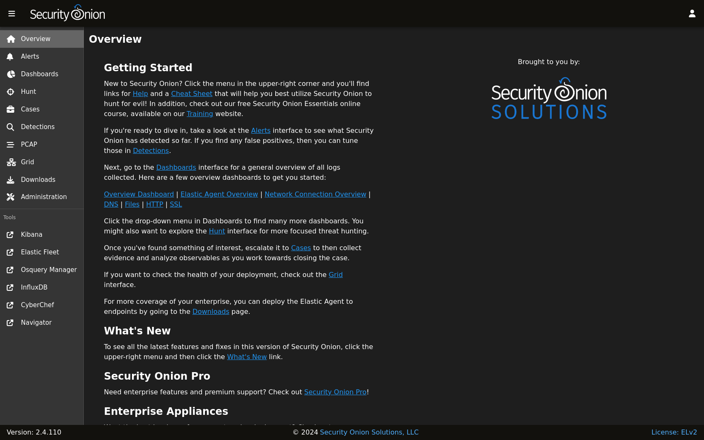

Go to the :ref:`grid` page, click the button to expand the node, and then verify all services are running properly:

.. image:: images/39_grid.png
  :target: _images/39_grid.png

While on the :ref:`grid` page, you can import a PCAP or EVTX file using the upload button at the bottom of the screen:

.. image:: images/40_upload.png
  :target: _images/40_upload.png

Once the import is complete, the :ref:`grid` page should display a message at the of the page and provide a link to :ref:`dashboards` to view all alerts and logs from the import:

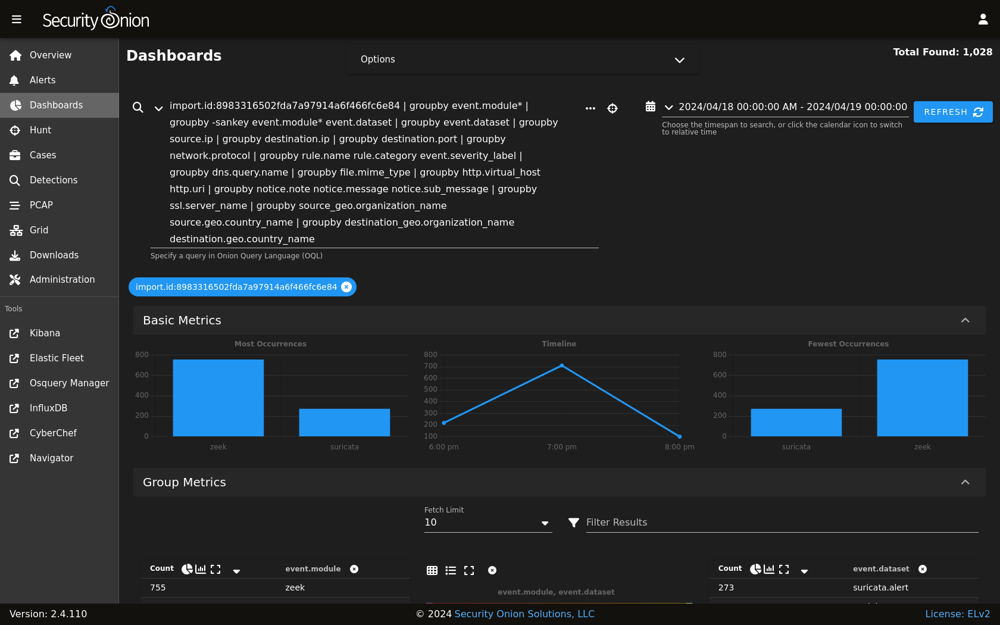

If you want to see just the alerts, you can go to the :ref:`alerts` page although you may need to manually adjust the time range:

.. image:: images/50_alerts.png
  :target: _images/50_alerts.png

If you find something interesting on the :ref:`alerts` or :ref:`dashboards` pages, you may want to use the Correlate or Hunt actions to find related logs on the :ref:`hunt` page:

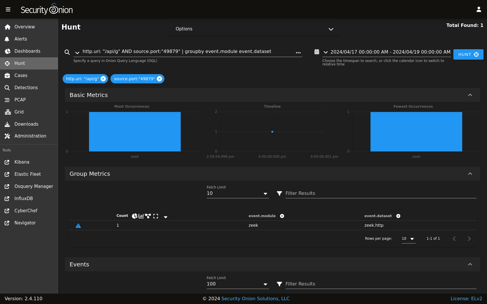

If you find interesting network traffic, you can pivot to full packet capture via the :ref:`pcap` action:

.. image:: images/62_pcap.png
  :target: _images/62_pcap.png

You can change the view to ASCII transcript for a more human readable view of the traffic:

.. image:: images/65_pcap_details.png
  :target: _images/65_pcap_details.png

If you find an interesting artifact, you can send it to :ref:`cyberchef`:

.. image:: images/68_cyberchef.png
  :target: _images/68_cyberchef.png

If you need to refer back to previous PCAP jobs, you can find them on the :ref:`pcap` page:

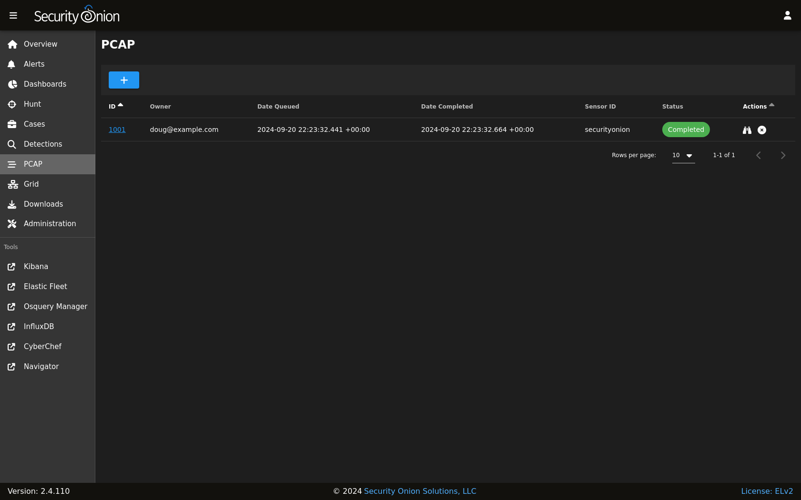

IMPORT installations do not support remote agents, but if you were running a production installation you could download the Elastic Agent installer from :ref:`downloads`:

.. image:: images/78_downloads.png
  :target: _images/78_downloads.png

The :ref:`administration` section allows to you manage user accounts:

.. image:: images/81_users.png
  :target: _images/81_users.png

It also allows you to manage grid members:

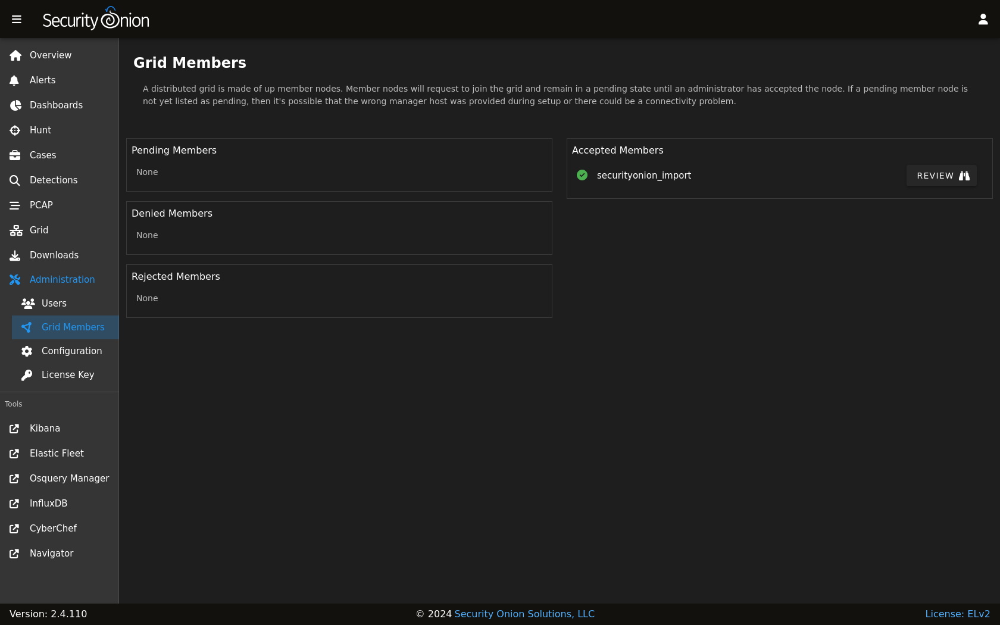

The :ref:`administration` section also allows you to configure various aspects of the system:

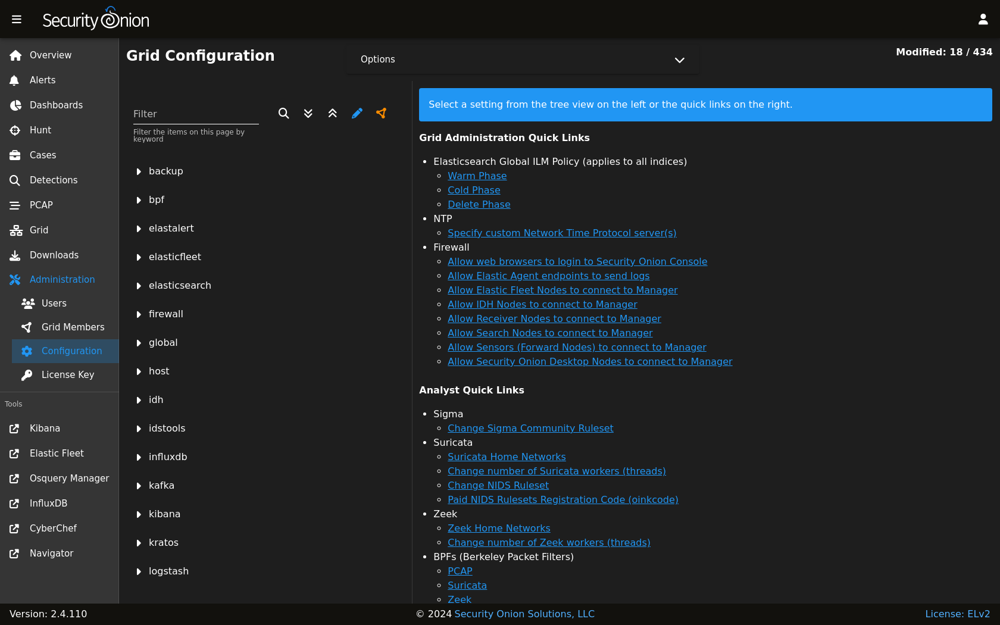

It also allows you to upload a license key for additional enterprise features:

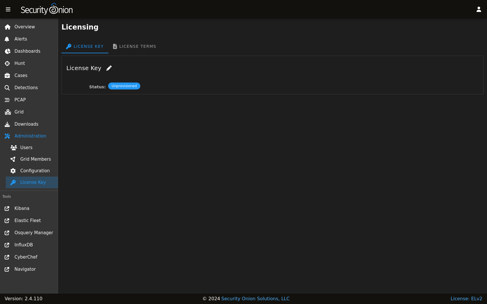

All this in a minimal VM with only 4GB RAM!

.. image:: images/39_grid.png
  :target: _images/39_grid.png

If you made it to the end of this First Time Users section, congratulations! If you have any questions or problems, please see the :ref:`help` section. If you like Security Onion, please consider sharing on social media about Security Onion to help spread the word. Thanks!
