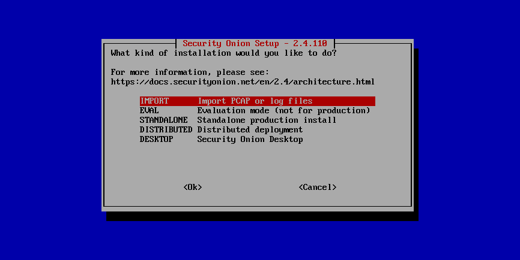
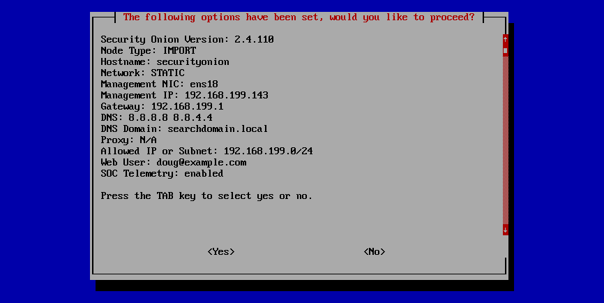

.. _first-time-users:

First Time Users
================

If this is your first time using Security Onion, then we highly recommend that you start with a simple IMPORT installation. This can be done in a minimal virtual machine (see the :ref:`vmware` and :ref:`virtualbox` sections) with as little as 4GB RAM, 2 CPU cores, and 200GB of storage. Just install Rocky Linux 9 and start our Setup wizard as shown in the :ref:`installation` section. Then follow the screenshots below to configure for IMPORT and run :ref:`so-import-pcap` to import one or more pcap files. After following the screenshots, you can skip to the :ref:`soc` section.

Once you're comfortable with your IMPORT installation, then you can move on to more advanced installations as shown in the :ref:`architecture` section.

.. image:: images/04_setup_init.png
  :target: _images/04_setup_init.png

.. image:: images/07_setup_license.png
  :target: _images/07_setup_license.png

.. image:: images/08_setup_hostname.png
  :target: _images/08_setup_hostname.png

.. image:: images/09_setup_network.png
  :target: _images/09_setup_network.png

.. image:: images/10_setup_dhcp.png
  :target: _images/10_setup_dhcp.png

.. image:: images/10_setup_mn_nic.png
  :target: _images/10_setup_mn_nic.png

.. image:: images/21_setup_webpass1.png
  :target: _images/21_setup_webpass1.png

.. image:: images/23_setup_access_type.png
  :target: _images/23_setup_access_type.png

.. image:: images/26_setup_so_allow.png
  :target: _images/26_setup_so_allow.png

.. image:: images/27_setup_so_allow_input.png
  :target: _images/27_setup_so_allow_input.png

.. image:: images/29_setup_finished.png
  :target: _images/29_setup_finished.png

.. image:: images/38_so-import-pcap.png
  :target: _images/38_so-import-pcap.png

.. image:: images/36_login.png
  :target: _images/36_login.png

.. image:: images/37_welcome.png
  :target: _images/37_welcome.png

.. image:: images/44_alerts.png
  :target: _images/44_alerts.png

.. image:: images/45_dashboards.png
  :target: _images/45_dashboards.png

.. image:: images/39_hunt.png
  :target: _images/39_hunt.png

.. image:: images/40_pcap.png
  :target: _images/40_pcap.png

.. image:: images/41_pcap_details.png
  :target: _images/41_pcap_details.png

.. image:: images/42_cyberchef.png
  :target: _images/42_cyberchef.png
