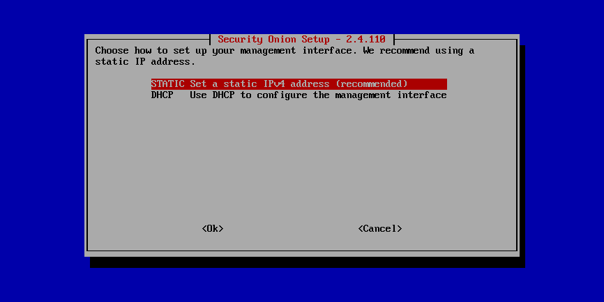
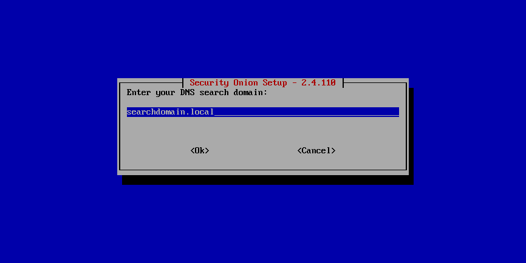
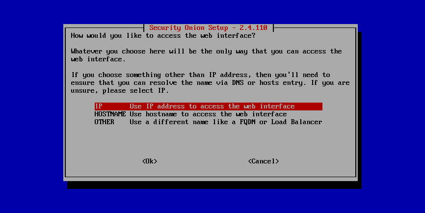

.. _first-time-users:

First Time Users
================

If this is your first time using Security Onion, then we highly recommend that you start with a simple IMPORT installation using our Security Onion ISO image (see the :ref:`download` section). This can be done in a minimal virtual machine (see the :ref:`vmware` and :ref:`virtualbox` sections) with as little as 4GB RAM, 2 CPU cores, and 200GB of storage.

The following screenshots will walk you through:

- installing our Security Onion ISO image
- configuring for IMPORT
- optionally enabling the Analyst environment (see the :ref:`analyst-vm` section)
- running :ref:`so-import-pcap` and importing one or more pcap files

After following the screenshots, you can skip to the :ref:`soc` section.

Once you're comfortable with your IMPORT installation, then you can move on to more advanced installations as shown in the :ref:`architecture` section.

.. image:: images/01_grub.png
  :target: _images/01_grub.png

.. image:: images/03_initial_install_finished.png
  :target: _images/03_initial_install_finished.png

.. image:: images/04_setup_init.png
  :target: _images/04_setup_init.png

.. image:: images/06_setup_type.png
  :target: _images/06_setup_type.png

.. image:: images/07_setup_license.png
  :target: _images/07_setup_license.png

.. image:: images/10_setup_mn_nic.png
  :target: _images/10_setup_mn_nic.png

.. image:: images/13_setup_gateway.png
  :target: _images/13_setup_gateway.png

.. image:: images/14_setup_dns_servers.png
  :target: _images/14_setup_dns_servers.png

.. image:: images/16_setup_network_init.png
  :target: _images/16_setup_network_init.png

.. image:: images/17_setup_airgap.png
  :target: _images/17_setup_airgap.png

.. image:: images/19_setup_homenet.png
  :target: _images/19_setup_homenet.png

.. image:: images/20_setup_webuser.png
  :target: _images/20_setup_webuser.png

.. image:: images/21_setup_webpass1.png
  :target: _images/21_setup_webpass1.png

.. image:: images/22_setup_webpass2.png
  :target: _images/22_setup_webpass2.png

.. image:: images/24_setup_ntp.png
  :target: _images/24_setup_ntp.png

.. image:: images/25_setup_ntp_input.png
  :target: _images/25_setup_ntp_input.png

.. image:: images/26_setup_so_allow.png
  :target: _images/26_setup_so_allow.png

.. image:: images/28_setup_summary.png
  :target: _images/28_setup_summary.png

.. image:: images/29_setup_finished.png
  :target: _images/29_setup_finished.png

.. image:: images/30_so_analyst_install.png
  :target: _images/30_so_analyst_install.png

.. image:: images/31_so_analyst_install_finished.png
  :target: _images/31_so_analyst_install_finished.png

.. image:: images/32_gnome_user.png
  :target: _images/32_gnome_user.png

.. image:: images/33_gnome_pass.png
  :target: _images/33_gnome_pass.png

.. image:: images/34_gnome_desktop.png
  :target: _images/34_gnome_desktop.png

.. image:: images/35_gnome_apps.png
  :target: _images/35_gnome_apps.png

.. image:: images/36_login.png
  :target: _images/36_login.png

.. image:: images/37_welcome.png
  :target: _images/37_welcome.png

.. image:: images/38_so-import-pcap.png
  :target: _images/38_so-import-pcap.png

.. image:: images/44_alerts.png
  :target: _images/44_alerts.png

.. image:: images/45_dashboards.png
  :target: _images/45_dashboards.png

.. image:: images/39_hunt.png
  :target: _images/39_hunt.png

.. image:: images/40_pcap.png
  :target: _images/40_pcap.png

.. image:: images/41_pcap_details.png
  :target: _images/41_pcap_details.png

.. image:: images/42_cyberchef.png
  :target: _images/42_cyberchef.png

.. image:: images/43_top.png
  :target: _images/43_top.png
