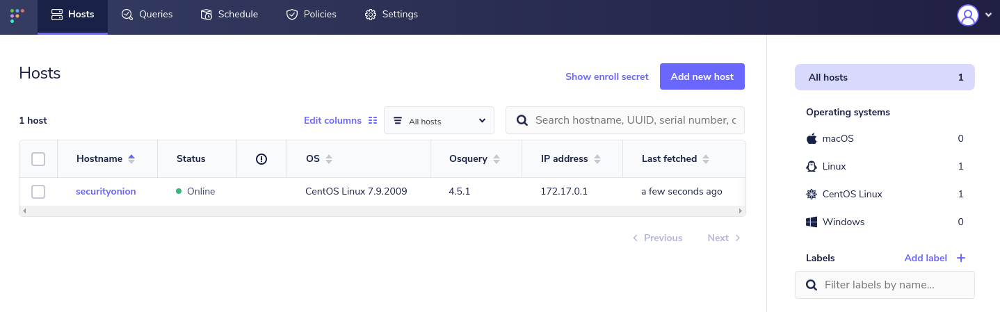

.. _fleet:

FleetDM
=======

From https://fleetdm.com/:

    Ask questions about your servers, containers, and laptops running Linux, Windows, and macOS. Quickly deploy osquery and scale your fleet to 50,000+ devices on top of a stable core technology.
    
Usage
-----

If you enabled Fleet during setup, you can then login to Fleet using the email address and password that you entered during the installer. You can edit the password or add a new Fleet user within Fleet itself.

Custom :ref:`osquery` packages are generated during setup and you can find them on the :ref:`downloads` page in :ref:`soc`. Before you install a package on an endpoint, use :ref:`so-allow` on your manager node to configure the firewall to allow inbound :ref:`osquery` connections.

Configuration
-------------

Fleet configuration can be found in ``/opt/so/conf/fleet/``. However, please keep in mind that if you make any changes to this directory they may be overwritten since the configuration is managed with :ref:`salt`.

Diagnostic Logging
------------------

Fleet logs can be found in ``/opt/so/log/fleet/``. Depending on what you're looking for, you may also need to look at the :ref:`docker` logs for the container:

::

        sudo docker logs so-fleet

fleetctl
--------

``fleetctl`` is a command-line utility that allows you to manage your Fleet instance and run live queries from the cli.

If using ``fleetctl`` from the Manager and Fleet is enabled on the Manager, first set the ``fleetctl`` login configuration:

::

    ./fleetctl config set --address https://localhost:8080 --url-prefix fleet --tls-skip-verify

Then login using a valid username and password:

::

    ./fleetctl login

``fleetctl`` documentation can be found at https://fleetdm.com/docs/using-fleet/fleetctl-cli.

Adding Query Packs
------------------

You can bulk add queries and packs to FleetDM using fleetctl. ``/opt/so/conf/fleet/packs/`` is mapped to the FleetDM container, so you can drop your query packs there and then reference them like this:

::

    sudo docker exec -it so-fleet fleetctl apply -f /packs/<yourpack>.yaml

More Information
----------------

.. seealso::

    For more information about osquery, please see the :ref:`osquery` section.

    For more information about Fleet, please see https://fleetdm.com/.
