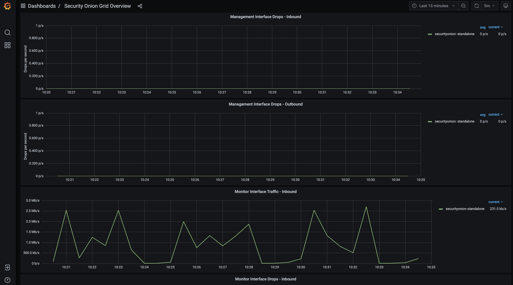
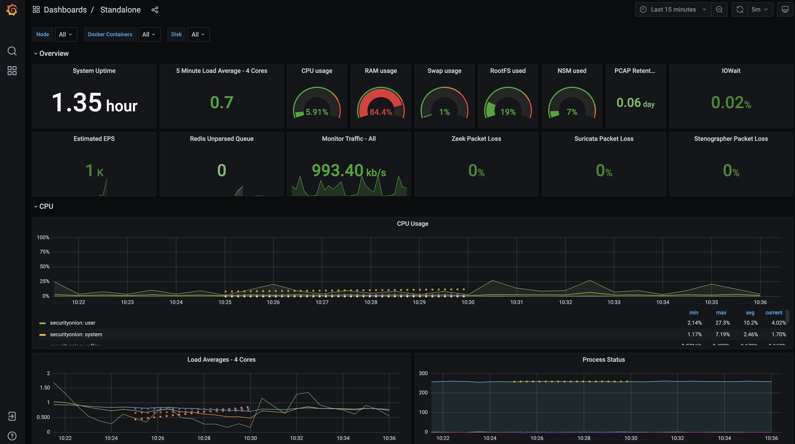

.. _grafana:

Grafana
=======

Once you've logged into :ref:`soc`, you can then click the Grafana link to see system health information. 

Depending on what kind of deployment you have, there will be at least one more dashboard available if you click the Dashboards icon on the left.

Once you've accessed the node dashboards, they should be added to ``Recently viewed dashboards`` which is accessible by simply clicking the Dashboards icon:

.. image:: https://user-images.githubusercontent.com/1659467/97081308-9361b600-15cf-11eb-890d-585efb58e6aa.png
  :target: https://user-images.githubusercontent.com/1659467/97081308-9361b600-15cf-11eb-890d-585efb58e6aa.png

Grafana Changes in Security Onion 2.3.60
----------------------------------------

Starting in Security Onion 2.3.60, Grafana will have both high-resolution data and downsampled low-resolution data. Some Grafana graphs have dotted lines that show previous data that has been downsampled. High-resolution data will be purged after 30 days, leaving just the downsampled low-resolution data.

For existing installations upgraded to Security Onion 2.3.60 or later, you may want to update your Grafana data as shown below. If you have a distributed deployment, you will run all commands on the manager.

If you want to remove some old data prior to downsampling, you can run ``so-influxdb-clean``. This is optional and not required. ``so-influxdb-clean`` will ask how many days or weeks worth of data you want to retain and remove all data older than that.

If you want to downsample all data, run ``so-influxdb-downsample``. This process could take a while depending on system resources and the amount of data that needs to be downsampled. For each measurement, the script will go day by day starting at 7/21/20 and downsample that day's data from the ``autogen`` retention policy into the ``so_long_term`` retention policy.

Once the downsampling is complete and you verify the downsampled data is available in Grafana (other than Processes, Disk I/O, Memory), you can remove the old data and free up space. The ``so-influxdb-drop-autogen`` script will remove the autogen retention policy and thus remove the old data that we previously downsampled.

Accounts
--------
By default, you will be viewing Grafana as an anonymous user. If you want to make changes to the default Grafana dashboards, you will need to log into Grafana with username ``admin`` and the randomized password found via ``sudo salt-call pillar.get secrets``.

Configuration
-------------
Grafana configuration can be found in ``/opt/so/conf/grafana/etc/``. However, please keep in mind that most configuration is managed with :ref:`salt`, so if you manually make any modifications in ``/opt/so/conf/grafana/etc/``, they may be overwritten at the next salt update.
The default configuration options can be seen in ``/opt/so/saltstack/default/salt/grafana/defaults.yaml``. Any options not specified in here, will use the Grafana default. 

Example
-------
If you want to configure and enable SMTP for Grafana, place the following in the ``global.sls`` file. 
If you have files referenced in the config file, those can be placed in ``/opt/so/saltstack/default/salt/grafana/etc/files/``.
Those files will be then be placed in ``/opt/so/conf/grafana/etc/files`` on the minion and mapped to ``/etc/grafana/config/files/`` within the container.

::

  grafana:
    config:
      smtp:
        enabled: true
        host: smtphost.mydomain:25
        user: myuser
        # If the password contains # or ; you have to wrap it with triple quotes wrapped by single quotes. Ex '"""#password;"""'
        password: mypassword
  #      cert_file: /etc/grafana/config/files/smtp_cert_file.crt
  #      key_file: /etc/grafana/config/files/smtp_key_file.key
  #      skip_verify: false
        from_address: admin@grafana.localhost
        from_name: Grafana
  #      ehlo_identity: dashboard.example.com

More Information
----------------

.. seealso::

  For more information about Grafana, please see https://grafana.com/.
