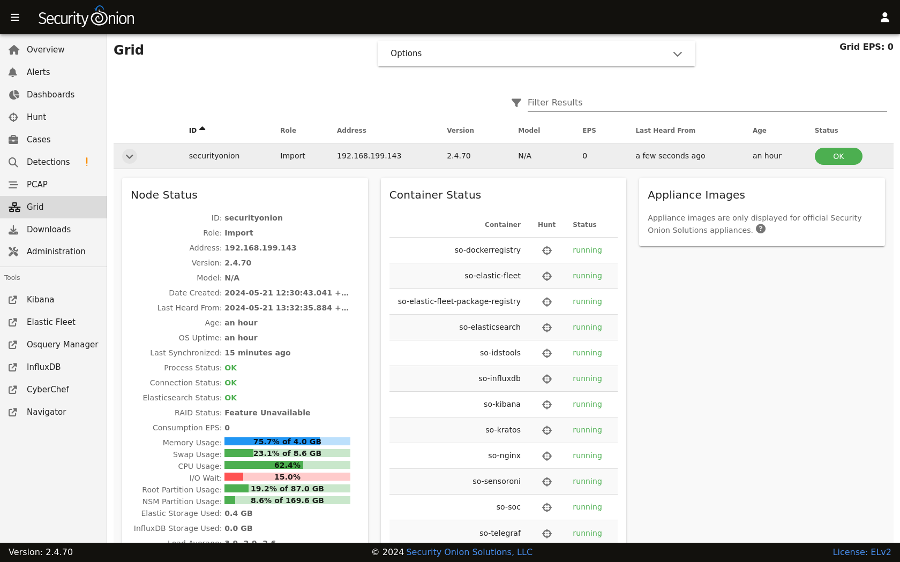

.. _grid:

Grid
====

:ref:`soc` includes a Grid interface which allows you to quickly check the status of all nodes in your grid.

Starting at the top of the page, there is a ``Grid EPS`` value in the upper right corner that shows the sum of all EPS measurements in the entire grid. Below that you will find a list of all nodes in your grid.

.. note::

  Please note that new nodes start off showing a red Fault and may take a few minutes to fully initialize before they show a green OK.

You can drill into individual nodes to see detailed information including Node Status, Container Status, and Appliance Images.

Node Status
-----------

This section includes an overview of node status.

Online Since
~~~~~~~~~~~~

The ``Online Since`` field shows how long the node has been online.

EPS
~~~

The ``EPS`` field is the number of Events Per Second.

Process Status
~~~~~~~~~~~~~~

If the ``Process Status`` field shows ``Fault``, you can check the ``Container Status`` section to determine which process has failed.

Connection Status
~~~~~~~~~~~~~~~~~

The ``Connection Status`` field shows whether or not the node is currently connected to the grid.

RAID Status
~~~~~~~~~~~

If you are using an official Security Onion Solutions appliance with RAID support, then you will see the corresponding status appear in this field.

Description
~~~~~~~~~~~

The ``Description`` field shows the optional Description you may have entered during Setup.

Icons in Lower Left Corner
~~~~~~~~~~~~~~~~~~~~~~~~~~

There are a few icons in the lower left of the ``Node Status`` section depending on what kind of node you are looking at: 

- Clicking the first icon takes you to the :ref:`influxdb` dashboard for that particular node to view health metrics.

- If the node is a network sensor, then there will be an additional icon for sending test traffic to the sensor.

- Depending on the node type, there may be an additional icon for uploading your own PCAP or EVTX file. Clicking this icon results in an upload form. Once you've selected a file and initiated the upload, a status message appears. Uploaded PCAP files are automatically imported via :ref:`so-import-pcap` and EVTX files are automatically imported via :ref:`so-import-evtx`. Once the import is complete, a message will appear containing a hyperlink to view the logs from the import. Please note that this is designed for smaller files. If you need to import files larger than 25MB, then you will need to manually import via :ref:`so-import-pcap` or :ref:`so-import-evtx`.

  .. image:: images/40_upload.png
    :target: _images/40_upload.png

Container Status
----------------

If any containers show anything other than ``running``, then you might want to double-check the configuration for that container and check the corresponding logs in ``/opt/so/log/``.

Appliance Images
----------------

If you have purchased our official Security Onion Solutions appliances, then the grid page will show pictures of the front and rear of the appliances, useful for walking through connectivity discussions with personnel in the data center. If you are not using official Security Onion Solutions appliances, then it will simply display a message to that effect.

Other Grid Pages
----------------

.. note::

    You can manage Grid members and Grid configuration in the :ref:`administration` section.
