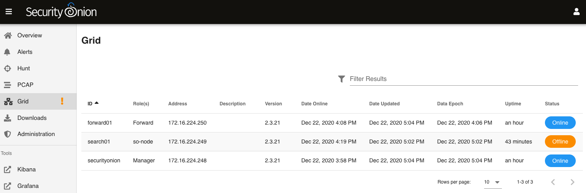

.. _grid:

Grid
====

:ref:`soc` gives you access to our new Grid interface. This interface allows you to quickly check the status of all nodes in your grid.

.. image:: images/grid.png
  :target: _images/grid.png

If any nodes are disconnected, they will be shown as follows:

