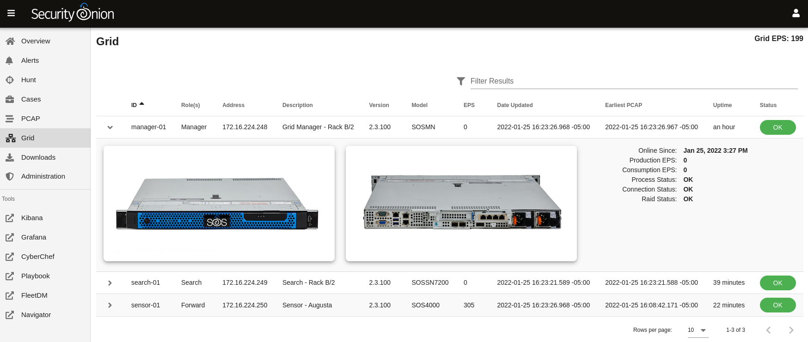

.. _grid:

Grid
====

:ref:`soc` gives you access to our Grid interface. This interface allows you to quickly check the status of all nodes in your grid. You can drill into individual nodes to see detailed information. The ``Grid EPS`` value in the upper right corner is the sum of all Consumption EPS measurements in the entire grid.

Node Status
-----------

This section includes an overview of node status.

Online Since
~~~~~~~~~~~~

This shows how long the node has been online.

Production EPS
~~~~~~~~~~~~~~

Production EPS is how much a node is producing. This is taken from the number of events out in :ref:`filebeat`.

Consumption EPS
~~~~~~~~~~~~~~~

Consumption EPS is how much a search node is consuming. 

Process Status
~~~~~~~~~~~~~~

If this shows ``Fault``, you can check the ``Container Status`` section to determine which process has failed.

Connection Status
~~~~~~~~~~~~~~~~~

This shows whether or not the node is currently connected to the grid.

RAID Status
~~~~~~~~~~~

If you are using an official Security Onion Solutions appliance with RAID support, then you will see the corresponding status appear in this field.

Container Status
----------------

If any containers show anything other than ``running``, then you might want to double-check the configuration for that container and check the corresponding logs in ``/opt/so/log/``.

Appliance Images
----------------

If you have purchased our official Security Onion Solutions appliances, then the grid page will show pictures of the front and rear of the appliances, useful for walking through connectivity discussions with personnel in the data center. If you are not using official Security Onion Solutions appliances, then it will simply display a message to that effect.
