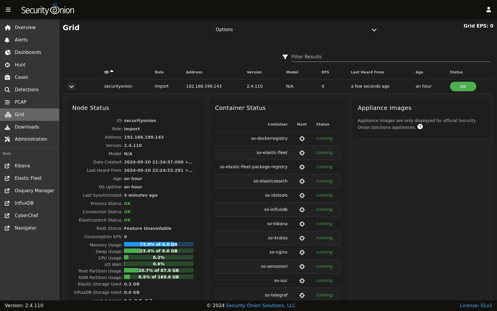

.. _grid:

Grid
====

:ref:`soc` includes a Grid interface which allows you to quickly check the status of all nodes in your grid.

Starting at the top of the page, there is a ``Grid EPS`` value in the upper right corner that shows the sum of all Consumption EPS measurements in the entire grid. Below that you will find a list of all nodes in your grid.

.. note::

  Please note that new nodes start off showing a red Fault and may take a few minutes to fully initialize before they show a green OK.

.. note::

  The EPS column represents inbound Events Per Second, therefore will only be relevant on nodes that ingest data. Pure sensors do not ingest events, therefore those nodes will show 0 EPS. To help 
  identify sensors that are generating large volumes of events, sort by the Mgmt Out column, which shows the outbound traffic throughput on the management network interface.

To show additional, sensor-related columns in the table, check the corresponding checkbox in the options dropdown, near the top of the page. This will add several more sortable columns to help identify sensors that may be underperforming, or due for a hardware upgrade. As these additional columns take up significant screen area, they will only be visible on wide displays, where the SOC web browser window is wide enough to show a large number of tabular columns. Included as of version 2.4.40.

You can drill into individual nodes to see detailed information including Node Status, Container Status, and Appliance Images.

Node Status
-----------

This section includes an overview of node status.

.. note::

  As of 2.4.40, a significant number of new metrics were added to the grid page. Be sure to upgrade to the latest version of Security Onion to see all the metrics 
  mentioned in this documentation.

ID
~~~~~~~~~~~~

The hostname assigned to the node.

Role
~~~~~~~~~~~~

The type of Security Onion node that was selected during Security Onion setup.

Address
~~~~~~~~~~~~

The network IP assigned to the management interface of the node.

Version
~~~~~~~~~~~~

The version of Security Onion installed on this node.

Model
~~~~~~~~~~~~

The official Security Onion appliance model number. Will show N/A for all other devices.

Date Created
~~~~~~~~~~~~

The date the node was created. This date is based on the node's filesystem timestamps, so replacing partition data or manually recreating core areas of the filesystem can interfere with assessing a node's true age.

Earliest PCAP
~~~~~~~~~~~~~

The earliest PCAP that is available on a sensor node. Only visible on sensor nodes, which capture live packet data.

Last Heard From
~~~~~~~~~~~~~~~

The last time that the node checked-in with the manager. Note that a check-in doesn't always include updated node metrics. 

Age
~~~~~~~~~~~~

The ``Age`` field shows how long the node has been part of the grid. Based on the ``Date Created`` value.

OS Uptime
~~~~~~~~~~~~

How long the node has been running, since the last power-on or reboot event.

Process Status
~~~~~~~~~~~~~~

If the ``Process Status`` field shows ``Fault``, you can check the other status indicators as well as the ``Container Status`` section to determine which process has failed.

Connection Status
~~~~~~~~~~~~~~~~~

The ``Connection Status`` field shows whether or not the node is currently connected to the grid.

RAID Status
~~~~~~~~~~~

If you are using an official Security Onion Solutions appliance with RAID support, then you will see the corresponding status appear in this field.

Consumption EPS
~~~~~~~~~~~~~~~

The ``Consumption EPS`` field is the number of Events Per Second consumed.

Memory Usage
~~~~~~~~~~~~

The system memory percentage used, as well as the total memory, in gigabytes. When this value is consistently in the red it may be time to add more system memory. Consistently red usage will likely end up causing node faults due to some services being automatically shutdown to recover memory for more critical processes.

Swap Usage
~~~~~~~~~~~~

The system swap percentage used, as well as the total swap, in gigabytes. Systems that do not have swap enabled will remain at 0.0%. When this value is consistently in the red it may be time to increase the system memory, and potentially the swap size.

CPU Usage
~~~~~~~~~~~~

The system CPU percentage used, across all cores. When this value is consistently in the red it may be time to upgrade the node hardware, or distributing the load across additional nodes.

I/O Wait
~~~~~~~~~~~~

The system I/O wait percentage. Higher values indicate the system is spending more time waiting for network or disk data transfer. When this value is consistently in the red it may be time to replace slow disks or expand network throughput capacity.

Capture Loss
~~~~~~~~~~~~

The percentage of packet capture loss. Higher values indicate a reduced visibility into packets traversing the network, which can lead to missed alerts.

Zeek Loss
~~~~~~~~~~~~

The percentage of dropped packets due to Zeek being unable to keep up with the flow of network data. 

Suricata Loss
~~~~~~~~~~~~~

The percentage of dropped packets due to Suricata being unable to keep up with the flow of network data.

Stenographer Loss
~~~~~~~~~~~~~~~~~

The percentage of dropped packets due to Stenographer being unable to keep up with the flow of network data. Stenographer is responsible for writing down all packets to disk, as well as indexing these packets.

Disk Usage Root
~~~~~~~~~~~~~~~

The percentage of the root OS disk utilization, as well as the total capacity of that disk (or partition). When this value is consistently in the red it can lead to problems including being unable to upgrade OS packages and Security Onion, the inability to save system logs, and other critical issues.

Disk Usage NSM
~~~~~~~~~~~~~~~

The percentage of the NSM disk utilization, as well as the total capacity of that disk (or partition). When this value is consistently in the red it can lead to problems including being unable to ingest new events, store PCAP on disk, detect anomalous events, and other critical issues.

Elastic Storage Used
~~~~~~~~~~~~~~~~~~~~

The total gigabytes used to store the ingested events, across all indices.

InfluxDB Storage Used
~~~~~~~~~~~~~~~~~~~~~

The total gigabytes used to store the current and historic metric data collected from all nodes in the grid.

PCAP Retention
~~~~~~~~~~~~~~

The number of historic days of available packet capture data which can be viewed by analyst using the SOC PCAP tool. PCAP data older than this number will be automatically pruned from disk so that new PCAP data can be recorded.

Load Average
~~~~~~~~~~~~

The 1 minute, 5 minute, and 15 minute load averages for the node. Note that on systems with high numbers of CPU cores, this average can be equally as high. For example, if a system has 128 cores then a load average of 128 generally indicates that all 128 cores are working at the peak capacity. Exceeding that number can indicate that some cores are bottlenecked due to waiting on I/O. 

Redis Queue Size
~~~~~~~~~~~~~~~~

The number of events queued up and pending to be ingested. If this number is either steady or falling then it indicates the system is able to keep up with the current traffic flow. If this number is continually increasing then it can indicate a problem with ingest times taking too long for the amount of events that are being generated. Occasional increases are expected during traffic bursts but should eventually start to decrease once the high traffic flow period ends.

Inbound Monitor Traffic
~~~~~~~~~~~~~~~~~~~~~~~

The throughput of inbound bytes reaching the sensor's monitoring interface.

Dropped Monitor Traffic
~~~~~~~~~~~~~~~~~~~~~~~

The throughput of inbound bytes intended for the sensor's monitoring interface but are instead dropped, typically due to insufficient network capacity.

Inbound Mgmt Traffic
~~~~~~~~~~~~~~~~~~~~

The throughput of inbound bytes intended for the node's management interface. This is the internal interface that the node uses to communicate with other nodes in the Security Onion grid.

Outbound Mgmt Traffic
~~~~~~~~~~~~~~~~~~~~~

The throughput of outbound bytes being transmitted from the node's management interface. This is the internal interface that the node uses to communicate with other nodes in the Security Onion grid.

Filter Keywords
~~~~~~~~~~~~~~~

This is the list of keywords that are associated with this node type. Useful for filtering to only show a subset of a grid's nodes on the grid page.

Description
~~~~~~~~~~~

The ``Description`` field shows the optional Description you may have entered during Setup.

Icons in Lower Left Corner
~~~~~~~~~~~~~~~~~~~~~~~~~~

There are a few icons in the lower left of the ``Node Status`` section depending on what kind of node you are looking at: 

- Clicking the first icon takes you to the :ref:`influxdb` dashboard for that particular node, to view historic health metrics and trends.

- If the node is a network sensor, then there will be an additional icon for sending test traffic to the sensor.

- Depending on the node type, there may be an additional icon for uploading your own PCAP or EVTX file. Clicking this icon results in an upload form. Once you've selected a file and initiated the upload, a status message appears. Uploaded PCAP files are automatically imported via :ref:`so-import-pcap` and EVTX files are automatically imported via :ref:`so-import-evtx`. Once the import is complete, a message will appear containing a hyperlink to view the logs from the import. Please note that this is designed for smaller files. If you need to import files larger than 25MB, then you will need to manually import via :ref:`so-import-pcap` or :ref:`so-import-evtx`.

  .. image:: images/40_upload.png
    :target: _images/40_upload.png

- The reboot button allows for remotely rebooting a grid node. This may be necessary when scheduled OS/kernel updates are automatically applied and required a restart to take effect. Review the notes on the confirmation dialog thoroughly before confirming a reboot. Rebooting a manager node will likely cause the SOC web interface to become temporarily unavailable.

- Clicking the question mark button takes you to this help document.

Container Status
----------------

If any containers show anything other than ``running``, then you might want to double-check the configuration for that container and check the corresponding logs in ``/opt/so/log/``.

Appliance Images
----------------

If you have purchased our official Security Onion Solutions appliances, then the grid page will show pictures of the front and rear of the appliances, useful for walking through connectivity discussions with personnel in the data center. If you are not using official Security Onion Solutions appliances, then it will simply display a message to that effect.

Other Grid Pages
----------------

.. note::

    You can manage Grid members and Grid configuration in the :ref:`administration` section.
