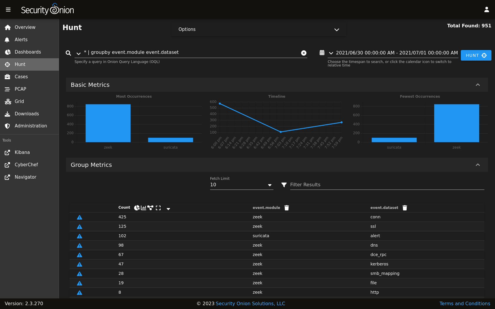

.. _hunt:

Hunt
====

:ref:`soc` includes a Hunt interface which is similar to our :ref:`dashboards` interface but is tuned more for threat hunting.

The main difference between Hunt and :ref:`dashboards` is that Hunt's default queries are more focused than the overview queries in :ref:`dashboards`. A second difference is that most of the default :ref:`dashboards` queries display a separate table for each aggregated field, whereas many of the default queries in Hunt aggregate multiple fields in a single table which can be beneficial when hunting for more obscure activity.
