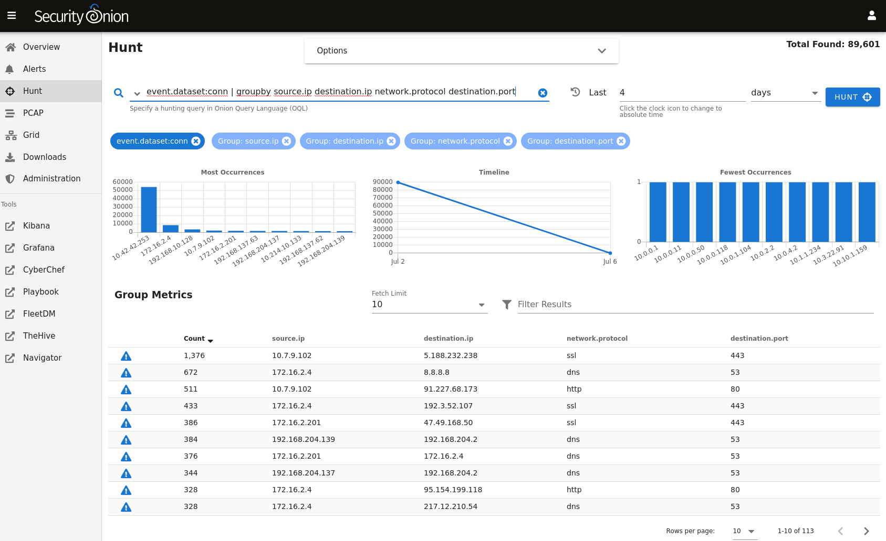
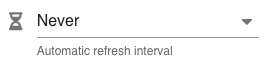
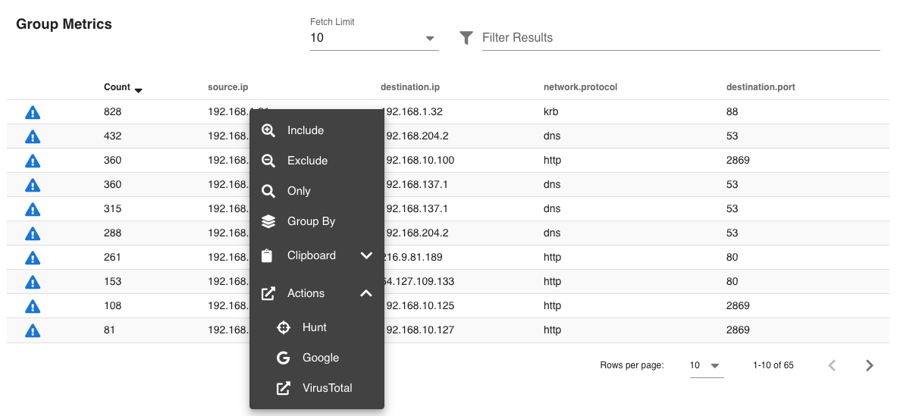
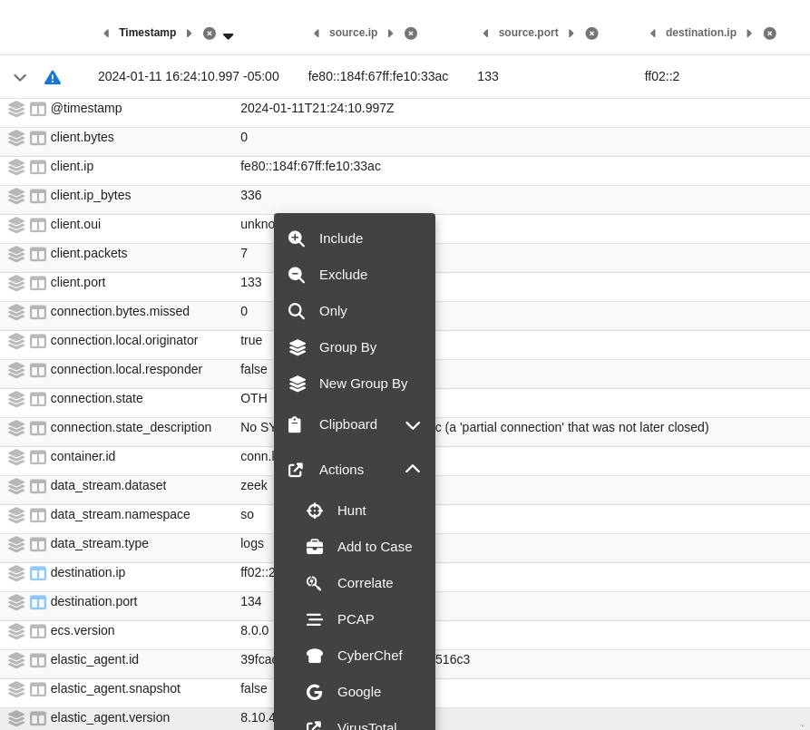
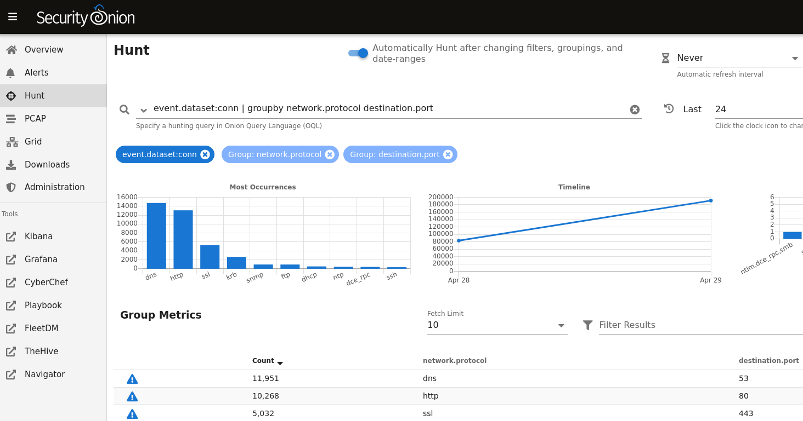
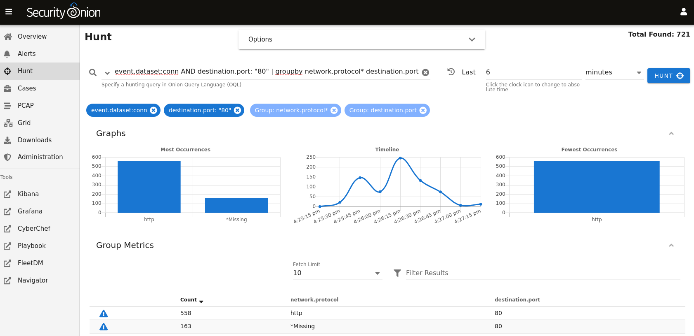

.. _hunt:

Hunt
====

:ref:`soc` gives you access to our new Hunt interface. This interface allows you to hunt through all of the data in :ref:`elasticsearch` and is highly tuned for stacking, pivoting, data expansion, and data reduction.

Auto Hunt
---------

The top of the page has a toggle for Auto Hunt which defaults to enabled:

.. image:: https://user-images.githubusercontent.com/1659467/94722720-af05d380-0325-11eb-9139-ce49c3a549cf.png
  :target: https://user-images.githubusercontent.com/1659467/94722720-af05d380-0325-11eb-9139-ce49c3a549cf.png

When enabled, Hunt will automatically submit your query any time you change filters, groupings, or date ranges.

Automatic Refresh Interval
--------------------------

To the right of the Auto Hunt toggle is the Automatic Refresh Interval setting: 

When enabled, Hunt will automatically refresh your query at the time interval you select.

Time Zone
---------

Hunt will try to detect your local time zone via your browser. Starting in Security Onion 2.3.60, you can manually specify your time zone if necessary.

Query Bar
---------
The easiest way to get started is to click the query drop down box and select one of the pre-defined queries. These pre-defined queries cover most of the major data types that you would expect to see in a Security Onion deployment: NIDS alerts from :ref:`suricata`, HIDS alerts from :ref:`wazuh`, protocol metadata logs from :ref:`zeek` or :ref:`suricata`, endpoint logs, and firewall logs. Each of the entries in the drop down list will show the actual query followed by a description of what that query does.

.. image:: https://user-images.githubusercontent.com/1659467/94723168-5256e880-0326-11eb-8952-37804962d526.png
  :target: https://user-images.githubusercontent.com/1659467/94723168-5256e880-0326-11eb-8952-37804962d526.png

Time Picker
-----------

By default, Hunt searches the last 24 hours. If you want to search a different time frame, you can change it in the upper right corner of the screen. You can use the default relative time or click the clock icon to change to absolute time.

.. image:: https://user-images.githubusercontent.com/1659467/94723208-64388b80-0326-11eb-959b-5ecfcd51fb9c.png
  :target: https://user-images.githubusercontent.com/1659467/94723208-64388b80-0326-11eb-959b-5ecfcd51fb9c.png

Visualization
-------------

The first section of output contains a Most Occurences visualization, a timeline visualization, and a Fewest Occurences visualization. Bar charts are clickable, so you can click a value to update your search criteria. Aggregation defaults to 10 values, so Most Occurences is the Top 10 and Fewest Occurences is the Bottom 10 (long tail). The number of aggregation values is controlled by the Fetch Limit setting in the Group Metrics section.

.. image:: https://user-images.githubusercontent.com/1659467/94723255-74506b00-0326-11eb-872f-9229e8efd9ac.png
  :target: https://user-images.githubusercontent.com/1659467/94723255-74506b00-0326-11eb-872f-9229e8efd9ac.png

Group Metrics
-------------

The middle section of output is the Group Metrics section and it's a data table that allows you to stack (aggregate) arbitrary fields. Group metrics are controlled by the ``groupby`` parameter in the search bar. Clicking the table headers allows you to sort ascending or descending. 

Clicking a value in the Group Metrics table brings up a context menu of actions for that value. This allows you to refine your existing search, start a new search, or even pivot to external sites like Google and VirusTotal.

The default Fetch Limit for the Group Metrics table is ``10``. If you need to see more than the top 10, you can increase the Fetch Limit and then page through the output using the left and right arrow icons or increase the ``Rows per page`` setting.

Events
------

The third and final section of output is a data table that contains all search results and allows you to drill into individual search results as necessary. Clicking the table headers allows you to sort ascending or descending. Starting from the left side of each row, there is an arrow which will expand the result to show all of its fields. To the right of that arrow is the ``Timestamp`` field. Next, a few standard fields are shown: ``source.ip``, ``source.port``, ``destination.ip``, ``destination.port``, ``log.id.uid`` (Zeek unique identifier), ``network.community_id`` (Community ID), and ``event.dataset``. Depending on what kind of data you're looking at, there may be some additional data-specific fields as well. 

Clicking a value in the Events table brings up a context menu of actions for that value. This allows you to refine your existing search, start a new search, or even pivot to external sites like Google and VirusTotal.

The default Fetch Limit for the Events table is ``100``. If you need to see more than 100 events, you can increase the Fetch Limit and then page through the output using the left and right arrow icons or increase the ``Rows per page`` setting.

.. image:: images/hunt-events.png
  :target: _images/hunt-events.png

When you click the arrow to expand a row in the Events table, it will show all of the individual fields from that event. Field names are shown on the left and field values on the right. When looking at the field names, there is an icon to the left that will add that field to the ``groupby`` section of your query. You can click on values on the right to bring up the context menu to refine your search or pivot to other pages. 

Statistics
----------

The bottom left corner of the page shows statistics about the current query including the speed of the backend data fetch and the total round trip time.

.. image:: https://user-images.githubusercontent.com/1659467/92963000-ca28a600-f43f-11ea-99ff-9a69604b03d0.png
  :target: https://user-images.githubusercontent.com/1659467/92963000-ca28a600-f43f-11ea-99ff-9a69604b03d0.png

Context Menu
------------

Clicking a value in the page brings up a context menu that allows you to refine your existing search, start a new search, or even pivot to external sites like Google and VirusTotal. 

Include
~~~~~~~

Clicking the ``Include`` option will add the selected value to your existing search to only show search results that include that value.

Exclude
~~~~~~~

Clicking the ``Exclude`` option will exclude the selected value from your existing search results.

Only
~~~~

Clicking the ``Only`` option will start a new search for the selected value and retain any existing groupby terms.

Group By
~~~~~~~~

Clicking the ``Group By`` option will update the existing query and aggregate the results based on the selected field.

Clipboard
~~~~~~~~~

The ``Clipboard`` sub-menu has several options that allow you to copy selected data to your clipboard in different ways.

Actions
~~~~~~

The ``Actions`` sub-menu has several different options:

- Clicking the ``Hunt`` option will start a new search for the selected value and will aggregate the results by ``event.module`` and ``event.dataset`` to give you a good overview of what types of data are available for that indicator.

- Clicking the ``Correlate`` option will find related logs based on Community ID, uid, fuid, etc.

- Clicking the ``PCAP`` option will pivot to the :ref:`pcap` interface to retrieve full packet capture for the selected stream.

- Clicking the ``Google`` option will search Google for the selected value.

- Clicking the ``VirusTotal`` option will search VirusTotal for the selected value.

If you'd like to add your own custom actions, you can copy ``/opt/so/saltstack/default/salt/soc/files/soc/hunt.actions.json`` to ``/opt/so/saltstack/local/salt/soc/files/soc/hunt.actions.json`` and then add new entries. Starting in Security Onion 2.3.60, this will be done in ``menu.actions.json``.

For example, suppose you want to add ``AbuseIPDB`` with URL ``https://www.abuseipdb.com/check/{value}``. First, copy ``/opt/so/saltstack/default/salt/soc/files/soc/hunt.actions.json`` to ``/opt/so/saltstack/local/salt/soc/files/soc/hunt.actions.json``:

::

  sudo cp -n /opt/so/saltstack/default/salt/soc/files/soc/hunt.actions.json /opt/so/saltstack/local/salt/soc/files/soc/hunt.actions.json

Next, edit ``/opt/so/saltstack/local/salt/soc/files/soc/hunt.actions.json`` using your favorite text editor and insert the following as the next to last line of the file:

::

  ,{ "name": "AbuseIPDB", "description": "Search for this value at AbuseIPDB", "icon": "fa-external-link-alt", "target": "_blank","links": [ "https://www.abuseipdb.com/check/{value}" ]}

Finally, restart SOC to make the changes take effect:

::

  sudo so-soc-restart
  
You can also create background actions that don't necessarily result in the user being taken to a new page or tab. For example, if you want to have a new action submit a case to JIRA, you would define it as a background POST action. When it completes the POST, it will show an auto-fading message in SOC telling you that the action completed. Alternatively, instead of the auto-fading message you can have it pop a new tab (or redirect SOC tab) to JIRA. Because of CORS restrictions, SOC can't expect to have visibility into the result of the background POST so there is no attempt to parse the response of any background action, other than the status code/text from the request's response.

Here is an example of a background action that submits a javascript fetch to a remote resource and then optionally shows the user a second URL:

::

  { 
    "name": "My Background Action", 
    "description": "Something wonderful!", 
    "icon": "fa-star", 
    "target": "_blank", 
    "links": [
      "http://somewhere.invalid/?somefield={:client.ip|base64}"
    ],
    "background": true, 
    "method": "POST", 
    "options": { 
      "mode": "no-cors", 
      "headers": { 
        "header1": "header1value",
        "header2:" "header2value" 
      }
    }, 
    "body": "something={value|base64}",
    "backgroundSuccessLink": "https://securityonion.net?code={responseCode}&text={responseStatus}",
    "backgroundFailureLink": "https://google.com?q={error}"
  },
  
The ``options`` object is the same options object that will be passed into the Javascript ``fetch()`` method. You can read more about that at `<https://developer.mozilla.org/en-US/docs/Web/API/Fetch_API/Using_Fetch>`_.

OQL
---

Onion Query Language (OQL) starts with standard `Lucene query syntax <https://lucene.apache.org/core/2_9_4/queryparsersyntax.html>`_ and then allows you to add optional segments that control what Hunt does with the results from the query. The ``groupby`` segment tells Hunt to group by (aggregate) a particular field. So, for example, if you want to group by destination IP address, you can add ``| groupby destination.ip`` to your search (assuming it didn't already have a groupby statement). The ``groupby`` segment supports multiple aggregations so you can add more fields that you want to group by, separating those fields with spaces. For example, to group by destination IP address and then destination port, you could use ``| groupby destination.ip destination.port``.

By default, grouping by a particular field won't show any values if that field is missing. Starting in Security Onion 2.3.50, you can add an asterisk after the field name if you would like to include missing values. For example, you might have some non-HTTP traffic on port 80 that wouldn't be shown by the following query grouping by ``network.protocol``:

However, if you add an asterisk after the ``network.protocol`` field name, Hunt will show missing values which in this case will help you see the non-HTTP traffic on port 80:

