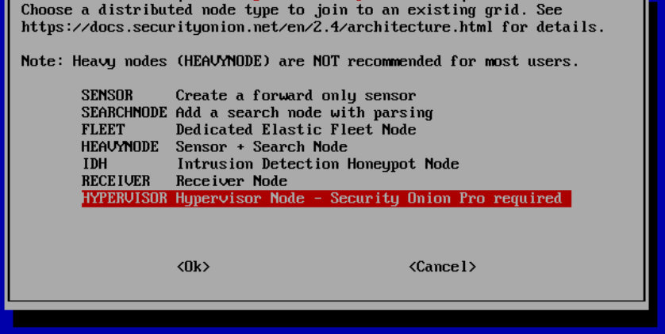
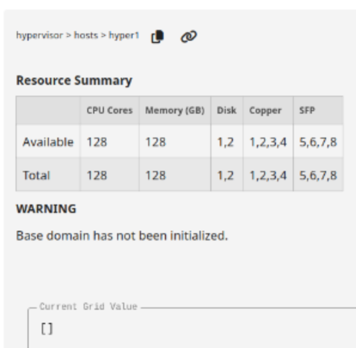
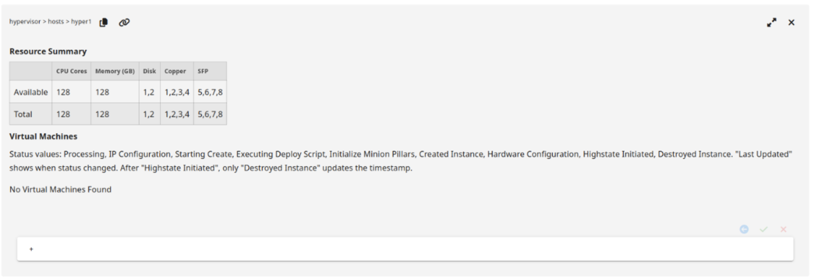
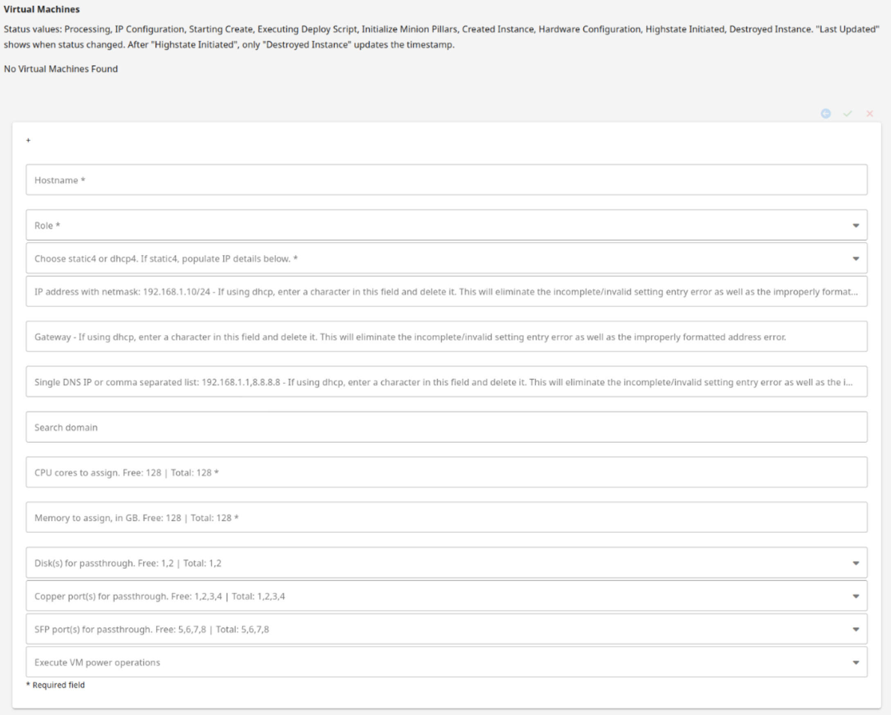
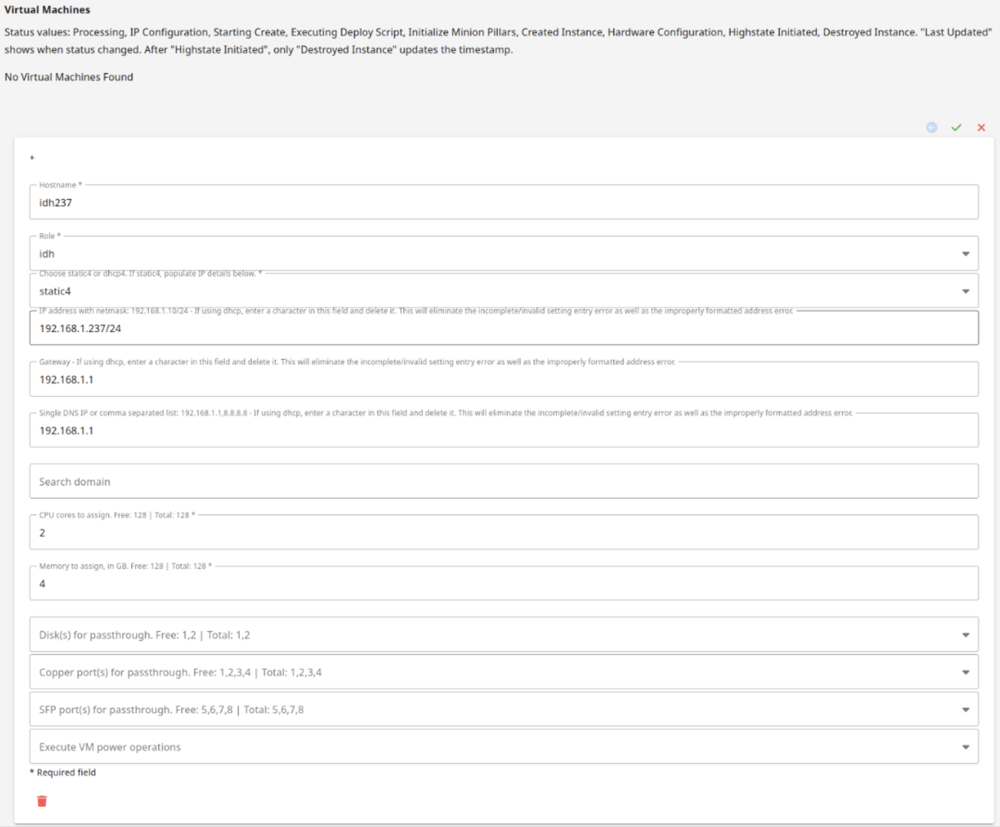
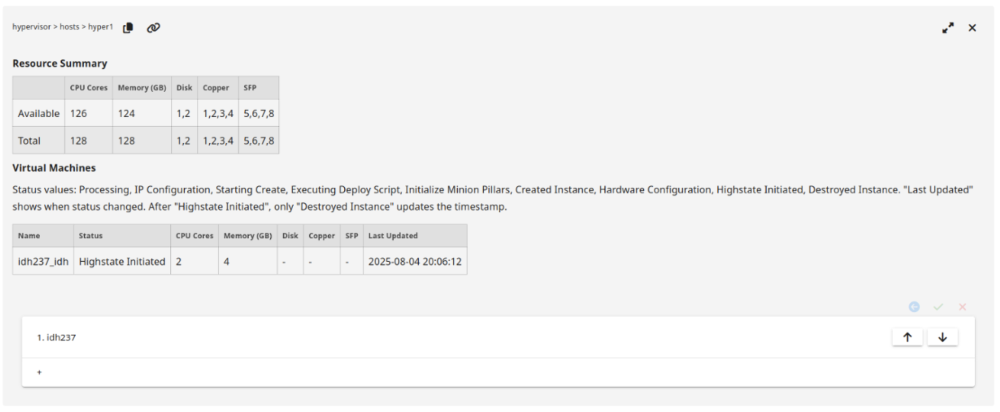
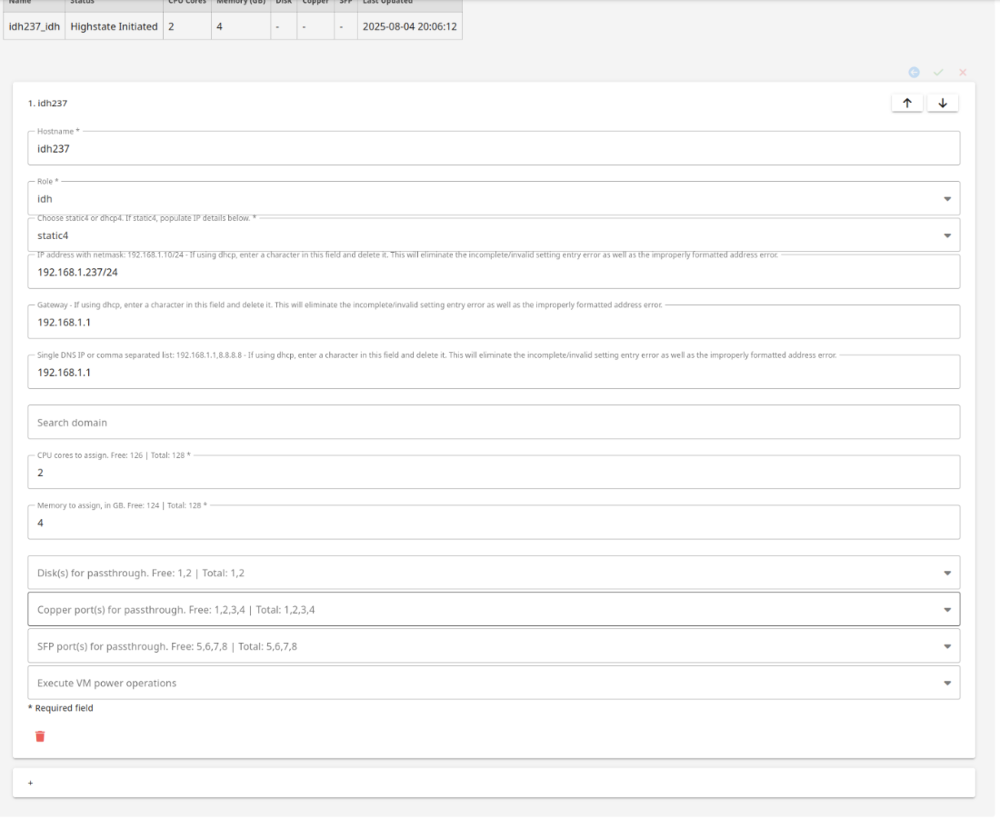
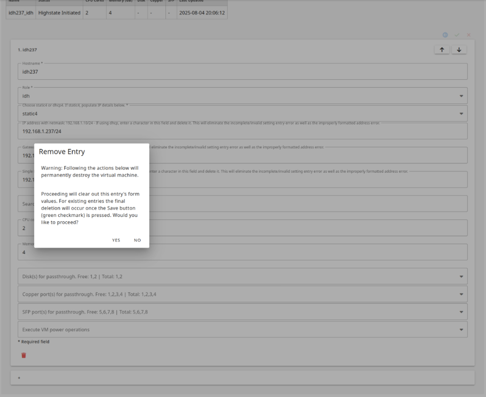
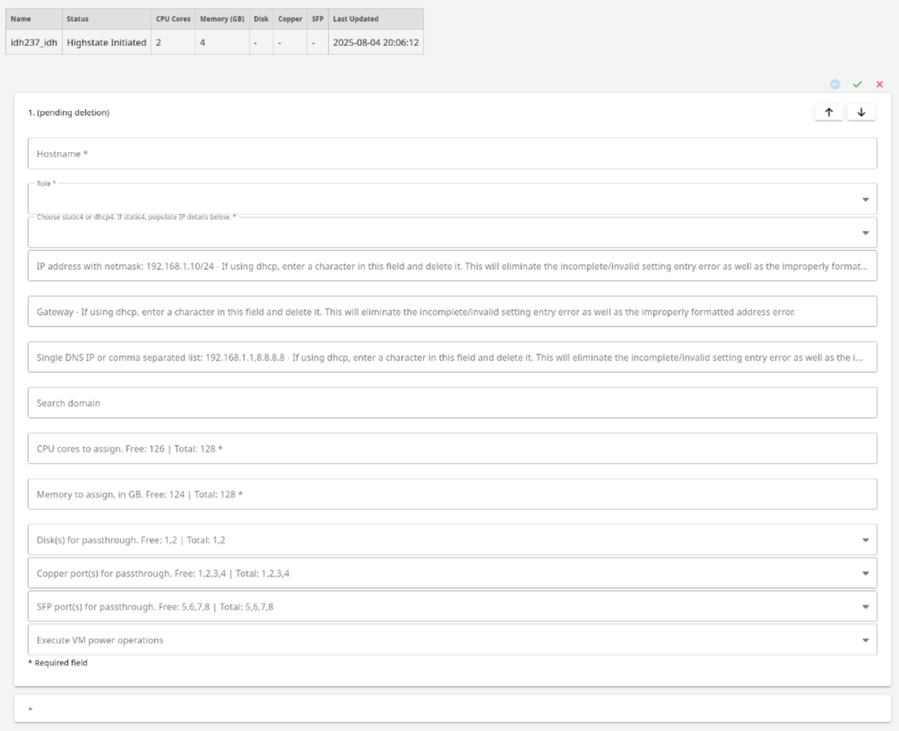

.. _hypervisor:

Hypervisor
==========

Starting with Security Onion version 2.4.170, Security Onion Pro users can create a hypervisor node that can run virtualized instances of Security Onion. If you have machines with extra horsepower, you can use this feature to spin up additional Security Onion virtual machines (VMs) to take advantage of that extra power.

.. note::

    This is an enterprise-level feature of Security Onion. Contact Security Onion Solutions, LLC via our website at https://securityonion.com/pro for more information about purchasing a Security Onion Pro license to enable this feature.

Adding a Hypervisor
-------------------

Install a new node and choose the Hypervisor option:

Once the new hypervisor node has been accepted into the grid, it will look like this:

Once the base domain has been configured on the hypervisor (allowing VMs to be created), it will look like this:

Adding a Security Onion VM
--------------------------

To create a new VM, click the plus sign:

Fill out the form and then click the green check to save and create the VM:

Once the VM is created and the first highstate is initiated, it will look like this:

Deleting a VM
-------------

To delete a VM, click the trash icon:

It will ask for confirmation:

Once you've confirmed, it will show that it is pending deletion:

