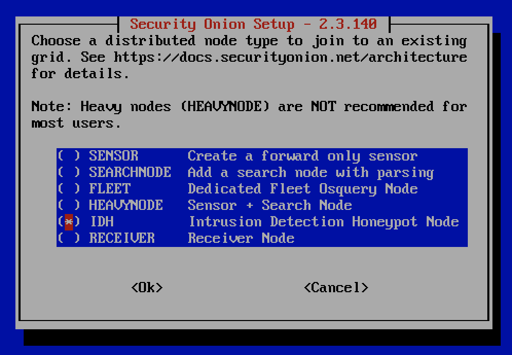
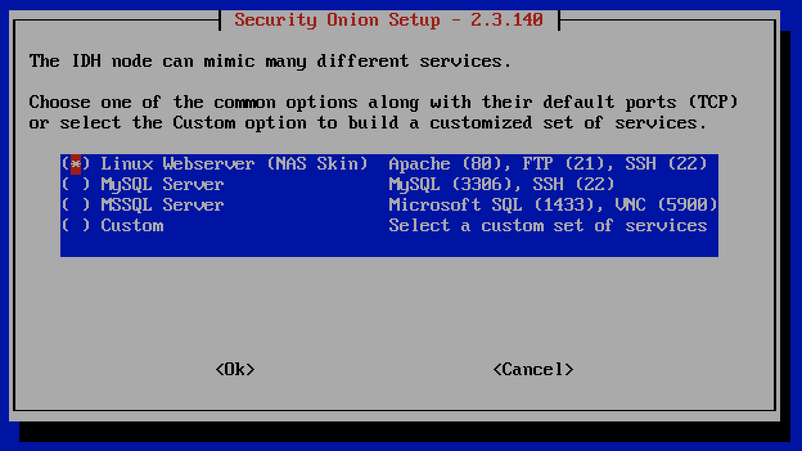
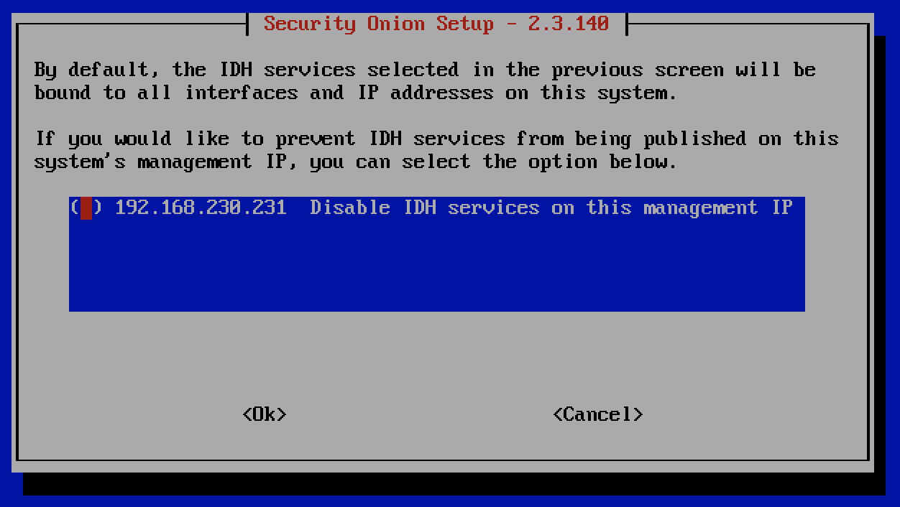
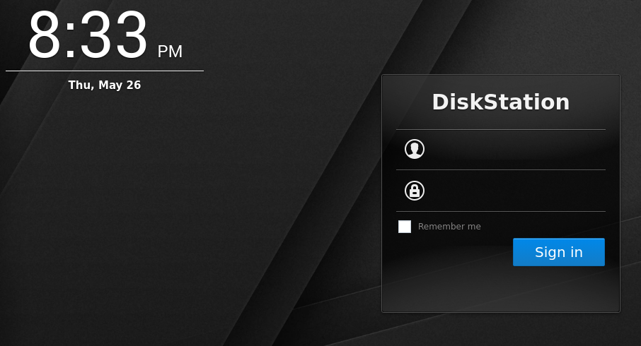
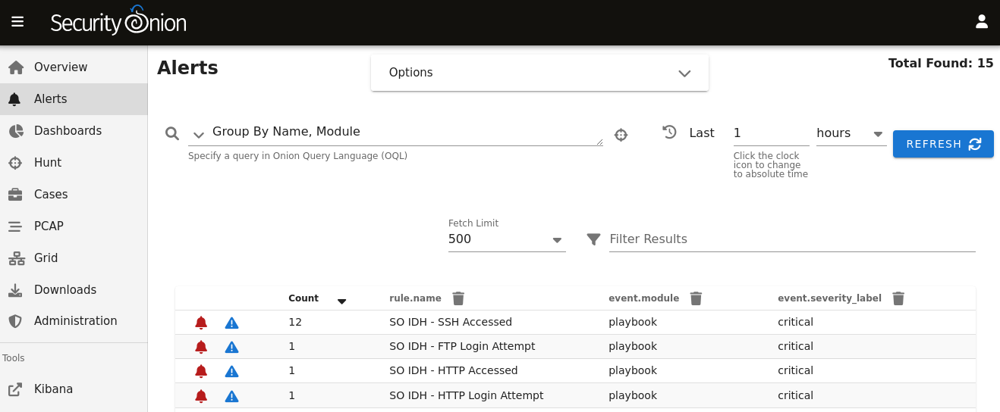

.. _idh:

Intrusion Detection Honeypot
============================

The Intrusion Detection Honeypot node allows you to build a node that mimics services. Connections to these services automatically generate alerts.

From the book, *Intrusion Detection Honeypots* (Sanders, C):

     An Intrusion Detection Honeypot (IDH) is a security resource placed inside your network perimeter that generates alerts when probed or attacked. These systems, services, and tokens rely on deception to lure attackers in and convince them to interact. Unbeknownst to the attacker, you’re alerted when that interaction occurs and can begin investigating the compromise.

Chris Sanders and Josh Brower presented the IDH concept at Security Onion Conference 2021 and you can view the recording at https://www.youtube.com/watch?v=NzUhfARVfJk&list=PLljFlTO9rB17mESq7Z9OeFKvVh39vJW34&index=5.

Installation
------------

IDH nodes are dedicated to just being IDH nodes and cannot run any other services. Therefore, you must have a separate manager to connect to. You can join a new IDH node to an existing Standalone deployment or full distributed deployment. Our ISO image includes a new boot menu option for IDH installs that will partition your disk appropriately with lower requirements than a full installation.

.. warning::

        The IDH node is designed to be placed *inside* your network perimeter! It should not be accessible from the Internet!
     
Screenshots
-----------

Run Setup, select the ``DISTRIBUTED`` install submenu, choose the ``Existing Deployment`` option, and then select the ``IDH`` option.

Then choose from one of the common honeypot options or choose the ``Custom`` option to customize.

You can optionally prevent the IDH services from listening on the management interface.

If you chose the ``Linux Webserver`` option above, anybody who connects to the webserver will see a fake login page.

Connections to honeypot services will result in ``SO IDH`` alerts that can be seen in :ref:`alerts`.

Technical Background
--------------------

The IDH node utilizes OpenCanary which is a modular opensource honeypot by Thinkst. You can read more about it at https://github.com/thinkst/opencanary.

OpenCanary logs can be found through :ref:`dashboards`, :ref:`hunt`, or :ref:`kibana` using the following queries:

::

     event.module: opencanary
     
::

     event.dataset: idh

Sigma Plays within :ref:`playbook` look for certain logs emitted by OpenCanary to generate alerts, which can be viewed in the :ref:`alerts` interface.

Services Configuration
----------------------

The following services are available for use with the IDH node. Pay special attention to how an alert is triggered for a service as some of them require more than a simple connection request to trigger.

- FTP - a File Transfer Protocol server which alerts on login attempts
- Git - a Git server which alerts on repo cloning
- HTTP - an HTTP web server that alerts on login attempts
- HTTP Proxy - an HTTP web proxy that alerts when there is an attempt to proxy to another page
- MSSQL - an MS SQL server that alerts on login attempts
- MySQL - a MYSQL server that alerts on login attempts
- Telnet - a Telnet server that alerts on login attempts
- SNMP - an SNMP server which alerts on oid requests
- SSH - a Secure Shell server which alerts on login attempts
- SIP - a SIP server which alerts on sip requests
- VNC - a VNC server which alerts on login attempts
- Redis - a Redis server which alerts on actions
- TFTP - a tftp server which alerts on requests
- NTP - an NTP server which alerts on ntp requests

This is based on the list at https://opencanary.readthedocs.io/en/latest/starting/configuration.html#services-configuration. RDP and SMB are not currently available for use within an IDH node.

In addition to changing the default ports, some of these services have further configuration options. For instance, the HTTP server has the ability to use custom HTML pages ("skins"). For more information, please see the OpenCanary documentation at https://opencanary.readthedocs.io/en/latest/starting/configuration.html#default-configuration.

These types of configuration changes can be made by modifying the minion pillar (see the Custom Configuration section below).

SSH
---

For IDH nodes, the local sshd is configured to listen on TCP/2222 and connections are only accepted from the Manager node. This allows TCP/22 to be used for honeypot services.

Custom Configuration 
--------------------

Services can be customized in two ways: 

1) Changing the default port. 

Note: The previously-configured port is not automatically closed on the IDH node's firewall, so it will need to be closed manually. This can be done by running the following command on the IDH node, substituting the protocol and port as needed:

::

     iptables -D INPUT -p tcp -m tcp --dport 80 -j ACCEPT

2) Service-specific config, like SSH version string. All of the defaults for these types of configuration can be found in the following files on the manager:

``/opt/so/saltstack/default/salt/idh/defaults/$Service.defaults.yaml``

Both of these configurations can be implemented by editing the node's minion pillar, which is stored on the manager in ``/opt/so/saltstack/local/pillar/minions/$IDH-Hostname_idh.sls``.

Custom Configuration - Example Port Change
------------------------------------------

For example, suppose that we already have the HTTP service running but we want to change the default port from ``80`` to ``8080``.

.. warning::

        The following configuration files are YAML, and so tabs are not permitted. Please only use spaces and pay special attention to the number of spaces!

First, we need to copy the default configuration for the HTTP service. This can be found on the manager in ``/opt/so/saltstack/default/salt/idh/defaults/http.defaults.yaml``. Out of the defaults defined there, we just need the following:

::

    idh:
      opencanary:
        config:
          http.port: 80

Next, we will edit the minion sls file (``/opt/so/saltstack/local/pillar/minions/$IDH-Hostname_idh.sls``) and add the previously copied config, but swap ``80`` for ``8080``. The minion sls file should look something like this:

::

    idh:
      services:
        - http
        - ftp
        - ssh
      opencanary:
        config:
          http.port: 8080

With this configuration changed, we can now make it active on the IDH node by using :ref:`salt` to apply the ``idh`` and ``firewall`` states. Run the following from the manager (replacing ``$IDH-Hostname`` with your actual IDH hostname):

::

     sudo salt '$IDH-Hostname*' state.apply idh,firewall

You should now be able to browse to the HTTP server on the IDH node on TCP/8080. You should be able to override any other configuration in the ``http.defaults.yaml`` in a similar manner.
