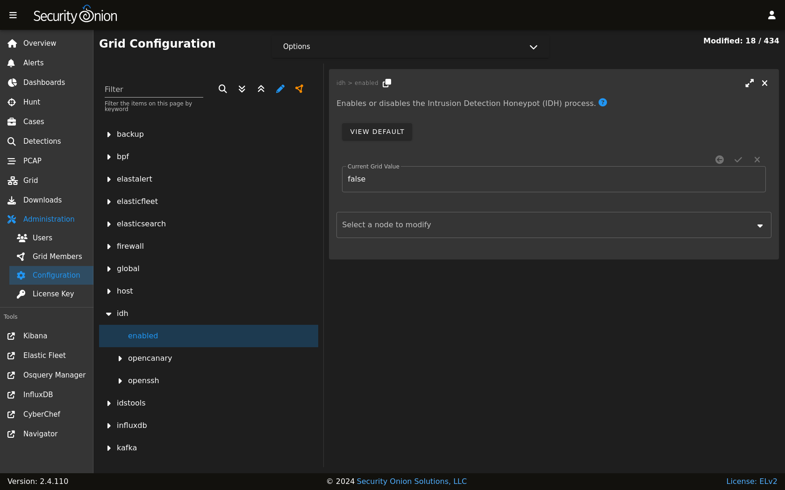

.. _idh:

Intrusion Detection Honeypot
============================

Security Onion includes an Intrusion Detection Honeypot (IDH) node option. This allows you to build a node that mimics common services such as HTTP, FTP, and SSH. Any interaction with these fake services will automatically result in an alert.

From the book, *Intrusion Detection Honeypots* (Sanders, C):

     An Intrusion Detection Honeypot (IDH) is a security resource placed inside your network perimeter that generates alerts when probed or attacked. These systems, services, and tokens rely on deception to lure attackers in and convince them to interact. Unbeknownst to the attacker, you’re alerted when that interaction occurs and can begin investigating the compromise.

Chris Sanders and Josh Brower presented the IDH concept at Security Onion Conference 2021 and you can view the recording at https://www.youtube.com/watch?v=NzUhfARVfJk&list=PLljFlTO9rB17mESq7Z9OeFKvVh39vJW34&index=5.

Installation
------------

IDH nodes are dedicated to just being IDH nodes and cannot run any other services. Therefore, you must have a separate manager to connect to. You can join a new IDH node to an existing Standalone deployment or full distributed deployment. Our ISO image includes a boot menu option for IDH installs that will partition your disk appropriately with lower requirements than a full installation.

.. warning::

        The IDH node is designed to be placed *inside* your network perimeter! It should not be accessible from the Internet!
     
Configuration
-------------

- Run Setup and select the ``DISTRIBUTED`` deployment option.
- Select the ``Existing Deployment`` option.
- Select the ``IDH`` option.
- You can optionally prevent the IDH services from listening on the management interface.
- Once Setup is complete and the IDH node is fully joined to the grid, you can do additional configuration by going to :ref:`administration` --> Configuration --> idh.
- After configuration is complete, connections to honeypot services will result in ``SO IDH`` alerts that can be seen in :ref:`alerts`.

Technical Background
--------------------

The IDH node utilizes OpenCanary which is a modular opensource honeypot by Thinkst. You can read more about it at https://github.com/thinkst/opencanary.

OpenCanary logs can be found through :ref:`dashboards`, :ref:`hunt`, or :ref:`kibana` using the following queries:

::

     event.module: opencanary
     
::

     event.dataset: idh

Sigma Plays within :ref:`playbook` look for certain logs emitted by OpenCanary to generate alerts, which can be viewed in the :ref:`alerts` interface.

Services Configuration
----------------------

The following services are available for use with the IDH node. Pay special attention to how an alert is triggered for a service as some of them require more than a simple connection request to trigger.

- FTP - a File Transfer Protocol server which alerts on login attempts
- Git - a Git server which alerts on repo cloning
- HTTP - an HTTP web server that alerts on login attempts
- HTTP Proxy - an HTTP web proxy that alerts when there is an attempt to proxy to another page
- MSSQL - an MS SQL server that alerts on login attempts
- MySQL - a MYSQL server that alerts on login attempts
- Telnet - a Telnet server that alerts on login attempts
- SNMP - an SNMP server which alerts on oid requests
- SSH - a Secure Shell server which alerts on login attempts
- SIP - a SIP server which alerts on sip requests
- VNC - a VNC server which alerts on login attempts
- Redis - a Redis server which alerts on actions
- TFTP - a tftp server which alerts on requests
- NTP - an NTP server which alerts on ntp requests

This is based on the list at https://opencanary.readthedocs.io/en/latest/starting/configuration.html#services-configuration. RDP and SMB are not currently available for use within an IDH node.

In addition to changing the default ports, some of these services have further configuration options. For instance, the HTTP server has the ability to use custom HTML pages ("skins"). For more information, please see the OpenCanary documentation at https://opencanary.readthedocs.io/en/latest/starting/configuration.html#default-configuration.

These types of configuration changes can be made by modifying the minion pillar (see the Custom Configuration section below).

sshd
----

For IDH nodes, the local sshd is configured to listen on TCP/2222 and connections are only accepted from the Manager node. This allows TCP/22 to be used for honeypot services.

Custom Configuration 
--------------------

You can configure IDH by going to :ref:`administration` --> Configuration --> idh.

Custom Configuration Example
----------------------------

For example, suppose that we already have the HTTP service running but we want to change the default port from ``80`` to ``8080``.

.. warning::

        Please be very careful when making changes!

- Go to :ref:`administration` --> Configuration.
- At the top of the page, click the ``Options`` menu and enable the ``Show all configurable settings, including advanced settings.`` option.
- On the left side, navigate to idh --> opencanary --> config --> http_x_port.
- On the right side, change the port value and then click the checkmark to save the change.
- At the top of the page, click the ``SYNCHRONIZE GRID`` button under the ``Options`` menu.

Activating Additional Network Interfaces
----------------------------------------

If you want to activate additional network interfaces after joining your IDH node to your grid, you can do so using standard Linux networking tools like nmtui. You can read more about nmtui at https://docs.oracle.com/en/operating-systems/oracle-linux/9/network/network-ConfiguringtheSystemsNetwork.html#ol-netconf-config-tui.
