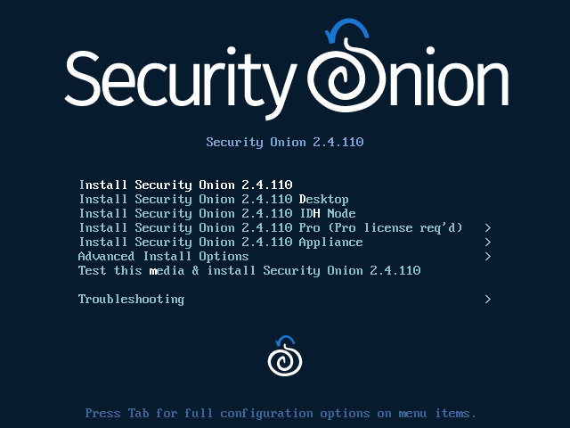

.. _installation:

Installation
============

.. warning::

  Please make sure that your hostname is correct during installation. Setup generates certificates based on the hostname and we do not support changing the hostname after Setup.
  
.. note::

  If you want to deploy in the cloud using one of our official cloud images, you can skip to the :ref:`cloud-amazon`, :ref:`cloud-azure`, or :ref:`cloud-google` sections.

Having downloaded your desired ISO according to the :ref:`download` section, it's now time to install! There are separate sections below to walk you through installing using our Security Onion ISO image (based on Oracle Linux 9) **or** manually installing from another ISO and then installing our components on top.

Installation using Security Onion ISO Image
-------------------------------------------

If you want to install using our Security Onion ISO image:

#. Review the :ref:`hardware` and :ref:`release-notes` sections.
#. Download and verify our Security Onion ISO image as shown in the :ref:`download` section.
#. Boot the ISO in a machine that meets the minimum hardware specs.
#. Follow the prompts to complete the installation and reboot.
#. You may need to eject the ISO image or change the boot order of the machine to boot from the newly installed OS.
#. Login using the username and password you set in the installer.
#. Security Onion Setup will automatically start. If for some reason you have to exit Setup and need to restart it, you can log out of your account and then log back in and it should automatically start. If that doesn't work, you can manually run it as follows:

    ::
    
      sudo SecurityOnion/setup/so-setup iso
      
#. Proceed to the :ref:`configuration` section.

Manual Installation via other ISO image
---------------------------------------

If you want to install Security Onion via another ISO image (**not** using our Security Onion ISO image), follow the steps below.

#. Review the :ref:`hardware` and :ref:`release-notes` sections.
#. Download the ISO image for your desired x86-64 :ref:`os`. Verify the ISO image and then boot from it.
#. Follow the prompts in the installer. If you're building a production deployment, you'll probably want to use LVM and dedicate most of your disk space to ``/nsm`` as discussed in the :ref:`partitioning` section.
#. Reboot into your new installation.
#. Login using the username and password you specified during installation.
#. Install prerequisites. If you're using a RHEL flavor like Oracle Linux 9:

   ::

     sudo dnf -y install git
   
   If you're using a Debian flavor like Ubuntu:
   
   ::
   
     sudo apt -y install git curl ethtool
     
#. Download our repo and start the Setup process:

   ::

     git clone -b 2.4/main https://github.com/Security-Onion-Solutions/securityonion
     cd securityonion
     sudo bash so-setup-network
     
#. Proceed to the :ref:`configuration` section.
