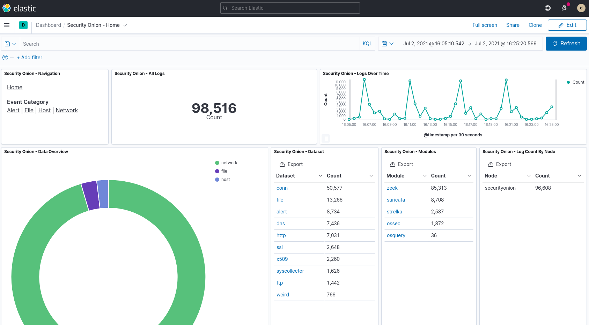

.. _introduction:

Introduction
============

Security Onion is a free and open platform for Network Security Monitoring (NSM) and Enterprise Security Monitoring (ESM). NSM is, put simply, monitoring your network for security related events. It might be proactive, when used to identify vulnerabilities or expiring SSL certificates, or it might be reactive, such as in incident response and network forensics. Whether you’re tracking an adversary or trying to keep malware at bay, NSM provides context, intelligence and situational awareness of your network. ESM takes NSM to the next level and includes endpoint visibility and other telemetry from your enterprise. There are some commercial solutions that get close to what Security Onion provides, but very few contain the vast capabilities of Security Onion in one package.

In the diagram below, we see Security Onion in a traditional enterprise network with a firewall, workstations, and servers. You can use Security Onion to monitor north/south traffic to detect an adversary entering an environment, establishing command-and-control (C2), or perhaps data exfiltration. You'll probably also want to monitor east/west traffic to detect lateral movement. As more and more of our network traffic becomes encrypted, it's important to fill in those blind spots with additional visibility in the form of endpoint telemetry. Security Onion can consume logs from your servers and workstations so that you can then hunt across all of your network and host logs at the same time.

.. image:: images/network-horiz.png
  :target: _images/network-horiz.png
   
Many assume NSM is a solution they can buy to fill a gap; purchase and deploy solution XYZ and problem solved. The belief that you can buy an NSM denies the fact that the most important word in the NSM acronym is “M” for Monitoring. Data can be collected and analyzed, but not all malicious activity looks malicious at first glance. While automation and correlation can enhance intelligence and assist in the process of sorting through false positives and malicious indicators, there is no replacement for human intelligence and awareness. We don’t want to disillusion you. Security Onion isn’t a silver bullet that you can setup, walk away from and feel safe. Nothing is and if that’s what you’re looking for you’ll never find it. Security Onion will provide visibility into your network traffic and context around alerts and anomalous events, but it requires a commitment from you the defender to review alerts, monitor the network activity, and most importantly, have a willingness, passion, and desire to learn.

Network Security Monitoring
---------------------------

From a network visibility standpoint, Security Onion seamlessly weaves together intrusion detection, network metadata, and full packet capture.

Intrusion Detection
~~~~~~~~~~~~~~~~~~~

Security Onion monitors your network traffic looking for fingerprints and identifiers that match known malicious, anomalous, or otherwise suspicious traffic. This is signature-based detection so you might say that it's similar to antivirus signatures for the network, but it's a bit deeper and more flexible than that. This capability is provided by :ref:`suricata`.

Network Metadata
~~~~~~~~~~~~~~~~

Unlike signature-based intrusion detection that looks for specific needles in the haystack of data, network metadata provides you with logs of connections, DNS requests, detected network services and software, SSL certificates, and standard protocols like HTTP, FTP, SMTP, SSH, and SSL. This provides a real depth and visibility into the context of data and events on your network. Security Onion provides network metadata using your choice of either :ref:`zeek` or :ref:`suricata`.

Full Packet Capture
~~~~~~~~~~~~~~~~~~~

Full packet capture is like a video camera for your network, but better because not only can it tell us who came and went, but also exactly where they went and what they brought or took with them (exploit payloads, phishing emails, file exfiltration). It’s a crime scene recorder that can tell us a lot about the victim and the white chalk outline of a compromised host on the ground. There is certainly valuable evidence to be found on the victim’s body, but evidence at the host can be destroyed or manipulated; the camera doesn't lie, is hard to deceive, and can capture a bullet in transit. Full packet capture is accomplished via :ref:`stenographer`. :ref:`stenographer` captures all the network traffic your Security Onion sensors see and stores as much of it as your storage solution will hold, automatically trimming old data as necessary to avoid filling your disk. 

Enterprise Security Monitoring
------------------------------

In addition to network visibility, Security Onion provides endpoint visibility and can collect logs from a wide variety of devices like firewalls and routers.

For endpoint detection, Security Onion offers :ref:`wazuh`, a free, open source HIDS for Windows, Linux and Mac OS X. When you add the :ref:`wazuh` agent to endpoints on your network, you gain invaluable visibility from endpoint to your network’s exit point. :ref:`wazuh` performs log analysis, file integrity checking, policy monitoring, rootkit detection, real-time alerting and active response. As an analyst, being able to correlate host-based events with network-based events can be the difference in identifying a successful attack.

Security Onion also supports other endpoint agents like :ref:`osquery` and :ref:`beats`. For devices that don't support the installation of agents, Security Onion can consume standard :ref:`syslog`.

Analysis Tools
--------------

With full packet capture, IDS alerts, network metadata from :ref:`zeek` or :ref:`suricata`, and endpoint telemetry, there is an incredible amount of data available at your fingertips. Fortunately, Security Onion tightly integrates the following tools to help make sense of this data.

Security Onion Console (SOC)
~~~~~~~~~~~~~~~~~~~~~~~~~~~~

:ref:`soc` is the first thing you see when you log into Security Onion. It includes a new :ref:`alerts` interface which allows you to see all of your NIDS alerts from :ref:`suricata` and HIDS alerts from :ref:`wazuh`.

.. image:: images/alerts.png
  :target: _images/alerts.png

:ref:`soc` also includes a new :ref:`Hunt` interface for threat hunting which allows you to query not only your NIDS/HIDS alerts but also network metadata logs from :ref:`zeek` or :ref:`suricata` and any other logs that you may be collecting. 

.. image:: images/hunt.png
  :target: _images/hunt.png

:ref:`soc` also includes an interface for full packet capture (:ref:`pcap`) retrieval.

.. image:: images/pcap.png
  :target: _images/pcap.png

TheHive
~~~~~~~

:ref:`hive` is the case management interface. As you are working in :ref:`alerts`, :ref:`hunt`, or :ref:`kibana`, you may find alerts or logs that are interesting enough to send to :ref:`hive` and create a case. Other analysts can collaborate with you as you work to close that case.

.. image:: https://user-images.githubusercontent.com/1659467/94850514-07f06d00-03f5-11eb-8071-6e45d82feec7.png
  :target: https://user-images.githubusercontent.com/1659467/94850514-07f06d00-03f5-11eb-8071-6e45d82feec7.png

Kibana
~~~~~~

:ref:`kibana`, created by the team at Elastic, allows us to quickly analyze and pivot between all of the different data types generated by Security Onion through a "single pane of glass".  This includes not only NIDS/HIDS alerts, but also :ref:`zeek` logs and system logs collected via syslog or other agent transport.  Kibana can pivot to full packet capture via :ref:`soc`.

CyberChef
~~~~~~~~~

:ref:`cyberchef` allows you decode, decompress, and analyze artifacts.

.. image:: images/cyberchef.png
  :target: _images/cyberchef.png

Playbook
~~~~~~~~

:ref:`playbook` is a web application that allows you to create a Detection Playbook, which itself consists of individual plays. These plays are fully self-contained and describe the different aspects around the particular detection strategy.

.. image:: https://user-images.githubusercontent.com/1659467/87230271-c5cb0880-c37c-11ea-8a36-24cabf137ed2.png
  :target: https://user-images.githubusercontent.com/1659467/87230271-c5cb0880-c37c-11ea-8a36-24cabf137ed2.png

Deployment Scenarios
--------------------

Analysts around the world are using Security Onion today for many different :ref:`architectures <architecture>`.  The Security Onion Setup wizard allows you to easily configure the best installation scenario to suit your needs.

Conclusion
----------

After you install Security Onion, you will have network and endpoint detection, comprehensive metadata, and full packet capture. These disparate systems with various dependencies and complexities all run seamlessly together and would otherwise take hours, days, or weeks to assemble and integrate on their own. What was once a seemingly impossible task is now as easy as answering a few questions!
